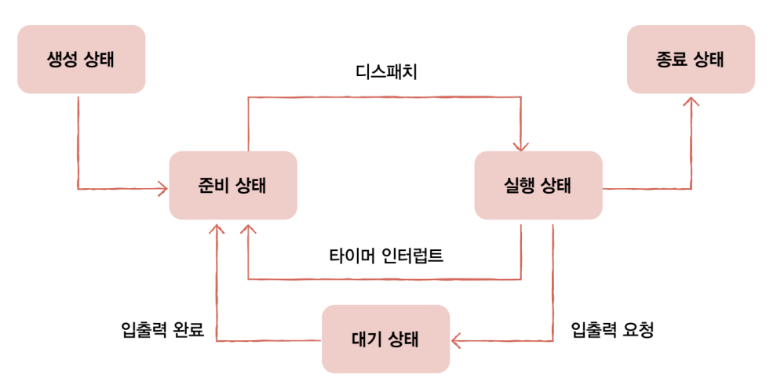

## 10-1 프로세스 개요

### 프로세스 직접  확인하기

사용자가 볼 수 있는 공간에서 실행되는 프로세스를 `포그라운드 프로세스`라고 한다. 반대로 사용자가 보지 못하는 공간에서 실행되는 프로세스를 `백그라운드 프로세스`라고 한다.

백그라운드 프로세스 중에서 사용자와 직접 상호작용하지 않고 정해진 일만 수행하는 백그라운드 프로세스가 있다. 이것을 유닉스 체계의 운영체제에서는 `데몬`이라고 부르고, 윈도우 운영 체제에서는 `서비스`라고 부른다.

### 프로세스 제어 블록

모든 프로세스는 실행을 위해 CPU를 필요로 하지만, CPU 자원은 한정되어 있다. 모든 프로세스가 CPU를 동시에 사용할 수는 없다. 
그래서 프로세서들을 차례대로 돌아가며 한정된 시간만큼만 CPU를 이용한다. 자신의 차례가 되면 정해진 시간만큼 CPU를 이용하고, 시간이 끝났음을 알리는 인터럽트(타이머 인터럽트)가 발생하면 자신의 차례를 양보하고 다음 차례가 올 때까지 기다린다.

	타이머 인터럽트는 클럭 신호를 발생시키는 장치에 의해 주기적으로 발생하는 하드웨어 인터럽트이다. 타임아웃 인터럽트라고도 한다.

운영체제는 빠르게 번걸아 수행되는 프로세스의 실행 순서를 관리하고, 프로세스에 CPU를 비롯한 자원을 배분한다. 이를 위해 운영체제는 `프로세스 제어 블록`(`PCB`)를 이용한다.

프로세스 제어 블록은 프로세스와 관련된 정보를 저장하는 자료 구조이다. 프로세스 제어 블록에는 해당 프로세스를 식별하기 위해 꼭 필요한 정보들이 저장된다.

PCB는 커널 영역에 생성된다. 운영체제도 수많은 프로세스들 사이에서 PCB로 특정 프로세스를 식별하고 해당 프로세스를 처리하는데 필요한 정보를 판단한다.

PCB는 프로세스 생성 시 만들어지고 실행이 끝나면 폐기된다. 

#### 프로세스 ID
`프로세스 ID`(`PID`)는 특정 프로세스를 식별하기 위해 부여하는 고유한 번호이다. 같은 일을 수행하는 프로그램이라 할지라도 두 번 실행하면 PID가 다른 두 개의 프로세스가 생성된다.

#### 레지스터 값
프로세스는 자신의 실행 차례가 돌아오면 이전까지 사용했던 레지스터의 중간값들을 모두 복원한다. 그래야 이전까지 진행했던 작업들을 그대로 이어 실행할 수 있다. 그래서 PCB 안에는 해당 프로세스가 실행하며 사용했던 프로그램 카운터를 비롯한 레지스터 값들이 담긴다.

#### 프로세스 상태
현재 프로세스가 어떤 상태인지도 PCB에 기록되어야 한다. 현재 프로세스가 입출력장치를 사용하기 위해 기다리고 있는 상태인지, CPU를 사용하기 위해 기다리고 있는 상태인지, 아니면 CPU를 이용하고 있는 상태인지 등의 프로세스 상태 정보가 PCB에 저장된다.

#### CPU 스케줄링 정보
프로세스가 언제, 어떤 순서로 CPU를 할당받을지에 대한 정보도 PCB에 기록한다.

#### 메모리 관리 정보
프로세스마다 메모리에 저장된 위치가 다르다. 그래서 PCB에는 프로세스가 어느 주소에 저장되어 있는지에 대한 정보가 있어야 한다. PCB에는 베이스 레지스터, 한계 레지스터 값과 같은 정보들이 담긴다. 또한 프로세스의 주소를 알기 위한 또 다른 중요 정보 중 하나인 페이지 테이블 정보도 PCB에 담긴다. 

#### 사용한 파일과 입출력장치 목록
프로세스가 실행 과정에서 특정 입출력장치나 파일을 사용하면 PCB에 해당 내용이 명시된다. 즉, 어떤 입출력장치가 이 프로세스에 할당되었는지, 어떤 파일들을 열었는지에 대한 정보들이 PCB에 기록된다.

### 문맥 교환

하나의 프로세스에서 다른 프로세스로 실행 순서가 넘어갈 때, 이전까지 실행되던 프로세스는 프로그램 카운터를 비롯한 각종 레지스터 값, 메모리 정보, 실행을 위해 열었던 파일이나 사용한 입출력장치 등 지금까지의 중간 정보를 백업해야 한다.

이러한 중간 정보, 즉 하나의 프로세스 수행을 재개하기 위해 기억해야 할 정보를 `문맥`(`context`)이라고 한다. 하나의 프로세스 문백은 해당 프로세스의 PCB에 표현되어 있다. 

프로세스가 CPU를 사용할 수 있는 시간이 다 되거나 예기치 못한 상황이 발생하여 인터럽트가 발생하면 운영체제는 해당 프로세스의 PCB에 문맥을 백업한다. 그리고 실행할 프로세스의 문맥을 복구한다. 이렇게 프로세스가 뒤바뀐다.

이처럼 기존 프로세스의 문맥을 PCB에 백업하고, 새로운 프로세스를 실행하기 위해 문맥을 PCB로부터 복구하여 새로운 프로세스를 실행하는 것을 `문맥 교환`(`context switching`)이라고 한다.

문맥 교환은 여러 프로세스가 끊임없이 빠르게 번갈아 가며 실행되는 원리이다. 빠르게 번갈아가며 수행되기 때문에 프로세스들이 동시에 실행되는 것처럼 보인다.

	문맥 교환을 너무 자주하면 오버헤드가 발생할 수 있기 때문에 문맥 교환이 자주 일어난다고 반드시 좋은 건 아니다.

### 프로세스의 메모리 영역

프로세스가 생성되면 커널 영역에 PCB가 생성된다. 사용자 영역에는 크게 `코드 영역`, `데이터 영역`, `힙 영역`, `스택 영역`으로 나뉘어 저장된다.

#### 코드 영역
`코드 영역`은 `텍스트 영역`이라고도 부른다. 이것은 말 글대로 실행할 수 있는 코드, 즉 기계어로 이러우진 명령어가 저장된다. 코드 영역에는 데이터가 아닌 CPU가 실행할 명령어가 담겨 있기 때문에 쓰기가 금지되어 있다. 즉, 읽기 전용 공간이다.

#### 데이터 영역
`데이터 영역`은 잠깐 썼다가 없앨 데이터가 아닌 프로그램이 실행되는 동안 유지할 데이터가 저장되는 공간이다. 이런 데이터로는 `전역 변수`가 대표적이다. 전역 변수는 '프로그램이 실행되는 동안 유지되며, 프로그램 전체에서 접근할 수 있는 변수'다.

코드 영역과 데이터 영역은 그 크기가 변하지 않는다. 그래서 코드 영역과 데이터 영역은 '크기가 고정된 영역'이라는 점에서 `정적 할당 영역`이라고도 부른다. 반면 힙 영역과 스택 영역은 프로세스 실행 과정에서 그 크기가 변할 수 있는 영역이다. 그래서 이 두 영역은  `동적 할당 영역`이라고도 부른다.

#### 힙 영역
`힙 영역`은 프로그램을 만드는 사용자, 즉 프로그래머가 직접 할당할 수 있는 저장 공간이다. 프로그래밍 과정에서 힙 영역에 메모리 공간을 할당했다면 언젠가는 해당 공간을 반환해야 한다.
메모리 공간을 반환한다는 의미는 '더 이상 해당 메모리 공간을 사용하지 않는다'라고 운영 체제에 말해주는 것과 같다.

메모리 공간을 반환하지 않는다면 할당한 공간은 메모리 내에 계속 남아 메모리 낭비를 초래한다. 이런 문제를 `메모리 누수`(`memory leak`)라고 한다. 

#### 스택 영역
`스택 영역`은 데이터를 일시적으로 저장하는 공간이다. 데이터 영역에 담기는 값과 달리 잠시 쓰고 없어질 값들이 저장되는 공간이다. 이런 데이터로는 함수의 실행이 끝나면 사라지는 매개 변수, 지역 변수가 대표적이다.

일시적으로 저장할 데이터는 스택 영역에 PUSH되고, 더 이상 필요하지 않는 데이터는 POP됨으로써 스택 영역에서 사라진다.

그래서 일반적으로 힙 영역은 메모리의 낮은 주소에서 높은 주소로 할당되고, 스택 영역은 높은 주소에서 낮은 주소로 할당된다. 그래야만 힙 영역과 스택 영역에 데이터가 쌓여도 새롭게 할당되는 주소가 겹칠 일이 없어진다.

## 10-2 프로세스 상태와 계층 구조

### 프로세스 상태

하나의 프로세스는 여러 상태를 거치며 실행된다. 그리고 운영체제는 프로세스의 상태를 PCB를 통해 인식하고 관리한다. 운영체제마다 상태를 표현하는 방식은 조금씩 다르지만 대표적인 상태는 다음과 같다.

#### 생성 상태 - new
프로세스를 생성 중인 상태를 `생성 상태`라고 한다. 이제 막 메모리에 적재되어 PCB를 할당받은 상태를 말한다. 생성 상태를 거쳐 실행할 준비가 완료된 프로세스는 곧바로  실행되지 않고 준비 상태가 되어 CPU의 할당을 기다린다.

#### 준비 상태 - ready
`준비 상태`는 당장이라도 CPU를 할당받아 실행할 수 있지만, 아직 자신의 차례가 아니기에 기다리고 있는 상태이다. 준비  상태 프로세스는 차례가 되면 CPU를 할당받아 실행 상태가 된다.

	준비 상태인 프로세스가 실행 상태로 전환되는 것을 디스패치라고 한다.

#### 실행 상태 - running
`실행 상태`는 CPU를 할당받아 실행 중인 상태를 의미힌다. 실행 상태인 프로세스는 할당된 일정 시간 동안만 CPU를 사용할 수 있다. 이때 프로세스가 할당된 시간을 모두 사용한다면 다시 준비 상태가 되고, 실행 도중 입출력장치를 사용하여 입출력장치의 작업이 끝날 때까지 기다려야 하나면 대기 상태가 된다.

#### 대기 상태 - blocked
입출력 작업을 요청한 프로세스는 입출력장치가 입출력을 끝낼 때까지(입출력 완료 인터럽트를 받을 때까지) 기다려야 한다. 이렇게 입출력장치의 작업을 기다리는 상태를 `대기 상태`라고 한다. 입출력 작업이 완료되면 해당 프로세스는 다시 준비 상태로 CPU 할당을 기다린다.

#### 종료 상태 - terminated
`종료 상태`는 프로세스가 종료된 상태이다. 프로세스가 종료되면 운영체제는 PCB와 프로세스가 사용한 메모리를 정리한다. 

위와 같은 도표를 `프로세스 상태 다이어그램`이라고 한다.

	프로세스가 대기 상태가 되는 이유는 입출력 작업만 있는 것이 아니다. 특정 이벤트가 일어나길 기다릴 때 프로세스는 대기 상태가 된다. 다만, 프로세스가 대기 상태가 되는 대부분의 원인이 입출력이기 때문에 '입출력 작업을 하면 대기 상태가 된다'라고 생각해도 무방한다.

### 프로세스 계층 구조

프로세스는 실행 도중 시스템 호출을 통해 다른 프로세스를 생성할 수 있다. 이때 새 프로세스를 생성한 프로세스를 `부모 프로세스`, 부모 프로세스에 의해 생성된 프로세스를 `자식 프로세스`라고 한다. 
부모 프로세스와 자식 프로세스는 엄연히 다른 프로세스이기에 각기 다른 PID를 가진다. 일부 운영체제에서는 자식 프로세스의 PCB에 부모 프로세스의 PID인 `PPID`가 기록되기도 한다.
자식 프로세서 또한 실행 과정에서 또 다른 자식 프로세스를 생성할 수 있다. 많은 운영체제는 이처럼 프로세스가 프로세스를 낳는 계층적인 구조로써 프로세스들을 관리한다. 

컴퓨터가 부팅 될 떄 실행되는 최초의 프로세스가 자식 프로세스들을 생성하고, 생성된 자식 프로세스들이 새로운 프로세스를 낳는 형식으로 여러 프로세스가 동시에 실행되는 것이다.

이 과정을 도표로 그리면 아래와 같은 트리 구조를 띄우는데, 이를 `프로세스 계층 구조`라고 한다.

### 프로세스 생성 기법

부모 프로세스를 통해 생성된 자식 프로세스들은 `복제와 옷 갈아입기`를 통해 실행된다. 좀 더 적확하게, 부모 프로세스는 `fork`를 통해 자신의 복사본을 자식 프로세스로 생성해내고, 만들어진 복사본은 `exec`를 통해 자신의 메모리 공간을 다른 프로그램으로 교체한다. 

fork와 exec는 시스템 호출이다. 
fork는 자기 자신 프로세스의 복사본을 만드는 시스템 호출이다. 자식 프로세스는 부모 프로세스의 복사본이기 떄문에 부모 포르세스의 자원들, 이를테면 메모리 내의 내용, 열린 파일의 목록 등이 자식 프로세스에 상속된다.(복사된 자식 프로세스라 할지라도 PID 값이나 저장된 메모리 위치는 다르다.)

자식 프로세스는 exec 시스템 호출을 통해 새로운 프로그램으로 전환된다. exec는 자신의 메모리 공간을 새로운 프로그램으로 덮어쓰는 시스템 호출이다. 다시 말해 새로운 프로그램 내용으로 전환돠여 실행하는 시스템 호출이다.

exec를 호출하면 코드 영역과 데이터 영역의 내용이 실행할 프로그램의 내용으로 바뀌고, 나머지 영역은 초기화된다.

예를 들어, bash 쉘에서 ls라는 명령어를 쳤다고 가정해보자. 쉘 프로세스는 fork를 통해 자신과 동일한 프로세스를 생성하고, 그로부터 탄생한 자식 프로세스(쉘 복제 프로세스)는 exec를 통해 ls명령어를 실행하기 위한 프로세스로 전한되어 실행된다.
그렇게 쉘 복사본으로 탄생한 자식 프로세스는 ls 명령어를 실행하기 위한 프로세스로 바뀌고, 메모리 공간에는 ls 명령어를 실행하기 위한 내용들이 채워진다.

부모 프로세스가 자식 프로세스를 fork한 뒤에 부모 프로세스, 자식 프로세스 누구도 exec를 호출하지 않는 경우도 있다. 이 경우 부모 프로세스와 자식 프로세스와 같은 코드를 병행하여 실행하는 프로세스가 된다.

## 10-3 스레드

### 프로세스와 스레드

`단일 스레드 프로세스`는 프로세스의 '실행의 흐름 단위가 하나'인 프로세스를 의미한다.
하지만 `스레드`라는 개념이 도입되면서 하나의 프로세스가 한 번에 여러 일을 동시에 처리할 수 있게 되었다. 이것을 `멀티 스레스 프로세스`라고 한다.

이런 점에서 스레드는 '프로세스를 구성하는 실행 단위'라고 볼 수 있다.
스레드는 프로세스 내에서 각기 다른 스레드 ID, 프로그램 카운터 값을 비롯한 레지스터 값. 스택으로 구성된다. 각자 프로그램 카운터 값을 비롯한 레지스터 값, 스택을 가지고 있기에 스레드마다 각기 다른 코드를 실행할 수 있다.

여기서 중요한 점은 프로세스의 스레드들은 실행에 필요한 최소한의 정보만을 유지한 채 프로세스 자원을 공유하며 실행된다는 점이다. 프로세스의 자원을 공유한다는 것이 스레드의 핵심이다. 

정리하면, 프로세스가 실행되는 프로그램이라면 스레드는 프로세스를 구성하는 실행의 흐름 단위이다. 실제로 최근 많은 운영체제는 CPU에 처리할 작업을 전달할 때 프로세스가 아닌 스레드 단위로 전달한다. 그리고 스레드는 프로세스 자원을 공유한 채 실행에 필요한 최소한의 정보만으로 실행된다.

### 멀티 프로세스와 멀티 스레드

여러 프로세스를 동시에  실행하는 것을 `멀티프로세스`, 그리고 여러 스레드로 프로세스를 동시에 실행하는 것을 `멀티스레드`라고 한다.

동일한 작업을 수행하는 단일 스레드 프로세스를 여러 개 실행하는 것과 하나의 프로세스를 여러 스레드로 실행하는 것은 무엇이 다를까?

프로세스끼리는 기본적으로 자원을 공유하지 않지만, 스레드끼리는 같은 프로세스 내의 자원을 공유한다. 그래서 멀티스레드를 사용하는 것이 멀티프로세스를 사용하는 것보다 메모리를 더 효율적으로 사용할 수 있다.
또한, 자원을 공유하기 때문에 서로 협력과 통신에 유리하다.

자원을 공유한다는 사실이 단점이 될 수도 있는데, 멀티프로세스 환경에서는 하나의 프로세스에 문제가 생겨도 다른 프로세스에는 지장이 적거나 없지만, 멀티스레드 환경에서는 프로세스 전체에 문제가 생길 수 있다.

	프로세스 간의 자원을 공유하고 데이터를 주고받는 것을 프로세스 간 통신이라고 부른다. IPC(Inter-Process Communication)라고 줄여 부른다. 
	통신이라는 말 때문에 네트워크를 통해 데이터를 주고 받는 것을 떠올리기 쉽지만, 같은 컴퓨터 내의 서로 다른 프로세스나 스레드끼리 데이터를 주고 받는 것도 통신으로 간주한다.
	프로세스들은 프로세스들이 공유할 수 있는 메모리 영역을 두는 공유 메모리를 사용해서 통신하거나 소켓, 파이프 등을 통해 통신할 수 있다.

