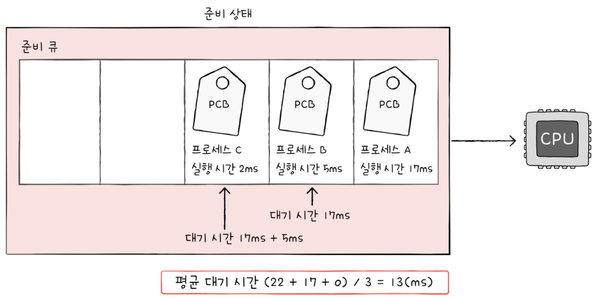

# CPU 스케줄링

## 11-1 CPU 스케줄링 개요

### 프로세스 우선순위

단순하게 생각해 봤을 때 CPU를 사용하고 싶어 하는 프로세스들이 차례로 들어가며 CPU를 이용하게 하는 방법이 있다. 언뜻 들으면 합리적인 방식인 것 같지만, 사실 좋은 방법이 아니다.

그 이유는 프로세스마다 `우선순위`가 다르기 때문이다. 우선순위가 높은 프로세스란 빨리 처리해야 하는 프로세스들을 의미한다. 우선순위가 높은 프로세스에는 대포적으로 입출력 작업이 많은 프로세스가 있다. 왜 입출력 작업이 많은 프로세스를 먼저 처리하는 것이 효율적일까?

대부분의 프로세스들은 CPU와 입출력장치를 모두 사용하며 실행된다. 달리 말하면 프로세스는 실행 상태와 대기 상태를 반복하며 실행된다. 
그런데 프로세스 종류마다 입출력장치를 이용하는 시간과 CPU를 이용하는 시간의 양에는 차이가 있다. 
비디오 재생이나 디스크 백업 작업 같은 입출력이 많은 프로세스를 `입출력 집중 프로세스`라고 하고, 복잡한 수학 연산, 컴파일, 그래픽 처리 등 CPU 작업이 많은 프로세스를 `CPU 집중 프로세스`라고 한다.
입출력 집중 프로세스는 실행 상태보다 대기 상태에 더 많이 머무르게 된다. 반대로 CPU 집중 프로세스는 대기 상태보다 실행 상태에 더 많이 머무르게 된다.

	CPU를 이용하는 작업을 CPU 버스트, 입출력장치를 기다리는 작업을 입출력버스트 라고 한다. 즉, 프로세스는 일반적으로 CPU 버스트와 입출력 버스트를 반복하며 실행된다고 볼 수 있다.

따라서 CPU 집중 프로세스와 입출력 집중 프로세스가 동시에 CPU 자원을 요구한다면, 입출력 집중 프로세스를 먼저 실행시켜 입출력 장치를 작동시키고, 그 후에 CPU 집중 프로세스에 CPU를 할당하는 것이 더 효율적이다. 

상황에 맞게, 그리고 프로세스의 중요도에 맞게 프로세스가 CPU를 이용할 수 있도록 운영체제는 프로세스마다 `우선순위`를 부여한다. 운영체제는 각 프로세스의 PCB에 우선순위를 명시하고, PCB에 적힌 우선순위를 기준으로 먼저 처리할 프로세스를 결정한다.

### 스케줄링 큐

CPU를 사용하고 싶은 프로세스들, 메모리에 적재되고 싶은 프로세스들, 특정 입출력장치를 사용하고 싶은 프로세스들을 모두 줄세운다. 이 줄을 운영체제는 `스케줄링 큐`로 구현하고 관리한다.

	스케줄링에서 말하는 큐는 반드시 선입선출 방식일 필요는 없다.

운영체제는 메모리로 적재되고 싶은 프로세스들을 큐에 삽입하여 줄을 세우고, CPU를 이용하고 싶은 프로세스들 또한 큐에 삽입하여 줄을 세우고, 특정 입출력장치를 이용하고 싶은 프로세스들 역시 큐에 삽입하여 줄을 세운다.

운영체제가 관리하는 대부분의 자원은 이렇게 큐로 관리된다. 그래서 운영체제가 관리하는 큐에는 다양한 종류가 있다. 대표적으로는 준비 큐와 대기 큐가 있다.
`준비 큐`는 CPU를 이용하고 싶은 프로세스들이 서는 줄을 의미하고, `대기 큐`는 입출력장치를 이용하기 위해 대기 상태에 접어든 프로세스들이 서는 줄을 의미한다.

준비 상태에 있는 프로세스들의 PCB는 준비 큐의 마지막에 삽입되어 CPU를 사용할 차례를 기다린다. 운영체제는 PCB들이 큐에 삽입된 순서대로 프로세스를 하나씩 꺼내어 실행하되, 그중 우선순위가 높은 프로세스를 먼저 실행한다.

대기 상태에 있는 프로세스도 똑같다. 같은 장치를 요구한 프로세스들은 같은 대기 큐에서 기다린다. 입출력이 완료되어 인터럽트가 발생하면 운영체제는 대기 큐에서 작업이 완료된 PCB를 찾고, PCB를 준비 상태로 변경한 뒤 대기 큐에서 제거한다. 그 후에 PCB는 준비 큐로 이동한다.

### 선점형과 비선점형 스케줄링

선점이란 '남보다 앞서서 차지함'을 의미한다. `선점형 스케줄링`(`preemptive scheduling`)은 프로세스가 CPU를 비롯한 자원을 사용하고 있더라도 운영체제가 프로세스로부터 자원을 강제로 빼앗아 다른 프로세스에 할당할 수 있는 스케줄링 방식이다.
다시 말해 하나의 프로세스가 자원 사용을 독점할 수 없는 스케줄링 방식이다.

프로세스마다 정해진 시간만큼 CPU를 사용하고, 정해진 시간을 모두 소비하여 타이머 인터럽트가 발생하면 운영체제가 프로세스로부터 CPU 자원을 빼앗아 다음 프로세스에 할당하는 방식은 선점형 스케줄링에 일종이라고 볼 수 있다.

`비선점형 스케줄링`(`non-preemptive scheduling`)이란 하나의 프로세스가 자원을 사용하고 있다면 그 프로세스가 종료되거나 스스로 대기 상태에 접어들기 전까진 다른 프로세스가 끼어들 수 없는 스케줄링 방식이다. 
다시 말해 하나의 프로세스가 자원 사용을 독점할 수 있는 스케줄링 방식이라고 볼 수 있다.

만약 비선형 스케줄링 방식으로 자원을 이용하는 프로세스가 있다면 다른 프로세스들은 그 프로세스의 사용이 모두 끝날 때까지 기다려야 한다.

현재 대부분의 운영체제는 선점형 스케줄링 방식을 차용하고 있지만, 각기 다른 장단점을 가지고 있다.

`선점형 스케줄링`은 더 급한 프로세스가 언제든 끼어들어 사용할 수 있는 스케줄링 방식이므로 어느 한 프로세스의 자원 독점을 막고 프로세스들에 골고루 자원을 배분할 수 있다는 장점이 있지만, 그만큼 문맥 교환에서 오버헤드가 발생할 수 있다.

`비선점형 스케줄링`은 문맥 교환 횟수가 더 적기 떄문에 오버헤드가 적지만, 하나의 프로세스가 자원을 사용 중이라면 당장 자원을 사용해야 하는 상황에서도 무작정 기다리는 수 밖에 없다. 모든 프로세스가 골고루 자원을 사용할 수 없다는 단점이 있다.

## 11-2 CPU 스케줄링 알고리즘

### 스케줄링 알고리즘 종류

반드시 똑같은 것이 아니니 아이디어 중 하나로 생각하면 좋다.

#### 선입 선처리 스케줄링

`선입 선처리 스케줄링`은 `FCFS 스케줄링`(`Fist Come Fist Served Scheduling`)이라고도 부른다. 이는 단순히 준비 큐에 삽입된 순서대로 프로세스들을 처리하는 비선점형 스케줄링 방식이다.
선입 선처리 스케줄링은 언뜻 보기에는 공정해보이지만, 때때로 프로세스들이 기다리는 시간이 매우 길어질 수 있다는 점에서 부작용이 있다.

만약 CPU를 오래 사용하는 프로세스가 먼저 도착하면 다른 프로세스는 그 프로세스가 CPU를 사용하는 동안 무작정 기다리는 수 밖에 없다. 
이런 현상을 `호위 효과`(`Convoy Effect`)라고 한다.

#### 최단 작업 우선 스케줄링

호위 효과를 방지하려면 단순하게 생각해 보면 CPU 사용 시간이 짧은 프로세스를 먼저 실행하면 된다.
이렇게 준비 큐에 삽입된 프로세스들 중 CPU 이용 시간의 길이가 짧은 프로세스부터 실행하는 스케줄링 방식을 `최단 작업 우선 스케줄링` 혹은 `SJF 스케줄링`(`Shotest Job First Scheduling`)이라고 한다. 
기본적으로 비선점형 스케줄링 알고리즘으로 분류되었지만, 선점형으로 구현될 수도 있다. `선점형 최단 작업 우선 스케줄링`이 바로 최소 잔여 시간 우선 스케줄링이다.

#### 라운드 로빈 스케줄링

`라운드 로빈 스케줄링`(`Round Robin Scheduling`)은 선입 선처리 스케줄링에 타입 슬라이스라는 개념이 더해진 스케줄링 방식이다. `타임 슬라이스`란 각 프로세스가 CPU를 사용할 수 있는 정해진 시간을 의미한다. 즉, 라운드 로빈 스케줄링은 정해진 타임 슬라이스만큼의 시간 동안 돌아가며 CPU를 이용하는 선점형 스케줄링이다.

큐에 삽입된 프로세스들은 삽입된 순서대로 CPU를 이용하되 정해진 시간만큼만 CPU를 이용하고, 정해진 시간을 모두 사용했음에도 아직 프로세스가 완료되지 않았다면 다시 큐의 맨 뒤에 삽입된다. 이때 문맥 교환이 발생한다.

그래서 라운드 로빈 스케줄링 방식에는 타임 슬라이스 크기가 매우 중요하다. 타임 슬라이스가 지나치게 크면 사실상 선입 선처리 스케줄링과 다를 바 없어 호위 효과가 생길 여지가 있고, 타입 슬라이스가 지나치게 작으면 문맥 교환에 발생하는 비용이 커 CPU는 프로세스를 처리하는 일보다 프로세스를 전환하는데 낭비를 해야하기 때문이다.

#### 최소 잔여 시간 우선 스케줄링

`최소 잔여 시간 우선 스케줄링` 혹은 `SRT`(`Shortest Remaining Time`) 스케줄링은 최단 작업 우선 스케줄링 알고리즘과 라운드 로빈 알고리즘을 합친 방식이다. 
프로세스들은 정해진 타임 슬라이스만큼 CPU를 사용하되, CPU를 사용할 다음 프로세스로는 남아있는 작업 시간이 가장 적은 프로세스가 선택된다.

#### 우선순위 스케줄링

`우선순위 스케줄링`은 프로세스들에 우선순위를 부여하고, 가장 높은 우선순위를 가진 프로세스부터 실행하는 스케줄링 알고리즘이다.

	우선순위가 같은 경우 선입 선처리로 스케줄링된다.

앞의 최단 작업 우선 스케줄링, 최소 잔여 시간 우선 스케줄링 모두 넓은 의미에서 우선순위 스케줄링의 일종이라고 볼 수 있다.
다만, 우선순위 스케줄링은 근본적인 문제를 내포하고 있다. 우선순위가 높은 프로세스를 우선하여 처리하는 방식이기에 우선순위가 낮은 프로세스는 준비 큐에 먼저 삽입되었음에도 불구하고 우선 순위가 높은 프로세스들에 의해 실행이 계속 연기될 수 있다.
이를 `기아`(`starvation`) 현상이라고 한다. 

이를 방지하기 위한 대표적인 기법으로는 `에이징`이 있다. 
이는 오랫동안 대기한 프로세스의 우선순위를 점차 높이는 방식이다. 말하자면 대기 중인 프로세스의 우선순위를 마치 나이 먹듯 점차 증가시키는 방식이다. 에이징 기법을 사용하면 우선순위가 낮은 프로세스도 언젠간 우선순위가 높아짐으로 마냥 기다리기만 하지 않아도 된다.

#### 다단계 큐 스케줄링

우선순위 스케줄링의 발전된 형태이다. `다단계 큐 스케줄링`(`Multilevel Queue Scheduling`)은 우선순위 별로 준비 큐를 여러개 사용하는 스케줄링 방식이다. 
우선순위가 가장 높은 큐에 있는 프로세스들을 먼저 처리하고, 우선순위가 가장 높은 큐가 비어있으면 그 다음 우선순위 큐에 있는 프로세스들을 처리한다.

이렇게 큐를 여러 개 두면 프로세스 유형별로 우선순위를 구분하여 실행하는 것이 편리해진다. 가령 어떤 큐에는 우선순위가 비교적 높아야 하는 CPU 집중 프로세스가 삽입될 수 있고, 어떤 큐에는 입출력 집중 프로세스가 삽입될 수 있다.

또한 큐별로 타임 슬라이스를 여러 개 지정할 수도 있고, 큐마다 다른 스케줄링 알고리즘을 사용할 수도 있다.

#### 다단계 피드백 큐 스케줄링

다단계 피드백 큐 스케줄링은 다단계 큐 스케줄링의 발전된 형태이다. 다단계 큐 스케줄링의 경우 프로세스들이 큐 사이를 이동할 수 없다. 그러나 이런 방식에서는 우선순위가 낮은 프로세스는 계속 연기될 여지가 있다. 다시 기아현상이 발생할 수 있는 것이다.
그래서 이를 보완한 방식이 `다단계 피드백 큐 스케줄링`(`Multilevel Feedback Queue Scheduling`)이다.

다른 점은 바로 프로세스들이 큐 사이를 이동할 수 있다는 점이다. 다단계 피드백 큐 스케줄링에서 새로 준비 상태가 된 프로세스가 있다면 우선 우선순위가 가장 높은 큐에 삽압되고 일정 시간 동안 실행된다.
그리고 만약 프로세스가 해당 큐에서 실행이 끝나지 않는다면 다음 우선순위 큐에 삽입되어 실행된다. 결국 CPU를 오래 사용해야 하는 프로세스는 점차 우선순위가 낮아진다.

즉, CPU를 비교적 오래 사용해야하는 CPU 집중 프로세스들은 자연스레 우선순위가 낮아지고, 입출력 집중 프로세스들은 자연스럽게 우선순위가 높은 큐에서 실행이 끝난다.

다단계 피드백 큐 스케줄링은 프로세스들이 큐 사이를 이동할 수 있는 방식이기 때문에 낮은 우선순위 큐에서 너무 오래 기다리는 프로세스가 있다면 점차 우선순위를 높은 큐로 이동시키는 에이징을 통해 기아 현상을 예방할 수 있다.

구현이 복잡하지만, 가장 일반적인 CPU 스케줄링 알고리즘으로 알려져 있다.

