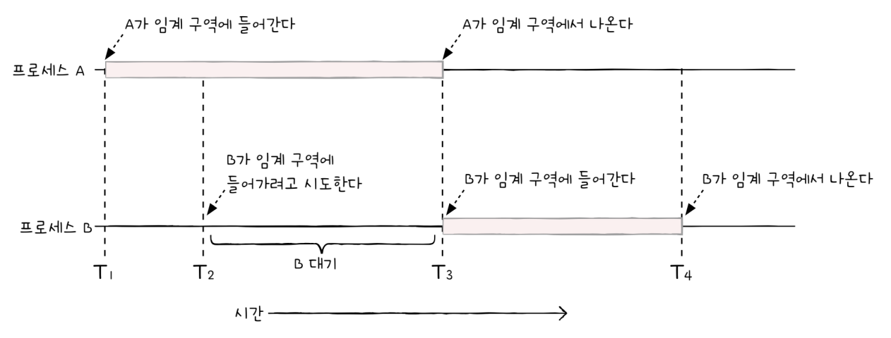
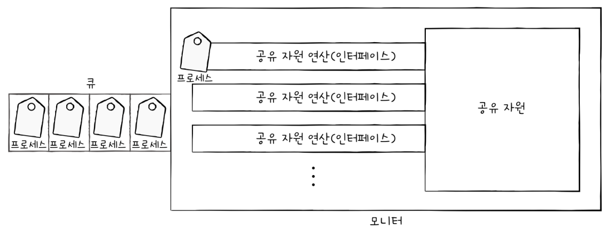
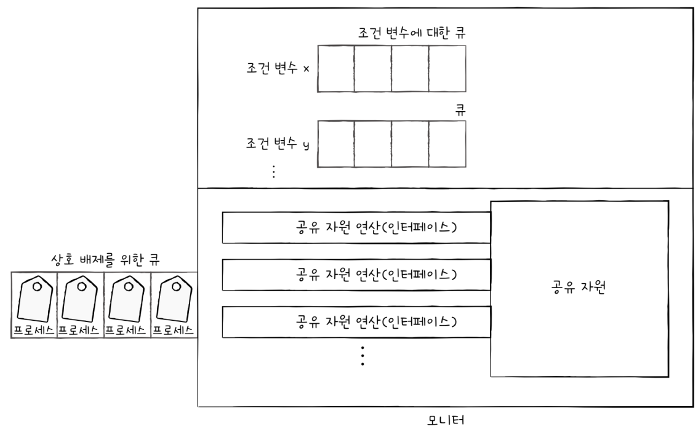

# 프로세스 동기화

## 12-1 동기화란

### 동기화의 의미

`프로세스 동기화`란 프로세스 사이의 수행 시기를 맞추는 것을 의미한다.
* 실행 순서 제어 : 프로세스를 올바른 순서대로 실행하기
* 상호 배제 : 동시에 접근해서는 안 되는 자원에 하나의 프로세스만 접근하게 하기

즉, 동기화에는 실행 순서 제어를 위한 동기화가 있고, 상호 배제를 위한 동기화가 있다.

	실행의 흐름을 가지는 모든 것은 동기화 대상이라, 스레드 또한 동기화의 대상이다.

#### 실행 순서 제어를 위한 동기화
파일을 쓰고 읽는 두가지 프로세스가 있다고 가정하면, 파일을 쓰는 프로세스가 먼제 파일을 생성해야 파일을 읽는 프로세스가 동작할 수 있다.
이렇게 동시에 실행되는 프로세스를 올바른 순서대로 실행되는 것이 `실행 순서 제어를 위한 동기화`이다.

#### 상호 배제를 위한 동기화
`상호 배제`(`mutual exclusion`)는 공유가 불가능한 자원의 동시 사용을 피하기 위해 사용하는 알고리즘이다. 
예를 들어 계좌에 10만원이 들어있을 때, 계좌에 2만원을 넣는 프로세스 A와 계좌에 5만원을 넣는 프로세스 B가 있다고 가정해보자.
두 프로세스가 동시에 실행됬다고 가정해보면, 실행 결과 계좌에 17만원이 남을 것을 기대하지만 동기화를 사용하지 않는다면, 실행 순서나 작업이 끝나는 순서에 따라서 12만원 혹은 15만원이 될 수 있다.
바로 계좌의 '잔액'이라는 데이터를 동시에 사용하기 때문이다.

이렇게 동시에 접근해서는 안 되는 자원에 동시에 접근하지 못하게 하는 것이 `상호 배제를 위한 동기화`이다.

### 생산자와 소비자 문제

생상자와 소비자 문제는 물건을 계속해서 생상하는 프로세스인 생산자, 물건을 계속해서 소비하는 프로세스인 소비자로 이루어져 있다.

생산자와 소비자는 '총합'이라는 데이터를 공유하고 있다. 생산자는 버퍼에 물건을 넣은 후, 물건의 총합에 해당하는 변수를 1 증가시키고, 소비자는 버퍼에 물건을 빼낸 후 물건의 총합에 해당하는 변수를 1 감소시킨다.

물건이 처음에 10개가 있다고 생각해보자. 그 후에 생산자를 100,000번, 소비자를 100,000번 동시에 실행한다.
총합의 변수가 10로 머물러 있을 것이라고 예상하지만 막상 동시에 실행해보면 예상치 못한 결과 나올 수 있다.

이는 생산자 프로세스와 소비자 프로세스가 제대로 동기화되지 않았기 때문이다.

### 공유 자원과 임계 구역

이전 예시에 나왔던 계좌의 `잔액`,물건의 `총합`이라는 공동의 자원을 `공유 자원`(`Shared Resource`)이라고 한다. 공유 자원은 전역 변수가 될 수도 있고, 파일이 될 수도 있고, 입출력장치, 보조기억장치가 될 수 있다.
그리고 이 공유 자원 중에는 두 개 이상의 프로세스를 동시에 실행하면 문제가 발생하는 자원이 있다. 
동시에 실행하면 문제가 발생하는 자원에 접근하는 코드 영역을 `임계 구역`(`Critical Section`)이라고 한다.
두 개 이상의 프로세스가 임계 구역에 진입하고자 하면 둘 중 하나는 대기해야 한다. 임계 구역에 먼저 진입한 프로세스의 작업이 마무리되면, 그제서야 기다렸던 프로세스가 임계 구역에 진입한다.

잘못된 실행으로 인해 여러 프로세스가 동시 다발적으로 임계 구역의 코드를 실행하여 문제가 발생하는 경우가 있다. 이를 `레이스 컨디션`(`Race Condition`)이라고 한다.
레이스 컨디션이 발생하면 데이터의 일관성이 깨지는 문제가 발생한다.

이때, 상호 배제를 위한 동기화는 이와 같은 일이 발생하지 않도록 두 개 이상의 프로세스가 임계 구역에 동시에 접근하지 못하도록 관리하는 것을 의미한다.

운영체제는 이러한 임계 구역 문제를 세 가지 원칙 하에 해결한다.
* 상호 배제 : 한 프로세스가 임계 구역에 진입했다면 다른 프로세스는 임계 구역에 들어올 수 없다.
* 진행 : 임계 구역에 어떤 프로세스도 진입하지 않았다면 임계 구역에 진입하고자 하는 프로세스는 들어갈 수 있어야 한다.
* 유한 대기 : 한 프로세스가 임계 구역에 진입하고 싶다면 그 프로세스는 언제가는 임계 구역에 들어올 수 있어야 한다.(무한정 대기해서는 안 된다.)

## 12-2 동기화 기법

### 뮤텍스 락

`뮤텍스 락`은 동시에 접근해서는 안 되는 자원에 동시에 접근하지 않도록 만드는 도구, 즉 상호 배제를 위한 동기화 도구이다.
임계 구역에 진입하는 프로세스는 '내가 지금 임계 구역에 있음'을 알리기 위해 뮤텍스 락을 이용해 임계 구역에 자물쇠를 걸어둘 수 있고, 다른 프로세스는 임계 구역이 잠겨 있다면 기다리고, 잠겨있지 않다면 임계 구역에 진입할 수 있다.

뮤텍스 락의 매우 단순한 형태는 하나의 전역 변수와 두 개의 함수로 구현할 수 있다.
* 자물쇠 역활 : 프로세스들이 공유하는 전역 변수 `lock`
* 임계 구역을 잠그는 역활 : `acquire`
* 임계 구역의 잠금을 해제하는 역활 : `release`

`acquire 함수`는 프로세스가 임계 구역에 진입하기 전에 함수다. 만일 임계 구역이 잠겨 있다면 임계 구역이 열릴 때까지 임계 구역을 반복적으로 확인하고, 임계 구역이 열려 있다면 암계 구역을 잠그는 함수다.

`release 함수`는 임계 구역에서의 작업이 끝나고 호출하는 함수다. 잠긴 임계 구역을 열어주는 함수라고 보면 된다.

임계 구역에 진입하려는 함수는 임계 구역이 열릴 때까지 계속 대기하게 되는데 이런 대기 방식을 `바쁜 대기`(`busy wait`)라고 한다.

### 세마포어

`세마포어`(`semaphore`)는 뮤텍스 락과 비슷하지만, 더 일반화된 방식의 동기화 도구이다. 뮤텍스 락은 하나의 공유 지원에 접근하는 프로세스를 상정한 방식이다. 하지만 공유 자원이 여러 개 있을 경우 여러 개의 프로세스가 각각 공유 자원에 접근이 가능해야 한다.

	세마포어의 종류에는 이진 세마포어와 카운팅 세마포어가 있지만, 이진 세마포어는 뮤텍스 락과 비슷한 개념이다.

세마포어는 철도 신호기에서 유래한 단어로 신호기가 내려가면 멈춤이고 올라오면 올라가면 가도 좋다는 신호이다. 세마포어는 이와 같이 '멈춤' 신호와 '가도 좋다'는 신호로써 임계 구역을 관리한다.

간략한 세마포어는 뮤텍스 락과 비슷하게 하나의 변수와 두 개의 함수로 단순하게 구현할 수 있다.
* 임계 구역에 진입할 수 있는 프로세스의 개수를 나타내는 `전역변수 S`
* 임계 구역에 들어가도 좋은지, 기다려야 할지를 알려주는 `wait 함수`
* 임계 구역 앞에서 기다리는 프로세스에 '이제 가도 좋다'고 신호를 주는 `signal 함수`

앞서 설명한 뮤텍스 락과 비슷한 문제가 발생하는데, 바로 사용할 수 있는 공유 자원이 없는 경우 프로세스는 무작정 무한히 반복하여 임계 구역에 들어가도 좋은지 확인해야 한다.
이렇게 바쁜 대기를 반복하며 확인할 시간에 CPU는 더 생산성 있는 작업을 할 수 있을 텐데, CPU 주기를 낭비한다는 점에서 손해이다.

그래서 실제로 세마포어는 다른 더 좋은 방식을 사용한다. wait 함수는 만일 사용할 수 있는 자원이 없을 경우 해당 프로세스 상태를 대기 상태로 만들고, 그 프로세스의 PCB를 세마포어를 위한 대기 큐에 집어넣는다. 그리고 다른 프로세스가 임계 구역에서의 작업이 끝나고 signal 함수를 호출하면 signal 함수는 대기 중인 프로세스를 대기 큐에서 제거하고, 프로세스 상태를 준비 상태로 변경한 뒤 준비 큐로 옮겨진다.

또한 세마포어를 이용해서 프로세스의 순서를 제어할 수 있다.
방법은 세마포어의 변수S를 0으로 두고 먼저 실행할 프로세스 뒤에 signal 함수, 다음에 실행할 프로세스 앞에 wait 함수를 붙이면 된다.

### 모니터

매번 임계 구역에 앞뒤로 일일이 wait와 signal  함수를 명시하는 것은 번거로운 일이다. 그리고 자칫 잘못된 코드로 예기치 못한 결과를 얻을 수도 있다.

그래서 최근에 등장한 동기화 도구가 `모니터`(`monitor`)이다. 모니터는 공유 자원과 공유 자원에 접근하기 위한 인터페이스를 묶어 관리한다. 그리고 프로세스는 반드시 인터페이스를 통해서만 공유 자원에 접근하도록 한다.

이를 위해 모니터를 통해 공유 자원에 접근하고자 하는 프로세스를 큐에 삽입하고, 큐에 삽입된 순서대로 하나씩 공유 자원을 이용하도록 한다. 즉, 모니터는 공유 자원을 다루는 인터페이스에 접근하기 위한 큐를 만들고, 모니터 안에 항상  하나의 프로세스만 들어오도록 하여 상호 배제를 위한 동기화를 제공한다.

이 밖에도 모니터는 세마포어와 마찬가지로 실행 순서 제어를 위한 동기화도 제공한다. 특정 조건을 바탕으로 프로세스를 실행하고 일시 중단하기 위해 모니터는 `조건 변수`(`Condition Variable`)를 사용하는데, 조건 변수는 프로세스나 스레드의 실행 순서를 제어하기 위해 사용하는 특별한 변수다.

	모니터가 조건 변수를 사용한다고 하지만 조건 변수와 모니터는 별개의 개념이다.

조건 변수로는 wait와 signal 연산을 수행할 수 있다. 우선 wait를 호출한 프로세스의 상태를 대기 상태로 전환하고 일시적으로 조건 변수에 대한 대기 큐에 삽입하는 연산이다. 

여기서 헷갈리면 안되는 점은 모니터에 진입하기 위해 삽입되는 큐와 wait가 호출되어 실행이 중단된 프로세스들이 삽입되는 큐는 다르다는 점이다. 전자는 모니터에 한 번에 하나의 프로세스만 진입하도록 하기 위해 만들어진 큐고, 후자는 모니터에 이미 진입한 프로세스의 실행 조건이 만족될 떄까지 잠시 실행이 중단되어 기다리기 위해 만들어진 큐다.

예를 들어 어떤 프로세스가 x.wait()로 x라는 조건 변수에 대한 wait 함수를 실행 시키면 조건 변수 x에 대한 큐에 삽입되어 실행이 중단된다.
그리고 다른 프로세스가 x.signal()을 실행시키면 큐에 담겨있던 프로세스가 다시 깨어나 모니터 안으로 들어올 수 있다.
다만 모니터 안에는 하나의 프로세스만 있을 수 있기 때문에 wait를 호출했던 프로세스는 signal을 호출한 프로세스가 모니터를 떠난 뒤 실행되거나, signal을 호출한 프로세스의 실행을 일시 중단하고 자신이 실행한 뒤 다시 signal을 호출한 프로세스를 재개한다.