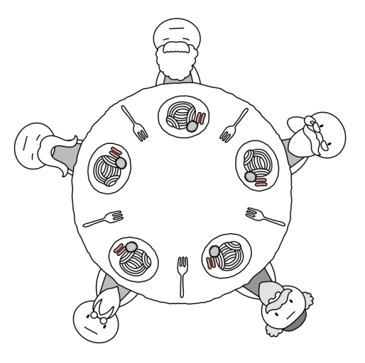
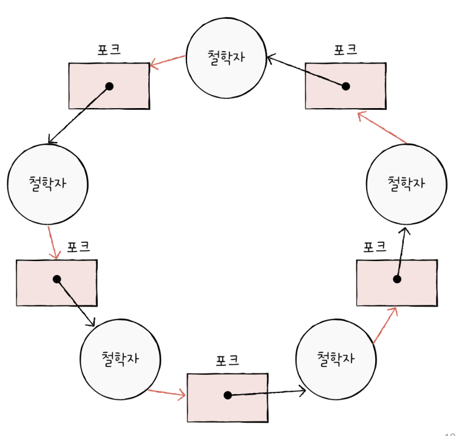

# 교착상태

## 13-1 교착 상태란?

### 식사하는 철학자 문제

`식사하는 철학자 문제`는 교착 상태를 설명하기 위한 아주 고전적인 문제 상황이다.
동그란 원탁에 다섯 명의 철학자가 앉아 있다. 철학자 앞에는 식사가 있고, 철학자들 사이에는 식사를 위한 포크가 있다. 그리고 음식은 두개의 포크로 먹을 수 있다.

철학자들은 다음과 같은 순서로 식사한다.
1. 계속 생각을 하다가 왼쪽 포크가 사용 가능하면 집어든다.
2. 계속 생각을 하다가 오른쪽 포크가 사용 가능하면 집어든다.
3. 왼쪽, 오른쪽 포크를 모두 집어들면 정해진 시간동안 식사를 한다.
4. 식사 시간이 끝나면 오른쪽 포크를 내려 놓는다.
5. 오른쪽 포크를 내려놓은 뒤 왼쪽 포크를 내려놓는다.
6. 1번부터 반복한다.

언뜻보면 아무런 문제가 없어보일 수 있지만, 어떤 철학자도 식사를 할 수 없고 영원히 생각만 하는 상황이 발생할 수 있다.
모든 철학자가 왼쪽 포크를 집어들면 모두가 오른쪽 포크를 집어 들 수 없기 떄문에, 다른 찰학자가 포크를 내려놓을 때까지 기다린다.

이렇게 일어나지 않을 사건을 기다리며 진행이 멈춰 버리는  현상을 `교착 상태`(`Deadlock`)라고 한다.

식사하는 철학자 문제에서 철학자는 '프로세스 혹은 스레드', 포크는 '자원', 생각하는 행위는 '자원을 기다리는 것'에 빗대어 볼 수 있다. 그리고 포크는 한 번에 하나의 프로세스 혹은 스레드만 접근할 수 있으니 '임계 구역'이라고 볼 수 있다.

교착 상태는 아주 다양한 상황에서 발생한다. 앞서 배운 뮤텍스 락에서도 교착 상태는 발생할 수 있다.

이러한 교착 상태를 해결하기 위해서는 첫째, 교착 상태가 발생했을 때의 상황을 정확히 표현하고, 둘째, 교착 상태가 일어나는 근본적인 이유에 대해서 알아야 한다.

### 자원 할당 그래프

교착 상태는 `자원 할당 그래프`(`Resource-allocation Graph`)를 통해 단순하게 표현할 수 있다. 자원 할당 그래프는 어떤 프로세스가 어떤 자원을 사용하고 있고, 또 어떤 프로세스는 어떤 자원을 기다리고 있는지를 표현하는 간단한 그래프이다.

자원 할당 그래프는 아래와 같은 규칙으로 그려진다.

#### 첫째, 프로세스는 원으로, 자원의 종류는 사각형으로 표현한다.

#### 둘째, 사용할 수 있는 자원의 개수는 자원 사각형 내에 점으로 표현한다.
같은 자원이라 할지라도 사용 가능한 자원의 개수는 여러 개 있을 수 있다. 예를 들어 하드 디스크가 세 개 있는 경우, 자원의 종류는 하드 디스크 하나지만, 사용 가능한 하드 디스크 개수는 세 개 이다.

#### 셋째, 프로세스가 어떤 자원을 할당받아 사용 중이라면 자원에서 프로세스를 향해 화살표를 표시한다.
프로세스가 자원 이용을 끝내고 운영체제에 자원을 반납하면 화살표는 삭제된다.

#### 넷째, 프로세스가 어떤 자원을 기다리고 있다면 프로세스에서 자원을 화살표로 표시한다.

앞서 식사하는 철학자 문제도 자원할당 그래프로 표현할 수 있다. 모든 철학자가 왼쪽 포크를 든 채 오른쪽 포크를 기다리는 상황이다.

교착 상태가 발생한 상황은 자원 할당 그래프가 원 형태를 띄고 있다.

### 교착 상태 발생 조건

교착 상태가 발생하는 조건에는 네 가지가 있다. `상호 배제`, `점유와 대기`, `비선점`, `원형 대기`이다. 즉, 넷 중에 하나라도 만족하지 않는다면 교착 상태가 발생하지 않지만, 아래 조건이 모두 만족될 때 교착 상태가 발생할 가능성이 생긴다고 보면 된다.

#### 상호 배제
우선 교착 상태가 발생한 근본적인 원인은 해당 자원을 한 번에 하나의 프로세스만 이용 가능했기 때문이다. 식사하는 철학자 문제에서 하나의 포크를 여러 명이 동시에 사용할 수 있있다면 교착 상태는 발생하지 않는다.
프로세스도 마찬가지로 사용하는 자원을 다른 프로세스가 사용할 수 없을 때, 즉 `상호 배제`상황에서 교착 상태가 발생할 수 있다.

#### 점유와 대기
식사하는 철학자 문제에서 누구도 식사를 이어나갈 수 없었던 이유는 '왼쪽 포크를 들고' 다른 철학자의 포크를 기다렸기 때문이다. 다시 말해 자원을 보유한 채 다른 자원을 기다렸기 때문에 문제가 발생했다. 
'자원을 할당받은 상태에서 다른 자원을 할당받기를 기다리는 상태'를 `점유와 대기`(`hold and wait`)라고 한다.

#### 비선점
만약 철학자들 중 누군가가 다른 철학자의 포크를 강제로 뺏앗을 수 있었다면 교착 상태는 발생하지 않았을 것이다.
이처럼 교착 상태가 발생하게 된 또 하나의 근본적인 문제는 프로세스가 자원을 `비선점`하고 있었기 때문이다. 비선점 자원은 그 자원을 이용하는 프로세스의 작업이 끝나야만 비로소 이용할 수 있다. 즉, 어떤 프로세스도 다른 프로세스의 자원을 강제로 빼앗지 못했기 때문이다.

#### 원형 대기
프로세스들과 프로세스가 요청 및 할당받은 자원이 원의 형태를 이루었기 떄문이다. 다시 말해 자원 할당 그래프가 원의 형태로 그려지면 교착 상태가 발생할 수 있다. 이렇게 프로세스들이 원의 형태로 자원을 대기하는 것을 `원형 대기`(`Circular wait`)라고 한다.

## 교착 상태 해결 방법

### 교착 상태 예방

교착 상태를 예방하는 방법은 교착 상태 발생 필요 조건 네 가지 중 하나를 충족하지 못하게 하는 방법과 같다.

#### 상호 배제 없애기
모든 자원을 공유 가능하게 만든다는 말과 같다. 다만, 이론적으로는 교착상태를 없앨 수 있지만 현실적으로 모든 자원의 상호 배제를 없애기는 어렵기 때문에 현실에서는 무리가 있는 방법이다.

#### 점유와 대기 없애기
운영체제는 특정 프로세스에 자원을 모두 할당하거나, 아예 할당하지 않는 방식으로 배분한다.

이 방식도 이론적으로 교착 상태를 해결할 수 있지만, 단점도 있다. 우선 자원의 활용률이 낮아질 우려가 있다. 한 프로세스에 필요한 자원들을 몰아주고, 그 다음에 다른 프로세스에 필요한 자원을 몰아줘야 한다. 당장 자원이 필요해도 기다릴 수 밖에 없는 프로세스와 사용되지 않으면서 오랫동안 할당되는 자원을 만들기 때문에 자원 활용률이 낮아진다.

그리고 점유와 대기를 금지하면 많은 자원을 사용하는 프로세스가 불리해진다. 자원을 많이 사용하는 프로세스는 자원을 적게 사용하는 프로세스에 비해 동시에 자원을 사용할 타이밍을 확보하기 어렵기 때문에 프로세스가 무한정 기다리게 되는 기아 현상을 야기할 수 있다.

#### 비선점 없애기
비선점을 없애면 자원을 이용 중인 프로세스로부터 자원을 빼앗을 수 있다. 이 방식은 선점하여 사용할 수 있는 일부 자원에 대해서 효과적이다. CPU는 프로세스들이 선점할 수 있는 대표적인 자원이다.

하지만 모든 자원이 선점 가능한 것은 아니다. 예를 들면 프린터를 이용하는 도중에 다른 프로세스가 프린터의 자원을 빼앗아서 사용하긴 어렵다. 그렇기에 비선점 조건을 없애기는 범용성이 떨어진다.

#### 원형 대기 없애기
방법은 간단하다. 모든 자원에 번호를 붙이고, 오름차순으로 자원을 할당하면 원형 대기는 발생하지 않는다.

예를 들어, 식사하는 철학자 문제에서 모든 포크에 1부터 5번까지 번호를 붙이고, 철학자들로 하여금 번호가 낮은 포크에서 높은 포크 순으로 집어들게 한다면 원형 대기는 발생하지 않는다. 5번 포크를 집어들고 1번을 집어들 수 없기 때문이다.

이는 마치 철학자들이 원형 식탁이 아니라 사각형 식탁에 일렬로 있는 상황과 유사하다.
앞선 세 방식에 비하면 비교적 현실적이고 실용적인 방식이지만, 단점 또한 존재한다.

모든 컴퓨터 내에 존재하는 수많은 자원에 번호를 붙이는 일은 간단한 작업이 아니고 각 자원에 어떤 번호를 붙이는지에 따라 특정 자원의 활용률이 떨어질 수 있다.

이렇게 교착 상태의 발생 조건을 원천적으로 제거하여 교착 상태를 사전에 방지하는 예방 방식은 교착 상태가 발생하지 않음을 보장할 수 있지만 여러 부작용이 따른다.

### 교착 상태 회피

`교착 상태 회피`는 교착 상태가 발생하지 않을 정도로만 자원을 할당하는 방식이다. 교착 상태 회피 방식에는 교착 상태를 한정된 자원의 무분별한 할당으로 인해 발생하는 문제로 간주한다.

프로세스들에  할당할 수 있는 자원이 충분한 상황에서 프로세스들이 한두 개의 적은 자원만을 요구한다면 교착 상태는 발생하지 않는다.

그렇기 때문에 프로세스들에 배분할 수 있는 자원의 양을 고려하여 교착 상태가 발생하지 않을 정도의 양만큼만 자원을 배분하는 방법이 교착 상태 회피이다.

교착 상태를 회피하는 방법을 알기 위해서는 안정 상태와 불안정 상태, 그리고 안전 순서열이라는 용어를 알아야 한다. 교착 상태가 발생하지 않고 모든 프로세스가 정상적으로 자원을 할당받고 종료될 수 있는 상태를 `안정 상태`(`safe state`)라고 부르고, 교착 상태가 발생할 수도 있는 상황을 `불안전 상태`(`unsafe state`)라고 부른다.
`안전 순서열`은 교착 상태 없이 안전하게 프로세스들에 자원을 할당할 수 있는 순서를 의미한다.
예를 들어, 브라우저, 메모장, 게임이 동시에 운영체제에 자원을 요구한 상황에서 웹 -> 메모장 -> 게임 순서대로 자원을 할당하면 교착 상태가 발생하지 않는다고 가정하면 웹 -> 메모장 -> 게임이 안전 순서열이 된다.
그레서 안전 순서열이 있는 상태를 안전 상태라고 볼 수 있다.
반면 `불안전 상태`는 안전 순서열이 없는 상태이다. 시스템이 불안전 상태에 놓이면 교착 상태가 발생할 수 있는 위험이 있다.

### 교착 상태 검출 후 회복
교착 상태 예방과 회피는 교착 상태 발생을 막기 위한 노력이였다면, `교착 상태 검출 후 회복`은 교착 상태 발생을 인정하고 사후에 조치하는 방식이다.

검출 후 회복 방식에서 운영체제는 프로세스들이 자원을 요구할 때마다 그때그때 모두 할당하며, 교착 상태 발생 여부를 주기적으로 검사한다. 그리고 교착 상태가 검출되면 그때 비로소 다음과 같은 방식으로 회복한다.

#### 선점을 통한 회복
선점을 통한 회복은 교착 상태가 해결될 때까지 한 프로세스의 자원을 몰아주는 방식이다. 교착 상태가 해결될 때까지 다른 프로세스로부터 자원을 강제로 빼앗고 한 프로세스에 할당하는 방식이다.

#### 프로세스 강제 종료를 통한  회복
프로세스 강제 종료를 위한 회복은 가장 단순하면서 확실한 방법이다. 운영체제는 교착 상태에 놓인 프로세스를 모두 강제 종료할 수도 있고, 교착 상태가 없어질 때까지 한 프로세스씩 강제 종료할 수도 있다.
전자는 한 번에 교착 상태를 해결할 수 있는 가장  확실한 방법이지만 그만큼 많은 프로세스들이 작업 내역을 읽게 될 가능성이 있고, 후자는 작업 내역을 잃는 프로세스는 최대한 줄일 수 있지만 교착 상태가 없어졌는지 여부를 확인하는 과정에서 오버헤드를 야기한다.

#### 교착 상태 무시
그냥 무시하는 방식도 있으며 `타조 알고리즘`이라는 이름도 있다. 문제의 발생 빈도나 심각성에 따라 때때로 이 방식이 적합할 때도 있다.