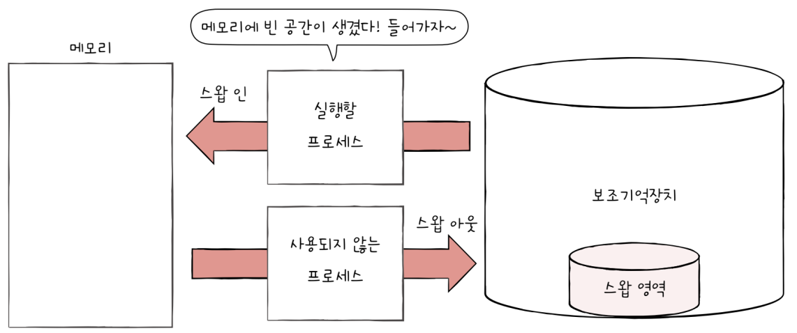
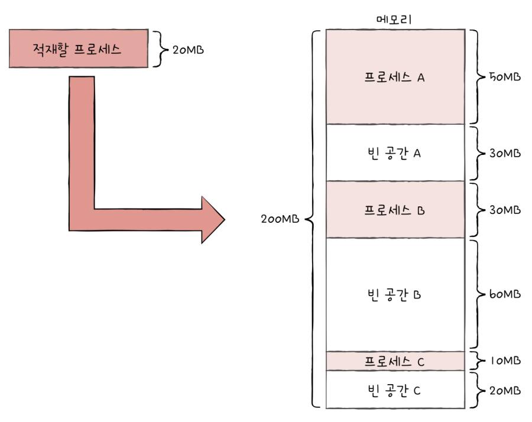
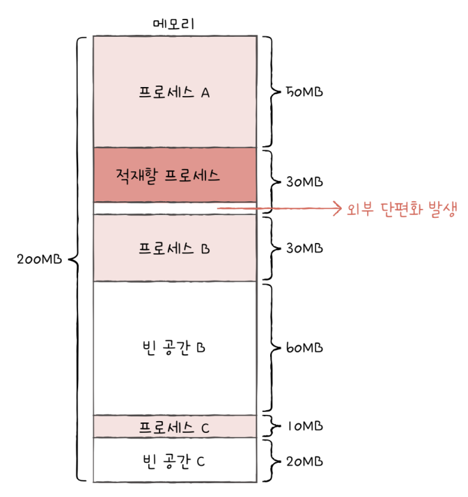
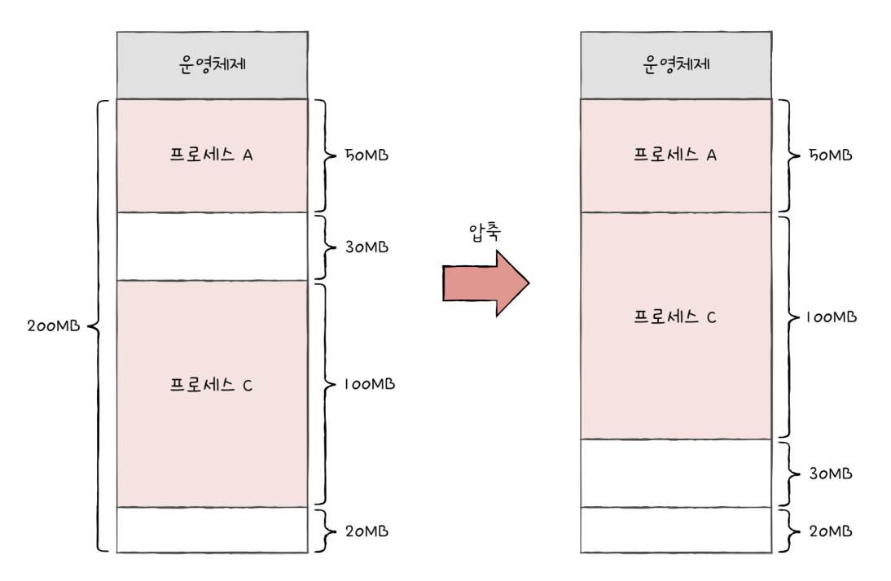
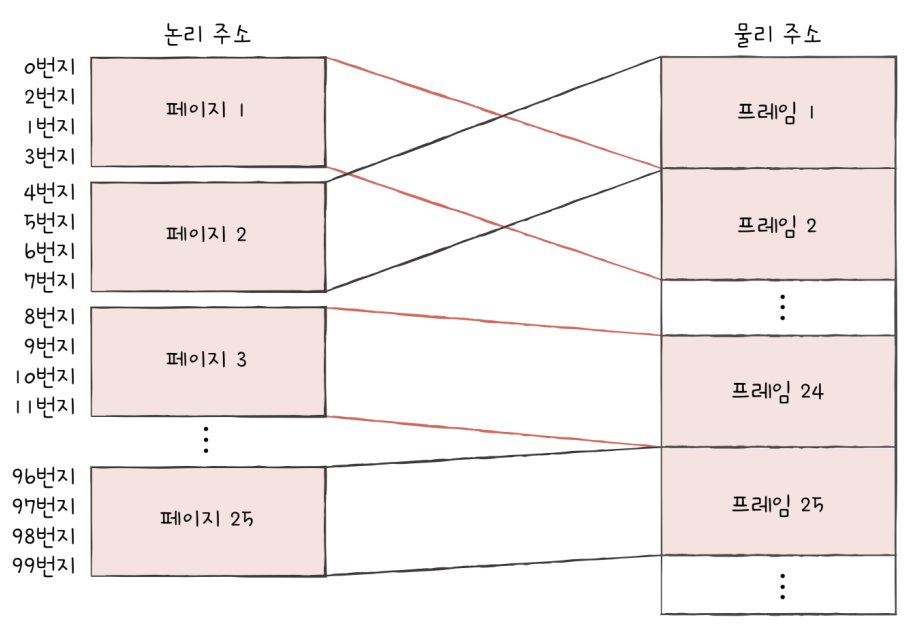
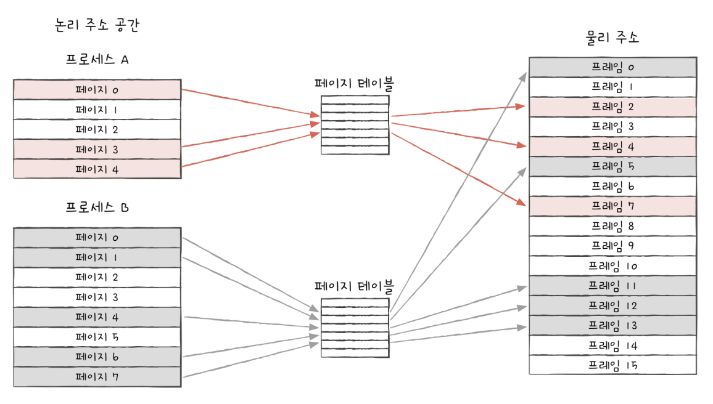
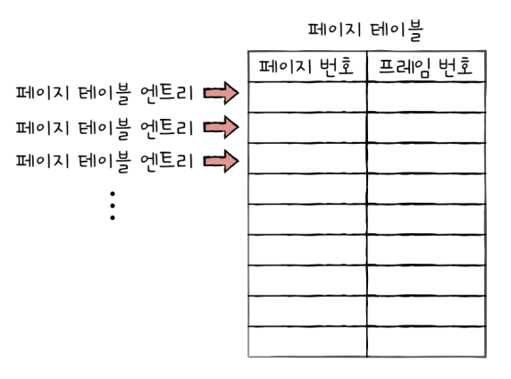
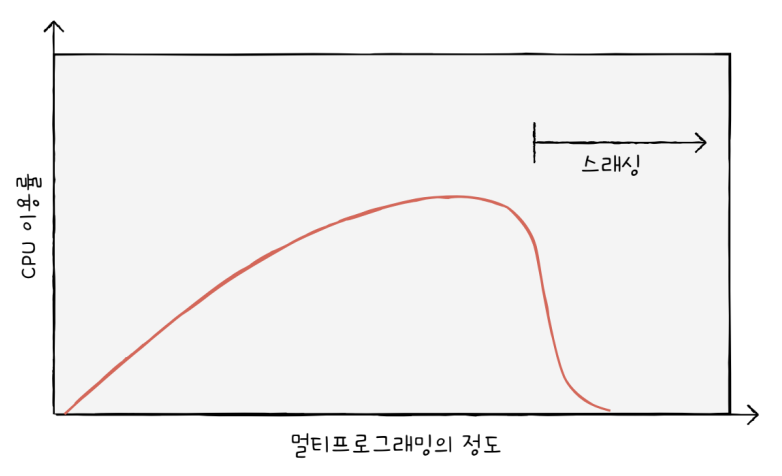
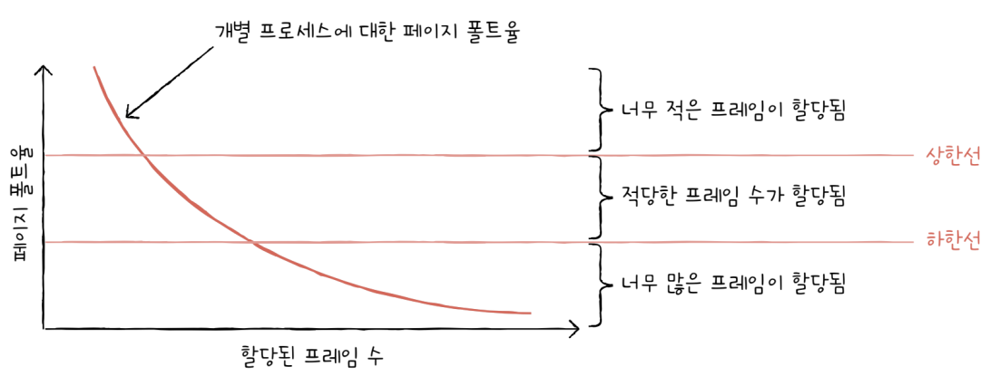

# 가상 메모리

## 14-1 연속 메모리 할당

### 스와핑

메모리에 적재된 프로세스들 중에는 현재 실행되지 않는 프로세스가 있을 수 있다. 입출력 작업의 요구로 대기 상태가 된 프로세스라던지, 오랫동안 사용되지 않은 프로세스가 이런 프로세스들에 속한다.
이런한 프로세스들은 임시로 보조기억장치 일부 영역으로 쫓아내고, 그렇게 해서 생긴 메모리상의 빈 공간에 또 다른 프로세스를 적재하여 실행하는 방식을 `스와핑` 이라고 한다.

이때 프로세스들이 쫓겨나는 보조기억장치의 일부 영역을 `스왑 영역`이라고 한다. 그리고 현재 실행되지 않은 프로세스가 메모리에서 스왑 영역으로 옮겨지는 것을 `스왑 아웃`, 반대로 스왑 영역에 있던 프로세스가 다시 메모리로 옮겨오는 것을 `스왑 인`이라고 한다. 
스왑 아웃되었던 프로세스가 다시 스왑 인될 때는 스왑 아웃되기 전의 물리 주소와는 다른 주소에 적재될 수 있다.



스와핑을 이용하면 프로세스들이 요구하는 메모리 주소 공간의 크키가 실제 메모리 크기보다 큰 경우에도 프로세스들을 동시 실행할 수 있다.

### 메모리  할당

프로세스는 메모리 내의 빈 공간에 적재되어야 한다. 비어 있는 메모리 공간에 프로세스를 연속적으로 할당하는 방식이 있다.
대표적으로 `최초 적합`, `최적 적합`, `최악 적합`의 세 가지 방식이 있다.
다음과 같은 상황에서 20MB의 프로세스를 적재하고 싶다고 가정해보자.



#### 최초 적합
`최초 적합`(`first fit`)은 운영체제가 메모리 내의 빈 공간을 순서대로 검색하다가 적재할 수 있는 공간을 발견하면 그 공간에 프로세스를 배치하는 방식이다.
즉 운영체제가 빈 공간 A -> B -> C 순으로 빈 공간을 검색했다면 프로세스는 빈 공간 A에 적재된다.
최초 적합 방식은 프로세스가 적재될 수 있는 공간을 발견하는 즉시 메모리를 할당하는 방식이므로 검색을 최소화할 수 있고 결과적으로 빠른 할당이 가능하다.

#### 최적 적합
`최적 적합`(`best fit`)은 운영체제가 빈 공간을 모두 검색해 본 후, 프로세스가 적재될 수 있는 공간 중 가장 작은 공간에 프로세스를 배치하는 방식이다. 
예시에서 가장 작은 공간은 C임으로 최적 적합 방식으로 메모리를 할당하면 프로세스는 공간 C에 할당된다.

#### 최악 적합
`최악 적합`(`worst fit`)은 운영체제가 빈 공간을 모두 검색해 본 후, 프로세스가 적재될 수 있는 공간 중 가장 큰 공간에 프로세스를 배치하는 방식이다. 
예시에서는 B에 할당된다.

### 외부 단편화
연속 메모리 할당은 당연하게 느껴질 수 있으나 효율적으로 사용하는 방법은 아니다. 연속 메모리 할당은 `외부 단편화`(`external fragmentation`)이라는 문제를 내포하고 있기 때문이다.

프로세스들이 메모리에 연속적으로 할당되는 환경에서 실행되고 종료되기를 반복하며 메모리 사이에 빈 공간들이 생긴다. 프로세스 바깥에 생기는 이러한 빈 공간들은 분명 빈 공간이지만 그 공간보다 큰 프로세스를 적재하기 어려운 상황을 초래하고, 메모리 낭비로 이어진다. 이런 현상을 `외부 단편화`라고 한다.



예시에서는 프로세스가 몇 개 없는 간단한 상황이기에 외부 단편화가 큰 문제가 아닌 것처럼 보일 수 있지만, 실제로는 이보다 메모리 용량도 크고 적재되는 프로세스도 많기 때문에 외부 단편화로 낭비되는 공간은 더 크다.

외부 단편화를 해결할 수 있는 대표적인 방안으로 메모리를 `압축`(`compaction`)하는 방법이 있다. 메모리 조각 모음이라고도 부른다. 압축은 여기저기 흩어진 빈 공간을 하나로 모으는 방식으로 메모리 내에 저장된 프로세스를 적당히 재배치시켜 하나의 큰 공간으로 만드는 방법이다.



다만 압축 방식에는 여러 단점이 있다. 작은 빈 공간을 모으는 동안 시스템은 하던 일을 중지해야 하고, 메모리에 있는 내용을 옮기는 작업은 많은 오버헤드를 야기하며, 어떤 프로세스를 어떻게 움직이여 오버헤드를 최소화하며 압축할 수 있는지에 대한 명확한 방법을 결정하기 어렵다.
이에 외부 단편화를 없앨 수 있는 다른 해결 방법인 가상 메모리 기법, 그 중에서도 페이징 기법을  사용한다.

## 14-2 페이징을 통한 가상 메모리 관리

### 페이징이란
연속 메모리 할당 방식에서 외부 단편화가 생긴 근본적인 이유는 각기 다른 크기의 프로세스가 메모리에 연속적으로 할당되었기 떄문이다.

만일 메모리와 프로세스를 일정한 단위로 자르고, 이를 메모리에 불연속적으로도 할당할 수 있다면 외부 단편화는 발생하지 않는다.
이것이 `페이징`이다.

페이징은 프로세스의 논리 주소 공간을 `페이지`라는 일정한 단위로 자르고, 메모리 물리 주소 공간을 `프레임`이라는 페이지와 동일한 크기의 단위로 자른 뒤 페이지를 프레임에 할당하는 가상 메모리 관리 기법이다.



페이징에도 스와핑을 사용할 수 있다. 페이징을 사용하는 시스템에서는 프로세스 전체가 스왑 아웃/수왑 인되는 것이 아닌 페이지 단위로 스왑 아웃/스왑 인된다. 
즉, 메모리에 적재될 필요가 없는 페이지들은 보조기억장치로 스왑아웃되고, 실행에 필요한 페이지들은 메모리로 스왑 인되는 것이다.
페이징 시스템에서는 스왑 아웃은 `페이지 아웃`, 스왑 인은 `페이지 인`이라고 부르기도 한다.

이는 달리 말하면 한 프로세스를 실행하기 위해 프로세스 전체가 메모리에 적재될 필요가 없다는 말과 같다. 

### 페이지 테이블

프로세스가 메모리에 불연속적으로 배치되어 있다면 CPU 입장에서 이를 순차적으로 실행할 수 없다. CPU 입장에서 '다음에 실행할 명령어 위치'를 찾기가 어려워진다.

이를 해결하기 위해 페이지 시스템은 프로세스가 비록 물리 주소에 불연속적으로 배치되더라도 논리 주소에는 연속적으로 배치되도록 `페이지 테이블`을 이용한다.

페이지 테이블은 페이지 번호와 프레임 번호를 이어주는 이정표다. CPU로 하여금 페이지 번호만 보고 해당 페이지가 적재된 프레임을 찾을 수 있게 합니다. 다시 말해 페이지 테이블은 현재 어떤 페이지가 어떤 프레임에 할당되었는지를 알려준다.



프로세스마다 각자의 프로세스 테이블이 있다. 각 프로세스의 페이지 테이블들은 메모리에 적재되어 있다. 그리고 CPU 내의 `페이지 테이블 베이스 레지스터`(`PTBR`)는 각 프로세스의 페이지 테이블이 적재된 주소를 가르키고 있다.
예를 들어 프로세스 A가 실행될 때 PTBR은 프로세스 A의 페이지 테이블을 가리키고, CPU는 프로세스 A의 페이지 테이블을 통해 프로세스 A의 페이지가 적재된 프레임을 알 수 있다.

	이러한 각 프로세스들의 페이지 테이블 정보들은 각 프로세스의 PCB에 기록된다. 그리고 프로세스의 문맥 교환이 일어날 때 레지스터와 마찬가지로 함께 변경된다.

그런데 이렇게 페이지 테이블을 메모리에 두면 문제가 있다. 메모리 접근 시간이 두 배로 늘어난다는 점이다. 메모리에 있는 페이지 테이블에 접근하기 위해 한 번, 그렇게 알게 된 프레임에 접근하기 위해 한 번, 이렇게 두 번의 접근이 필요하다.

이런 문제를 해결하기 위해 CPU 곁에 (일반적으로는 MMU에) `TLB`(`Translation Lookaside Buffer`)라는 페이지 테이블의 캐시 메모리를 둔다. TLB는 페이지 테이블의 캐시이기 때문에 페이지 테이블의 일부 내용을 저장한다. 참조 지역성에 근거해 주로 최근에 사용된 페이지 위주로 가져와 저장한다.

CPU가 발생한 논리 주소에 대한 페이지 번호가 TLB에 있는 경우 이를 `TLB 히트`라고 한다. 이 경우 페이지가 적재된 프레임을 알기 위해 메모리에 접근할 필요가 없다.
그리고 페이지 번호가 TLB에 없는 경우를 `TLB 미스`라고 한다.

### 페이징에서의 주소 변환

하나의 페이지 혹은 프레임은 여러 주소를 포괄하고 있다. 그렇기에 특정 주소에 접근하려면 아래와 같은 두 가지 정보가 필요하다.
* 어떤 페이지  혹은 프레임에 접근하고 싶은지
* 접근하려는 주소가 그 페이지 혹은 프레임으로부터 얼마나 떨어져 있는지

그렇기에 페이징 시스템에서 모든 논리 주소가 기본적으로 `페이지 번호`(`Page Number`)와 `변위`(`Offset`)로 이루어져있다.
가령 CPU가 32비트 주소로 내보냈다면 이 중 N비트는 페이지 번호, 32-N비트는 변위 이런 식이다.

페이지 번호는 말그래돌 접근하고자 하는 페이지 번호이다. 페이지 테이블에서 해당 페이지 번호를 찾으면 페이지가 어떤 프레임에  할당되었는지를 알 수 있다.
변위는 접근하려는 주소가 프레임의 시작 번지로부터 얼만큼 떨어져 있는지를 알기 위한 정보이다.
즉, 논리 주소 <페이지 번호, 변위>는 페이지 테이블을 통해 물리 주소 <프레임 번호, 변위>로 변환된다.

	논리 주소의 변위와 물리 주소의 변위 값은 같다.

### 페이지 테이블 엔트리

페이지 테이블의 각 엔트리, 다시 말해 페이지 테이블의 각각의 행들을 `페이지 테이블 엔트리`라고 한다.



실은 페이지 테이블 엔트리에는 이외에도 다른 중요한 정보들이 있다. 대표적인 것이 유효 비트, 보호 비트, 참조 비트, 수정 비트이다.

#### 유효 비트
`유효 비트`는 현재 해당 페이지에 접근 가능한지 여부를 알려준다. 페이지 테이블 엔트리에서 프레임 번호 다음으로 중요한 정보라고도 볼 수 있다. 
일반적으로 프로세스를 이루는 모든 페이지는 메모리에 있지 않는다. 일부 페이지는 보조기억장치(스왑 영역)에 있는 경우가 많다. 
유효 비트는 현재 페이지가 메모리에 적재되어 있는지 아니면 보조기억장치에 있는지를 알려주는 비트다.

만약 메모리에 적재되어 있지 않은 페이지로 접근하는 경우에는 `페이지 폴트`라는 예외가 발생한다.

CPU가 페이지 폴트를 처리하는 과정은 하드웨어 인터럽트를 처리하는 과정과 유사하다.
1. CPU는 기존 작업의 내역을 백업한다.
2. 페이지 폴트 처리 루틴을 실행한다.
3. 페이지 처리 루틴은 원하는 페이지를 메모리로 가져온 뒤 유효 비트를 바꿔준다.
4. 페이지 폴트를 처리했다면 CPU는 해당 페이지에 접근할 수 있다.

#### 보호 비트
`보호 비트`는 페이지 보호 기능을 위해 존재하는 비트이다. 보호 비트를 통해 해당 페이지가 읽고 쓰기가 모두 가능한 페이지인지, 혹은 읽기만 가능한 페이지인지를 나타낼 수 있다.
프로세스를 이루는 요소 중 코드 영역은 읽기 전용 영역이라서 읽기 전용 페이지에 쓰인다. 이와 같은 방식으로 페이지를 보호한다.

보호비트는 세 개의 비트로 더 복잡하게 구현할 수도 있다. 읽기를 나타내는 r, 쓰기를 나타내는 w, 실행을 나타내는 x의 조합으로 읽기, 쓰기, 실행하기 권한의 조합으로 나타낼 수도 있다.

#### 참조 비트
`참조 비트`는 CPU가 이 페이지에 접근한 적이 있는지 여부를 나타낸다. 적재 이후 CPU가 읽거나 쓴 페이지는 참조 비트가 바뀌고, 적재 이후 한 번도 읽거나 쓴 적이 없는 페이지는 유지된다.

#### 수정 비트
`수정 비트`는 해당 페이지에 데이터를 쓴 적이 있는지 없는지 수정 여부를 알려준다. `더티 비트`라고도 부른다.
수정 비트는 페이지가 메모리에서 사라질 때 보조기억장치에 쓰기 작업을 해야 하는지, 할 필요가 없는지를 판단하기 위해 존재한다.

수정을 하지 않는 경우에는 스왑 아웃될 경우에 아무런 추가 작업 없이 새로 적재된 페이지로 덮어쓰기만 하면된 된다.
하지만 CPU가 쓰기 작업을 수행한 페이지의 경우 보조기억장치에 저장된 페이지의 내용과 메모리에 저장된 페이지의 내용이 서로 다른 값을 가지고 있다. 이런 경우 스왑 아웃하는 경우 변경된 값을 보조기억장치에 기록하는 작업이 추가되어야 한다.

##### 페이징의 이점 - 쓰기 시 복사
외부 단편화 문제 말고도 페이징이 제공하는 이점이 있다. 대표적인 것이 프로세스 간에 페이지를 공유할 수 있다는 점이다.
프로세스 간 페이지를 공유하는 사례로는 `쓰기 시 복사`(`copy on write`)가 있다.

유닉스나 리눅스와 같은 운영체제에서 fork 시스템  호출을 하면 부모 프로세스의 복사본이 자식 프로세스로 만들어진다. '프로세스 간에는 기본적으로 자원을 공유하지 않는다'라는 개념에서 보면 새롭게 생성된 자식 프로세스의 코드 및 데이터 영역은 부모 프로세스가 적재된 메모리 공간과는 전혀 다른 메모리 공간에 생성된다. 
하지만 이 복사 작업은 프로세스 생성 시간을 늦추고 불필요한 메모리 낭비를 야기한다.

반면 쓰기 시 복사에서는 부모 프로세스와 동일한 자식 프로세스가 생성되면 자식 프로세스가 부모 프로세스와 동일한 프레임을 가르킨다. 
만일 부모 프로세스와 자식 프로세스가 메모리에 어떠한 데이터도 쓰지 않고 그저 읽기 작업만 이어 나간다면 이 상태가 지속된다.

그런데 부모 혹은 자식 프로세스 중에 하나가 페이지에 쓰기 작업을 하면 그 순간 페이지가 별도의 공간으로 복제된다. 그 프로세스는 자신의 고유한 페이지가 할당된 프레임을 가르킨다. 이것이 `쓰기 시 복사`이다.

## 14-3 페이지 교체와 프레임 할당

### 요구 페이징
프로세스를 메모리에 적재할 때 처음부터 모든 페이지를 적재하지 않고 필요한 페이지만을 메모리에 적재하는 기법을 `요구 페이징`이라고 한다. 이름 그대로 실행에 요구되는 페이지만 적재하는 기법이다.
1. CPU가 특정 페이지가 접근하는 명령어를 실행한다.
2. 해당 페이지가 현재 메모리에 있을 경우 CPU는 페이지가 적재된 프레임에 접근한다.
3. 해당 페이지가 현재 메모리에 없을 경우 페이지 폴트가 발생한다.
4. 페이지 폴트 루틴은 해당 페이지를 메모리에 적재하고 유효 비트를 바꾼다.

참고로 아무런 페이지도 메모리에 적재하지 않은 채 무작정 실행할 수 있다. 이 경우 프로세스의 첫 명령어를 실행하는 순간부터 페이지 폴트가 계속 발생하게 되고, 실행에 필요한 페이지가 어느 정도 적재된 이후부터는 페이지 폴트 발생 빈도가 떨어진다.
이를 `순수 요구 페이징`기법이라고 한다.

요구 페이징 시스템이 안정적으로 작동하려면 필연적으로 다음 두 가지를 해결해야 한다. 하나는 `페이지 교체`이고, 다른 하나는 `프레임 할당`이다.

요구 페이징 기법으로 페이지들을 적재하다 보면 언젠가 메모리가 가득 차게 된다. 이때는 당장 실행에 필요한 페이지를 적재하기 위해 메모리에 적재된 페이지를 보조기억장치로 내보내야 한다. 메모리에 적재된 많고 많은 페이지를 내보내는지 결정하는 방법이 페이지 교체 알고리즘이다.
즉 쫒아낼 페이지를 결정하는 방법을 `페이지 교체 알고리즘`이라고 한다.

### 페이지 교체 알고리즘

좋은 페이지 교체 알고리즘이란 페이지 폴트를 가장 적게 일으키는 알고리즘이다. 페이지 폴트가 일어나면 보조기억장치로부터 필요한 페이지를 가져와야 하기 때문에 메모리에 적재된 페이지를 가져오는 것보다 느려지기 때문이다.

그렇기에 페이지 교체 알고리즘을 제대로 이해하려면 `페이지 폴트 횟수`를 알 수 있어야 한다. 그리고 페이지 폴트 횟수는 `페이지 참조열`을 통해 알 수 있다. 
페이지 참조열은 CPU가 참조하는 페이지들 중 연속된 페이지를 생략한 페이지열을 의미한다. 예를 들어 CPU가 아래와 같은 순서로 페이지에 접근했다고 가정해보자.

```
2 2 2 3 5 5 5 3 3 7
```

여기서 연속된 페이지를 생략한 페이지열은 다음과 같다.

```
2 3 5 3 7
```

연속된 페이지를 생략하는 이유는 중복된 페이지를 참조하는  행위는 페이지 폴트를 발생시키지 않기 때문이다.

#### FIFO 페이지 교체 알고리즘
`FIFO 페이지 교체 알고리즘`(`First-In First-Out Page Replacement Algorithm`)은 가장 단순한 방법이다. 이름 그대로 메모리에 가장 먼저 올라온 페이지부터 내쫓는 방식이다.

FIFO 페이지 교체 알고리즘은 아이디어와 구현이 간단하지만, 마냥 좋은 것은 아니다. 프로그램 실행 초기에는 적재된 페이지 속에는 프로그램 실행 초기에 잠깐 실행되다가 이후에 사용되지 않을 페이지도 있겠지만, 프로그램 실행 내내 사용될 내용도 포함하고 있을 수 있다.

#### 최적 페이지 교체 알고리즘
`최적 페이지 교체 알고리즘`은 CPU에 의해 참조되는 횟수를 고려하는 페이지 교체 알고리즘이다. 메모리에 오랫동안 남아야 할 페이지는 자주 사용될 페이지고, 반대로 메모리에 없어도 될 페이지는 오랫동안 사용되지 않을 페이지이다.
그렇기에 다른 페이지 교체 알고리즘에 비해 페이지 폴트 발생 빈도가 낮다.

다만, 최적 페이지 교체 알고리즘은 실제 구현이 어렵다. 최적 페이지 교체 알고리즘은 앞으로 오랫동안 사용되지 않을 페이지를 내보내는 알고리즘이다. 하지만 '앞으로 오랫동안 사용되지 않을 페이지'를 예측하기가 어렵다.
그래서 운영체제에서 사용하기보단, 주로 다른 페이지 교체 알고리즘의 이론상 성능을 평가하기 위한 목적으로 사용된다.

#### LRU 페이지 교체 알고리즘
오랫 동안 사용되지 '않은' 페이지를 교체하는 알고리즘이 `LRU 페이지 교체 알고리즘`(`Least Recently Used Page Replacement Algorithm`)이다.

LRU 페이지 교체 알고리즘은 '최근에 사용되지 않은 페이지는 앞으로도 사용되지 않을 것'이라는 아이디어를 토대로 만들어진 알고리즘이다. 페이지마다 마지막으로 사용한 시간을 토대로 최근에 가장 사용이 적었던 페이지를 교체한다.

### 스래싱과 프레임 할당

프로세스가 사용할 수 있는 프레임 수가 적어도 페이지 폴트는 자주 발생한다. 반대로 프로세스가 사용할 수 있는 프레임 수가 많으면 일반적으로 페이지 폴트 빈도는 감소한다. 
CPU가 페이지 교체에 너무 많은 시간을 쏟으면 당연히 성능에도 큰 악영향을 초래한다. 이처럼 프로세스가 실제 실행되는 시간보다 페이징에 더 많은 시간을 소요하여 성능이 저해되는 문제를 `스레싱`(`Thrashing`)이라고 한다.

스래싱을 그래프로 표현하면 아래와 같다. CPU 이용률을 통해 CPU가 얼마나 쉴 새 없이 일을 하고 있는지를 알 수 있다. 멀티 프로그래밍의 정도를 통해 메모리에 올라와 있는 프로세스의 수를 알 수 있다. 메모리에서 동시에 실행되는 프로세스의 수를 `멀티 프로그래밍의 정도`라고 한다.



이 그래프는 동시에 실행되는 프로세스의 수를 늘린다고 CPU 이용률이 그에 비례해서 증가하는 것이 아님을 나타낸다. 
동시에 실행되는 프로세스 수가 어느 정도 증가하면 CPU 이용률이 높아지지만, 필요 이상으로 늘리면 각 프로세스들이 사용할 수 있는 프레임 수가 적어지기 때문에 페이지 폴트가 지나치게 빈번하게 발생하고, 이에 따라 CPU 이용률이 떨어져 전체적인 성능이 저해된다.
CPU 성능이 아무리 뛰어나도 물리 메모리가 너무 작다면 전체 컴퓨터의 성능이 안좋아 지는 이유는 이러한 이유 떄문이다.

스래싱이 발생하는 근본적인 원인은 각 프로세스가 필요로 하는 최소한의 프레임 수가 보장되지 않았기 때문이다. 그렇기에 운영체제는 각 프로세스들이 무리 없이 실행하기 위한 최소한의 프레임 수를 파악하고 프로세스들에 적절한 수만큼 프레임을 할당해 줄 수 있어야 한다.

우선 가장 단순한 `프레임 할당 방식`을 생각해보자. 모든 프로세스에 균등하게 프레임을 제공하는 방식이다. 이러한 프레임 할당 방식을 `균등 할당`방식이라고 한다.

하지만 이는 그리 권장할 만한 방법은 아니다. 실행되는 프로세스들의 크기는 각기 다른데, 동일한 프레임 개수를 할당하는 것은 비합리적이다. 그래서 프로세스의 크기가 크면 프레임을 많이 할당하고 프로세스 크기가 작으면 적게 할당하면 이를 `비례 할당`이라고 한다.

	균당 할당과 비례 할당 방식은 프로세스의 실행 과정을 고려하지 않고 단순히 프로세스의 크기와 물리 메모리의 크기만을 고려한 방식이라서 정적 할당 방식이라고도 한다.

하지만 비례 할당 또한 완벽한 방식은 아니다. 프로세스의 크기가 클지라도 막상 많은 프레임을 필요로 하지 않는 경우도 있다.
그래서 프로세스를 실행하는 과정에서 배분할 프레임을 결정할 수 있는데 크게 `작업 집합 모델`을 사용하는 방식과 `페이지 폴트 빈도`를 사용하는 방식이 있다.

	이 두 개 방식은 프로세스의 실행을 보고 할당할 프레임 수를 결정한다는 점에서 동적 할당 방식이라고 한다.

스레싱이 발생하는 이유는 빈번한 페이지 교체 때문이다. 그렇기에 작업 집합 모델 기반 프레임 할당 방식은 `프로세스가 일정 기간 동안 참조한 페이지 집합`을 기억하여 빈번한 페이지 교체를 방지한다.

CPU가 메모리를 참조할 때에는 참조 지역성의 원리에 의거해 주로 비슷한 구역을 집중적으로 참조한다. 그렇다면 CPU가 특정 시간 동안 주로 참조한 페이지 개수만큼만 프레임을 할당하면 페이지 교체는 빈번하게 발생하지 않는다. 

실행 중인 프로세스가 일정 시간 동안 참조한 페이지의 집합을 `작업 집합`이라고 한다. CPU가 과거에 주로 참조한 페이지를 작업 집합에 포함한다면 운영체제는 작업 집합의 크기만큼만 프레임을 할당해 주면 된다.

그리고는 페이지 폴트 빈도를 기반으로 한 프레임 할당 방식도 있다.
1. 페이지 폴트율이 너무 높으면 그 프로세스는 너무 적은 프레임을 갖고 있다.
2. 페이지 폴트율이 너무 낮으면 그 프로세스는 너무 많은 프레임을 갖고 있다.

이를 페이지 폴트율과 할당된 프레임 수의 그래프로 그려보면 반비례 관계가 된다. 거기서 임의의 페이지 폴트율 상한선과 하한선을 정해서 페이지 폴트율이 상한선보다 높아지면 프레임을 더 할당해주고, 페이지 폴트율이 하한선보다 더 낮아지면 프레임을 회수한다.



즉, 페이지 폴트 기반 프레임 할당 방식은 페이지 폴트율에 상한선과 하한선을 정하고, 이 범위 안에서만 프레임을 할당하는 방식이다.