# 파일 시스템

## 15-1 파일과 디렉터리

### 파일
우리가 일상적으로 컴퓨터를 이용할 때는 파일 단위로 이용한다. `파일`이란 하드 디스크나 SSD와 같은 보조기억장치에 저장된 관련 정보의 집합을 의미한다. 다르게 표현하자면 파일은 의미 있고 관련 있는 정보를 모은 논리적 단위를 의미한다.

모든 파일에는 이름과 파일을 실행하기 위한 정보, 그리고 파일 관련 부가 정보가 있다. 이 부가 정보를 `속성`(`attribute`) 또는 `메타데이터`(`metadata`)라고 부른다.

#### 파일 속성과 유형
운영체제마다 유지하는 파일 속성은 조금씩 차이가 있지만, 대표적인 속성의 종류는 다음과 같다.

| 속성 이름        | 의미                                                               |
| ---------------- | ------------------------------------------------------------------ |
| 유형             | 운영체제가 인지하는 파일의 종류를 나타낸다.                        |
| 크기             | 파일의 현재 크기와 허용 가능한 최대 크기를 나타낸다.               |
| 보호             | 어떤 사용자가 해당 파일을 읽고, 쓰고, 실행할 수 있는지를 나타낸다. |
| 생성 날짜        | 파일이 생성된 날짜를 나타낸다.                                     |
| 마지막 접근 날짜 | 파일에 마지막으로 접근한 날짜를 나타낸다.                          |
| 마지막 수정 날짜 | 파일이 마지막으로 수정된 날짜를 나타낸다.                          |
| 생성자           | 파일을 생성한 사용자를 나타낸다.                                   |
| 소유자           | 파일을 소유한 사용자를 나타낸다.                                   |
| 위치             | 파일의 보조기억장치상의 현재 위치를 나타낸다.                      |

이 중에 `파일 유형`은 운영체자가 인식하는 파일 종류를 나타낸다. 같은 이름의 파일일지라도 유형이 다르면 실행 양상도 달라진다. 그래서 파일을 실행할 운영체제에 파일 유형을 알려주아야 한다.

이때 가장 흔히 사용하는 방식은 파일 이름 뒤에 붙는 `확장자`를 이용하는 것이다.

| 파일 유형          | 대표적인 확장자           |
| ------------------ | ------------------------- |
| 실행 파일          | 없는 경우, exe, com, bin  |
| 목적 파일          | obj, o                    |
| 소스 코드 파일     | c, cpp, cc, java, asm, py |
| 워드 프로세스 파일 | xml, rtf, doc, docx       |
| 라이브러리 파일    | lib, a, so, dll           |
| 멀티미디어 파일    | mpeg, mov, mp3, mp4, avi  |
| 백업/보관 파일     | rar, zip, tar             |

#### 파일 연산을 위한 시스템 호출
파일을 다루는 모든 작업은 운영체제에 의해 이뤄진다. 어떤 응용 프로그램도 임의로 파일을 조작할 수 없으며 파일을 다루려면 운영체제에 부탁해야 한다.

### 디렉터리
파일들을 일목요연하게 관리하기 위해 `디렉터리`를 이용할 수 있다. 윈도우 운영체제에서는 디렉터리를 `폴더`라고 부른다.

옛날 운영제체에서는 하나의 디렉터리만 존재했다. 모든 파일이 하나의 디렉터리 아래에 있었는데 이런 디렉터리 구조를 `1단계 디렉터리`라고 부른다.

컴퓨터의 용량이 커지고 파일이 많아지다보니 이런 구조로는 파일을 관리하기 어려웠기 때문에 만들어진 디렉터리 구조가 `트리 구조 디렉터리`이다.

트리 구조 디렉터리는 최상위 디렉터리가 있고 그 아래에 여러 서브 디렉터리(자식 디렉터리)가 있을 수 있다. 서브 디렉터리도 또 다른 서브 디렉터리를 가질 수 있다. 최상위 디렉터리는 흔히 `루트 디렉터리`라고 부르고 슬래시(`/`)로 표현한다.

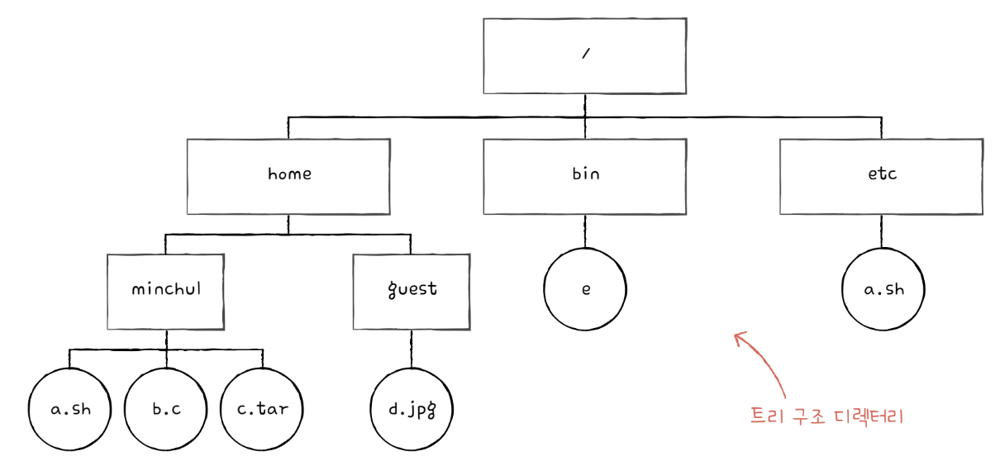

	윈도우에서는 최상위 디렉터리는 흔히 `C:₩'로 표현한다.

그러다 보니 자연스레 생긴 개념이 바로 `경로`이다. 경로는 디렉터리를 이용해 파일 위치, 나아가 파일 이름을 특정 짓는 정보이다.

#### 절대 경로와 상대 경로
같은 디렉터리에는 동일한 이름의 파일이 존재할 수 없지만, 서로 다른 디렉터리에는 동일한 이름의 파일이 존재할 수 있다. 모든 파일은 루트 디렉터리에서 자기 자신까지 이르는 공유한 경로를 가지고 있고, 이러한 경로를 `절대 경로`라고 부른다.

위 사진에서 minchul 이라는 디렉터리 안에 있는 a.sh의 절대 경로는 `/home/minchul/a.sh`가 된다.

경로를 나타내는 또 다른 방식은 `상대 경로`가 있다. 절대 경로가 루트 디렉터리부터 시작하는 경로라면 상대 경로는 현재 디렉터리부터 시작하는 경로이다.

#### 디렉터리 연산을 위한 시스템 호출
운영제체가 파일 연산을 위한 시스템 호출을 제공하는 것처럼 운영체제는 디렉터리 연산을 위한 시스템 호출도 제공한다.

#### 디렉터리 엔트리
많은 운영체제에서 디렉터리를 그저 특별한 형태의 파일로 간주한다. 즉, 디렉터리도 파일이다. 단지 포함된 정보가 조금 특별할 뿐이다.

파일이 내부에 해당 파일과 관련된 정보를 담고 있다면, 디렉터리는 내부에 해당 디렉터리에 담겨 있는 대상과 관련된 정보를 담고 있다. 그리고 이 정보는 보통 테이블 형태로 구성된다. 즉, 디렉터리는 보조기억장치에 테이블 형태의 정보로 저장된다.

각각의 엔트리(행)에 담기는 정보는 파일 시스템마다 차이가 있다. 다만 파일 시스템을 막론하고 디렉터리 엔트리가 공통으로 포함하고 있는 정보는 바로 디렉터리에 포함된 대상의 이름과 그 대상이 보조기억장치 내에 자장된 위치를 유츄할 수 있는 정보이다.

파일 시스템에 따라 디렉터리 엔트리에 파일 속성을 명시하는 경우도 있다.

## 15-2 파일 시스템

### 파티셔닝과 포매팅
보조기억장치를 사용하려면 `파티션`을 나누는 작업(`파티셔닝`)과 `포멧` 작업(`포매팅`)을 거쳐야 한다.

`파티셔닝`은 저장 장치의 논리적인 영역을 구획하는 작업을 의미한다. 하드 디스트나 SSD처럼 용량이 큰 저장 장치를 하나 이상의 논리적인 단위로 구획하는 것이다. 이렇게 파티셔닝 작업을 통해 나누어진 영역 하나하나를 `파티션`이라고 한다.

포맷하는 작업, 즉 `포매팅`은 조장 장치를 완전히 삭제하는 것으로 알고 있지만, 이는 정확하지 않다. 포매팅이란 파일 시스템을 설정하여 어떤 방식으로 파일을 저장하고 관리할 것인지를 결정하고, 새로운 데이터를 쓸 준비를 하는 작업을 의미한다. 어떤 종류의 파일 시스템을 사용할지를 바로 이때 결정한다.

파일 시스템에는 여러 종류가 있고, 파티션마다 다른 파일 시스템을 설정할 수도 있다.

포매팅까지 완료하여 파일 시스템을 설정했다면 그때부터 파일과 디렉터리를 생성할 수 있다.

### 파일 할당 방법
운영체제는 파일과 디렉터리를 `블록`단위로 읽고 쓴다. 즉, 하나의 파일이 보조기억장치에 저장될 때는 하나 이상의 블록에 걸쳐 저장된다. 하드 디스크의 가장 작은 저장단위는 섹터이지만, 운영체제는 하나 이상의 섹터를 블록이라는 단위로 묶은 뒤 블록 단위로 파일과 디렉터리를 관리한다.

파일을 보조 기억장치에 할당하는 방법에는 크게 두 가지가 있다. `연속 할당`과 `불연속 할당`이다. 그리고 불연속 할당에는 크게 `연결 할당`, `색인 할당`이 있다.

#### 연속 할당
`연속 할당`은 가장 단순한 방법이다. 이름 그대로 보조기억장치 내 연속적인 블록에 파일을 할당하는 방식이다. 

연속으로 할당된 파일에 접근하기 위해서는 파일의 첫 번째 블록 주소와 블록 단위의 길이만 알면 된다. 그렇기에 연속 할당을 사용하는 파일 시스템에서는 다음과 같이 디렉터리 엔트리에 파일 이름과 첫 번째 블록 주소와 블록 단위의 길이를 명시한다.

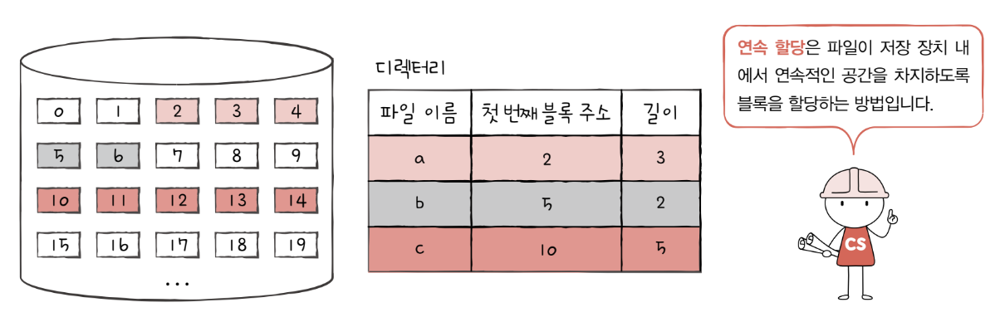

연속 할당 방식은 그저 연속적으로 저장하는 방식이기 때문에 구현이 단순하다는 장점이 있지만, `외부 단편화`를 야기한다는 치명적인 문제가 있다.

#### 연결 할당
연속 할당의 문제를 해결할 수 있는 방식이 `연결 할당`이다. 연결 할당은 각 블록 일부에 다음 블록의 주소를 저장하여 각 블록이 다음 블록을 가르키는 형태로 할당하는 방식이다. 즉, 파일을 이루는 데이터를 연결 리스트로 관리한다.

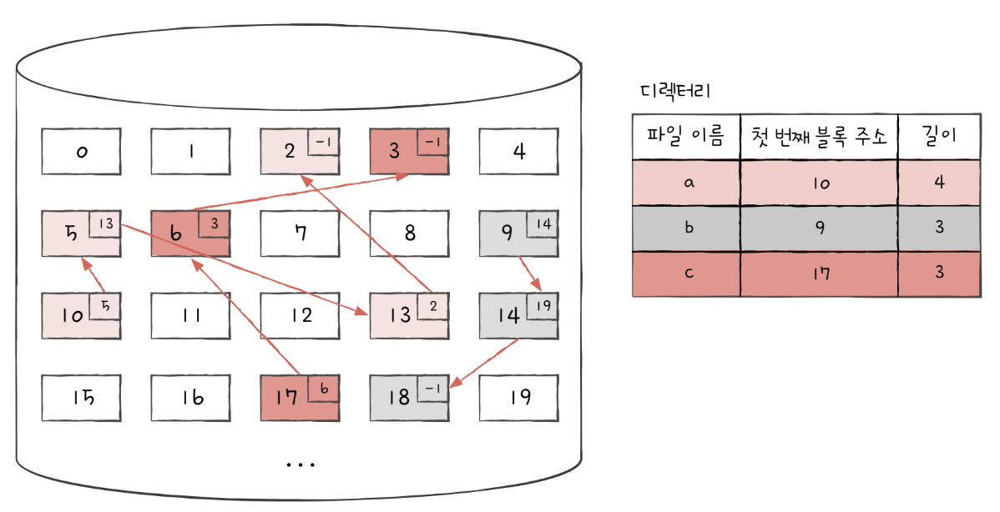

연결 할당은 외부 단편화 문제를 핼결했지만 이 또한 단점이 있다.

* 반드시 첫 번째 블록부터 하나씩 차례대로 읽어야 한다.
	* 파일 내 임의의 위치에 접근하는 속도, 즉 `임의 접근`속도가 매우 느리다.
* 하드웨어 고장이나 오류 발생 시 해당 블록 이후 블록은 접근할 수 없다.
	* 하나의 블록 안에 파일 데이터와 다음 블록 주소 모두 포함되어 있으니, 하드웨어 고장이나 오류로 파일을 이루는 블록에 하나라도 문제가 발생하면 그 블록 이후의 블록에 접근할 수 없다.

오늘날에는 그대로 구현하기보다는 조금 변형해서 사용하는데 그 변형한 대표적인 파일 시스템이 FAT 파일 시스템이다.

#### 색인 할당
`색인 할당`은 파일의 모든 블록 주소를 `색인 블록`이라는 하나의 블록에 모아 관리하는 방식이다. 색인 할당은 연결 할당과 달리 파일 내 임의의 위치에 접근하기 쉽다.

색인 블록 안에 파일을 구성하는 데이터 블록 주소가 있으므로 색인 블록만 할면 해당 파일 데이터에 접근할 수 있다. 그렇기에 색인 할당을 사용하는 파일 시스템에서는 디렉터리 엔트리에 파일 이름과 더불어 `색인 블록 주소`를 명시한다.

색인 할당을 기반으로 만든 파일 시스템이 유닉스 파일 시스템이다.

### 파일 시스템 살펴보기
여러 파일 시스템이 있지만 크게 USB, SD 카드 등의 저용량 장치에서 사용되는 `FAT 파일 시스템`과, 유닉스 계열 운영체제에서 사용되는 `유닉스 파일 시스템`이 있다.

#### FAT 파일 시스템
연결 할당의 단점을 보완한 파일 시스템이 FAT 파일 시스템이다. 

각 블록에 포함된 다음 블록의 주소들을 한데 모아 테이블 형태로 관리하면 앞서 언급되었던 단점들을 상당 부분 해소할 수 있다. 이러한 테이블을 `파일 할당 테이블`(`File Allocation Table`) (이하 `FAT`)이라고 부른다.

이렇게 FAT을 이용하는 파일 시스템이 `FAT 파일 시스템`이다. FAT 파일 시스템은 버전에 따라 FAT12, FAT16, FAT32가 있으며, FAT 뒤에 오는 숫자는 블록을 표현하는 비트 수를 의미한다.

FAT 파일 시스템에서 FAT은 파티션 앞부분에 만들어진다. 

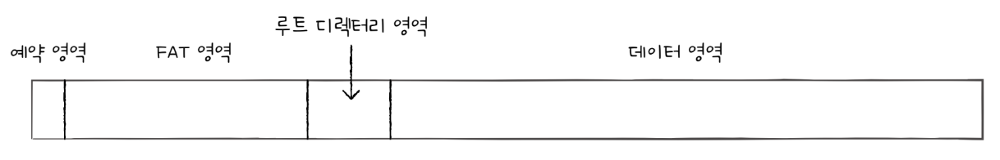

FAT는 하드 디스크 파이션의 시작 부분에 있찌만, 실행하는 도중 FAT가 메모리에 캐시될 수 있다. FAT가 메모리에 적재된 채 실행되면 기존 연결 할당보다 다음 블록을 찾는 속도가 매우 빨라지고, 결과적으로 임의 접근에도 유리해진다.

FAT 파일 시스템의 디렉터리 엔트리는 다음과 같다.

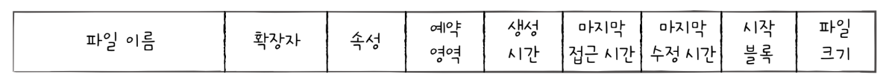

	속성 항목은 해당 파일이 읽기 전용인지, 숨김  파일읹, 시스템 파일인지, 일반 파일인지, 디렉터리인지 등을 식별하기 위한 항목이다.

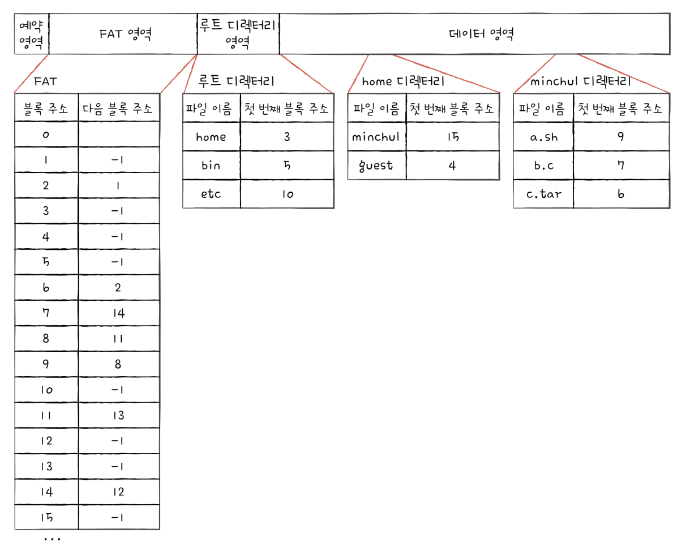

`/home/minclul/a.sh`에 접근한다고 하자
1. 루트 디렉토리에서 home 디렉토리의 위치를 찾는다.
2. home 디렉토리 내용에서 minchul 디렉토리의 위치를 찾는다.
3. minchul 디렉터리에서 a.sh를 찾는다.
4. FAT을 보면 9, 8, 11, 13 순서로 저장되어 있다는 것을 알 수 있다.

#### 유닉스 파일 시스템
색인 할당은 색인 블록을 기반으로 파일의 데티어 블록들을 찾는 방식이다. `유닉스 파일 시스템`에서는 이 색인 블록을 `i-node`(`index-node`)라고 부른다.

i-node에는 파일 속성 정보와 열다섯 개의 블록 주소가 저장될 수 있다. FAT 파일 시스템에서는 파일 속성 정보가 디렉터리 엔트리에 표현되었지만, 유닉스 파일 시스템에서 파일 속성 정보는 i-node에 표현된다.

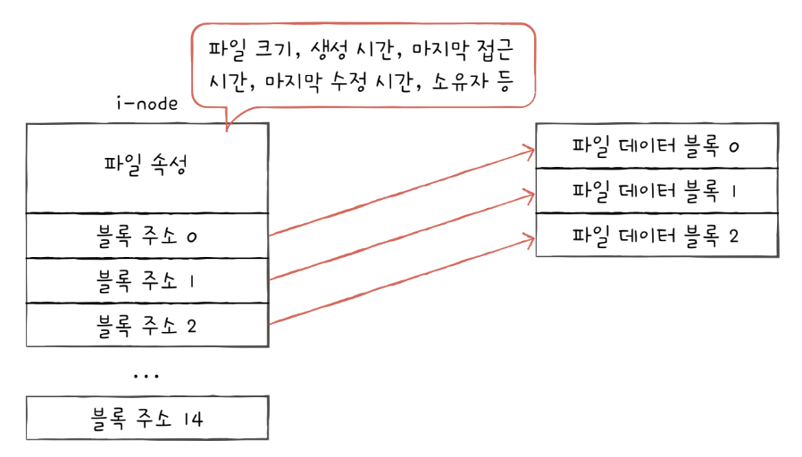

유니온 파일 시스템에는 파일마다 이러한 i-node가 있고, i-node마다 번호가 부여되어 있다. 그리고 i-node들은 다음과 같이 파티션 내 특정 영역에 모여 있다. i-node 영역에는 i-node들이 있고, 데이터 영역에 디렉터리와 파일들이 있다.

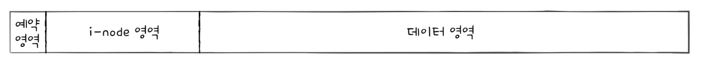

i-node의 크기는 유한하다. i-node 하나는 기본적으로 열다섯 개의 블록 주소를 저장할 수 있기 때문에 i-node 하나는 열다섯 개의 블록을 차지하는 파일까지 가리킬 수 있다. 만약 블록 20,30개를 차지하는 큰 파일의 경우 하나의 i-node로 파일의 데이터 블록을 모두 가리킬 수 없다.

유닉스 파일 시스템은 이러한 문제를 다음과 같이 해결한다.

1. 블록 주소 중 열두 개에는 직접 블록 주소를 저장한다.
	1. 파일 데이터가 저장된 블록을 `직접 블록`이라고 한다.
	2. 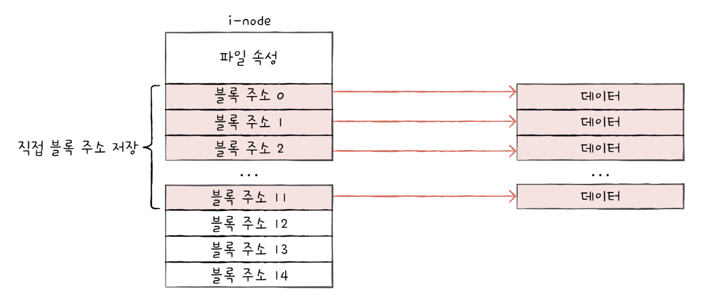
2. 첫째 내용으로 충분하지 않다면 열세 번째 주소에 단일 간접 블록 주소를 저장한다.
	1. 열세 번째 블록 주소는 단일 간접 블록의 주소를 저장한다.
	2. `단일 간접 블록`이란 파일 데이터가 저장된 블록이 아닌 파일 데이터를 저장한 블록 주소가 저장된 블록을 의미한다.
	3. 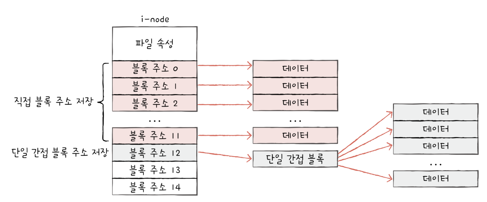
3. 단일 간접 블록으로 충분하지 않다면 열네 번째 주소에 이중 간접 블록 주소를 저장한다.
	1. `이중 간접 블록`이란 데이터 블록 주소를 저장하는 블록 주소가 저장된 블록을 의미한다. 단일 간접 블록들의 주소를 저장하는 블록이 이중 간접 블록이다.
	2. 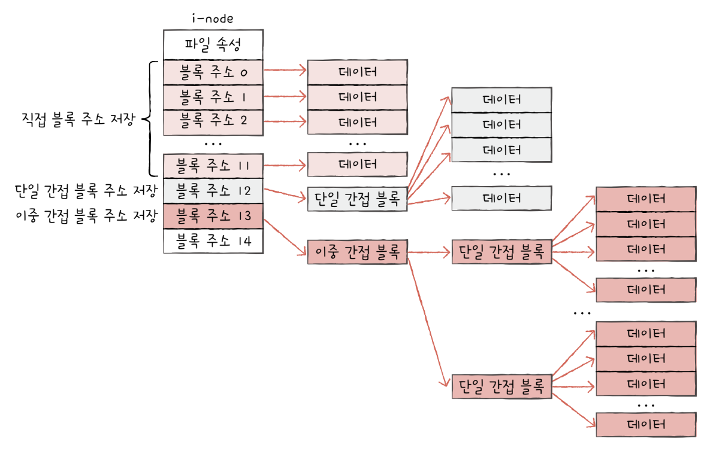
4. 이중 간접 블록으로 충분하지 않다면 열다섯 번째 주소에 삼중 간접 블록 주소를 저장한다.
	1. 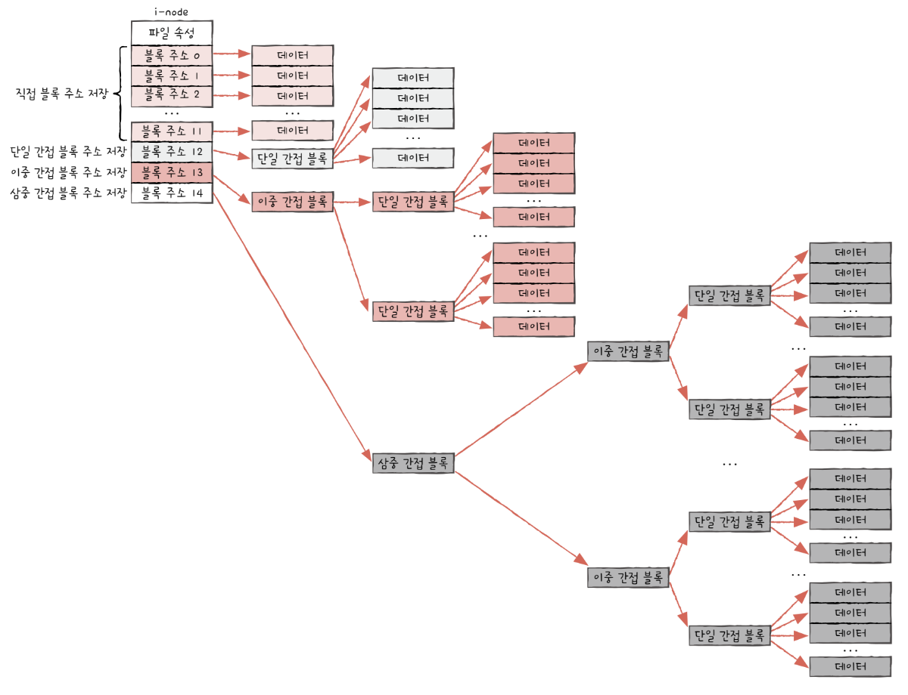

이로써 i-node만 알면 파일 속성뿐만 아니라 파일 크기가 크더라도 파일 데이터를 모두 가리킬 수 있다. i-node가 파일의 모든 것을 담고 있다고 해도 과언이 아니다. 그래서 유닉스 파일 시스템의 디렉터리 엔트리도 다음 그림과 같이 파일 이름과 i-node 번호로 구성된다.

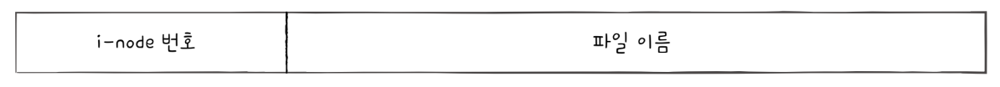

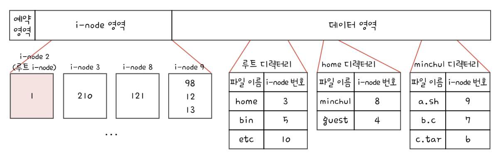

`/home/minchul/a.sh`에 접근한다고 하자.

1. 2번 i-node에 접근하여 루트 디렉토리의 위치를 파악한다.
2. home 디렉터리의 i-node는 3번 i-node이다.
3. 3번 i-node에 접근하여 home 디렉터리 위치를 파악한다.
4. 210번 블록으로 가서 home 디렉터리에서 minchul 디렉터리의 i-node가 8 인것을 알 수 있다.
5. 8번 i-node를 통해서 121 블록을 읽어 minchul 디렉토리의 내용을 알 수 있다.
6. a.sh의 i-node 번호는 9번이다.
7. a.sh는 98, 12, 13 블록을 읽으면 된다.

