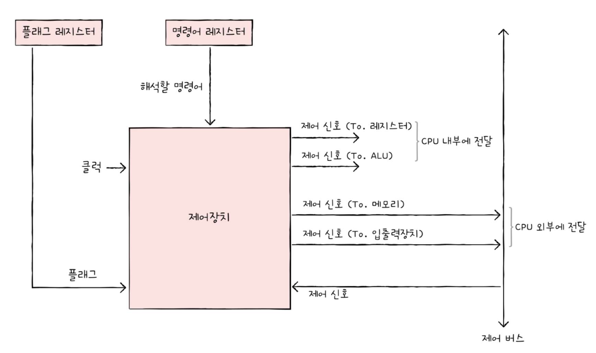

## 4-1 `ALU`와 `제어장치`

### `ALU`
`ALU`가 어떤 정보를 받아들이고 내보내는지 표현한 그림

`ALU`는 계산하는 부품이기 때문에 연산할 피연산자와 수행할 연산이 필요하다.
`피연산자`는 레지스터를 통해서 받아들이고, 제어장치로부터 `제어 신호`를 받아들인다.  

그리고 해당 연산을 통한 정보를 내보낸다. 내보내는 정보는 특정 숫자나 문자가 될 수도 있고, 혹은 메모리 주소가 될 수도 있다. 이 결과값은 바로 메모리에 저장되는 것이 아니라 `일시적으로 레지스터에 저장`된다.

`CPU`가 메모리에 접근하는 속도는 레지스터에 접근하는 속도보다 당연히 느리기 때문에 연산에 결과를 그때마다 메모리에 접근하게 된다면 프로그램에 속도가 늦어짐으로 레지스터에 우선 저장하는 것이다.

`CPU`가 내보내는 것이 결과값 말고 또 있는데 바로 `플래그`이다. 결과에 대한 추가적인 정보를 나타내기 위해서 사용하는 것이 바로 `플래그`이다.

	연산 결과가 연산 결과를 담을 레지스터보다 큰 상황을 `오버플로우`라고 한다.
 
`ALU`가 내보내는 대표적인 플래그는 다음과 같다.
* 부호 플래그 : 연산한 결과에 대한 부호를 나타낸다.
	* 부호 플래그가 1일 경우 계산 결과는 음수, 0일 경우 양수를 의미힌다.
* 제로 플래그 : 연산 결과가 0인지 여부를 나타낸다.
	* 1일 경우 연산 결과는 0, 0일 경우 연산 결과는 0이 아니다.
* 캐리 플래스 : 연산 결과 올림수나 빌림수가 발생했는지 나타낸다.
	* 1이면 발생, 0이면 발생하지 않았다는 것을 의미힌다.
* 오버플로우 플래그 : 오버플로우가 발생했는지를 나타낸다.
	* 1이면 발생, 0이면 발생하지 않았다는 것을 의미힌다.
* 인터럽트 플래그 : 인터럽트가 가능한지 나타낸다.
	* 1인 경우 인터럽트 가능, 0이면 불가능을 의미한다.
* 슈퍼바이저 플래그 : 커널 모드로 실행 중인지, 사용자 모드로 실행 중인지를 나타낸다.
	* 1인 경우 커널 모드로 실행, 0인 경우 사용자 모드로 실행 중임을 의미힌다.

이러한 플래그들들은 `플래그 레지스터`라는 레지스터에 저장된다. 

### 제어장치

#### 받아들이는 신호

##### `클럭 신호`
`클럭`이란 컴퓨터의 모든 부품을 움직일 수 있게 하는 시간 단위이다.  
클럭의 주기에 맞춰 레지스터에서 다른 레지스터로 데이터가 이동되거나, `ALU`에서 연산이 수행되거나, `CPU`가 메모리에 저장된 명령어를 읽어들인다.  

단, `컴퓨터의 모든 부품이 클럭 신호에 맞춰서 작동한다.` 라는 말을 `컴퓨터의 모든 부품이 한 클럭마다 작동한다`로 이해하면 안된다. 클럭의 박자에 맞춰서 작동할 뿐이지 하나의 명령어가 여러 클럭에 걸쳐 실행될 수 있다.

##### `해석해야 할 명령어`
`CPU`가 해석할 명령어는 `명령어 레지스터`라는 특별한 레지스터에 저장된다. 이 레지스터로부터 해셕할 명령어를 받아들이고 해석한 뒤, 제어 신호를 발생시킨다.

##### 플래그 레지스터 속 플래그 값
제어장치는 플래그 값을 받아들이고 이를 참고하여 제어 신호를 발생시킨다.

##### `시스템 버스`, 그중에서 `제어 버스`로 전달된 제어 신호
제어 신호는 `CPU` 뿐만 아니라 입출력장치같은 `CPU 외부 장치`에서도 발생시킬 수 있다. 제어 장치는 제어 버스를 통해서 외부로부터 전달받은 신호를 받아들이기도 한다.

#### 내보내는 신호

내보내는 신호는 크게 두가지로 나뉜다. 첫째는 `CPU` 외부에 전달하는 제어 신호와 `CPU` 내부에 전달하는 제어 신호이다.

##### 외부로 전달하는 제어 신호
외부로 전달한다는 것은 곧 `제어 버스`에 제어 신호를 보낸다는 말과 같다.  
이러한 제어 신호에는 크게 `메모리에 전달`하는 제어 신호와 `입출력 장치에 전달`하는 제어 신호가 있다.  

##### 내부로 전달하는 제어 신호
`ALU`에 전달하는 제어 신호와 `레지스터`에 전달하는 신호가 있다.

## 4-2 레지스터

### 반드시 알아야 할 레지스터
`CPU`마다 레지스터는 이름, 크기, 종류가 매우 다양하다. 하지만 여러 서적에서 중요하게 다루며, 많은 `CPU`에서 공통적으로 다루는 레지스터가있다.  

#### 프로그램 카운터
메모리에서 가져올 명령어 주소를 저장한다. `명령어 포인터`라고 부르는 `CPU`도 있다.

#### 명령어 레지스터
해석할 명령어, 즉 방금 메모리에서 읽어 들인 명령어를 저장하는 레지스터이다. 제어장치는 명령어 레지스터 속 명령어를 받아들이고 이를 해석한 뒤 제어 신호를 내보낸다.

#### 메모리 주소 레지스터
메모리의 주소를 저장하는 레지스터이다. `CPU`가 읽어 들이고자 하는 주소 값을 주소 버스로 보낼 때 메모리 주소 레지스터를 거치게 된다.

#### 메모리 버퍼 레지스터
메모리와 주고 받을 값을 저장하는 레지스터이다. 즉, 메모리에 쓰고 싶은 값이나 메모리로부터 전달받은 값은 메모리 버퍼 레지스터를 거친다. `CPU`가 주소 버스로 내보낼 값은 메모리 주소 레지스터를 거치고, 데이터 버스로 주고 받을 값은 메모리 버퍼 레지스터를 거친다.  
메모리 버퍼 레지스터는 `메모리 데이터 레지스터`라고도 부른다.

#### 플래그 레지스터
연산 결과 또는 `CPU` 상태에 대한 부가적인 정보를 저장하는 레지스터이다.

#### 범용 레지스터
일반적인 상황에서 자유롭게 사용할 수 있는 레지스터이다. 데이터와 주소를 모두 저장할 수 있다. `CPU` 안에는 여러 개의 범용 레지스터가 있고, 현대 대다수의 `CPU`는 모두 범용 레지스터를 가지고 있다.

### 특정 레지스터를 이용한 주소 지정 방식
#### 스택 주소 지정 방식
`스택 포인터`를 활용해서 주소를 저장하는 주소 지정 방식이다. 여기서 `스택 포인터`란 스택의 꼭대기를 가르키는 레지스터이다.  
이런 스택들은 메모리 안에 있고, `스택 영역`이라는 곳에 있다. 이 영역은 다른 주소 공간과 다르게 스택처럼 사용하기로 암묵적으로 약속된 영역이다.

#### 변위 주소 지정 방식
오퍼랜드 필드의 값과 특정 레지스터의 값을 더하여 유효 주소를 얻어내는 주소 지정 방식이다.
그래서 변위 주소 지정 방식을 사용하는 명령어는 연산 코드 필드, 어떤 레지스터의 값과 더할지 나타내는 레지스터 필드, 그리고 주소를 담고 있는 오퍼랜드 필드가 있다.  

이때, 어떤 레지스터를 더하는지에 따라 `상대 주소 지정 방식`과 `베이스 레지스터 주소 지정 방식` 등으로 나뉜다. 

#### 상대 주소 지정 방식
오퍼랜드와 프로그램 카운터의 값을 더하여 유효 주소를 얻는 방식이다.   
예를 들어 오퍼랜드가 음수인 -3이 들어가 있다면 명령어는 실행하려는 명령어의 세 칸 이전의 명령어를 실행한다. 

#### 베이스 레지스터 주소 지정 방식
오퍼랜드와 베이스 레지스터의 값을 더하여 유효 주소를 얻는 방식이다.
여기서 베이스 레지스터는 `기준 주소`, 오퍼랜드는 `기존 주소로부터 떨어진 거리`로서의 역활을 한다. 

## 4-3 명령어 사이클과 인터럽트

### 명령어 사이클
실행하는 프로그램은 수많은 명령어로 이루어져 있고, `CPU`는 이 명령어들을 하나씩 실행한다. 이때, 각각의 명령어들은 일정한 주기가 반복되며 실행되는데, 이 주기를 `명령어 사이클`이라고 한다.  
예를 들면, 메모리에 있는 명령어를 `CPU`로 가져오는 `인출 사이클`이 있고, `CPU`로 가져온 명령어로 실행하는 `실행 사이클`이 있다.  
모든 명령어가 이렇게 간단하게 실행되는 것은 아니고 `간접 주소 지정 방식`을 사용하는 경우에는 한번 더 메모리에 접근해야 되기 때문에 `간접 사이클`이라는 것이 필요하다.

### 인터럽트
`CPU`가 수행 중인 작업은 방해를 받아 잠시 중단될 수 있는데, 이렇게 `CPU`의 작업을 방해하는 신호를 `인터럽트`라고 한다.  
인터렙트의 종류에는 크게 `동기 인터럽트`와 `비동기 인터럽트`가 있다.

#### 동기 인터럽트
`CPU`에 의해 발생하는 인터럽트이다.   
`CPU`가 명령어들을 수행하다가 예상치 못한 상황에 마주쳤을 때, 발생하는 인터럽트이다.
`예외`(`exception`)이라고도 부른다. 

#### 비동기 인터럽트
주로 입출력장치에 의해 발생하는 인터럽트이다. 
* `CPU`가 프린터와 같은 입출력장치에 입출력 작업을 부탁하면 작업을 끝낸 입출력장치가 `CPU`에 완료 알림(인터럽트)을 보낸다.
* 키보드, 마우스와 같은 입출력장치가 어떠한 입력을 받아들였을 때 이를 처리하기 위해 `CPU`에 입력 알림(인터럽트)을 보낸다.

일반적으로 비동기 인터럽트를 인터럽트라고 칭하기도 한다. 용어의 혼동을 방지하기 위해서 `하드웨어 인터럽트`라고 하기도 한다.

##### 하드웨어 인터럽트
`하드웨어 인터럽트`는 알람과 같은 인터럽트이다. `CPU`는 입출력 작업 도중에도 효율적으로 명령어를 처리하기 위해 하드웨어 인터럽트를 사용한다. 

##### 하드웨어 인터럽트 처리 순서

1. 입출력장치는 `CPU`에 `인터럽트 요청 신호`를 보낸다.
2. `CPU`는 실행 사이클이 끝나고 명령어를 인출하기 전 항상 인터럽트 여부를 확인한다.
3. `CPU`는 인터럽트 요청을 확인하고 `인터럽트 플래그`를 통해 현재 인터럽트를 받아들일 수 있는 지 여부를 확인한다. 
4. 인터럽트를 받아들일 수 있다면, `CPU`는 지금까지의 작업을 백업한다.
5. `CPU`는 `인터럽트 벡터`를 참조하여 `인터럽트 서비스 루틴`을 실행한다.
6. 인터럽트 서비스 루틴 실행이 끝나면 4번에서 백업해 둔 작업을 복구하여 실행을 재개한다.

* 인터럽트 요청 신호
	* 인터럽트는 `CPU`의 정상적인 흐름을 끊는 행위이기 때문에 인터럽트하기 전에 지금 끼어들어도 되는지 물어보는 신호
* 인터럽트 플래그
	* `CPU`가 인터럽트 요청을 수용하기 위해서는 플래그 레지스터의 `인터럽트 플래그`가 활성화되어 있어야 한다. 
	* `CPU`가 중요한 작업을 처리하거나 방해받지 말아야할 경우 불가능으로 설정해주는데 그러면 인터럽터 요청이 오더라도 무시한다.
	* 하지만 `무시할 수 없는 인터럽트`도 있는데 바로 하드웨어 고장으로 인한 인터럽트인다.
* 인터럽트 서비스 루틴
	* 인터럽트를 처리하기 위한 프로그램
	* `인터럽트 핸들러`라고도 부른다.
	* 어떤 인터럽트가 발생했을 때 해당 인터럽트를 어떻게 처리하고 작동해야 할지에 대한 정보로 이루어진 프로그램이다.
* 인터럽트 벡터
	* 인터럽트 서비스 루틴을 식별하기 위한 정보
	* 인터럽트 서비스 루틴의 시작 주소를 알 수 있다.

인터럽트를 위해서 서비스 루틴을 실행할 때, 지금까지 실행했던 것에 대한 정보는 스택에 저장하고 인터럽트를 수행하고 스택에 있는 명령어를 불러와 다시 실행한다.