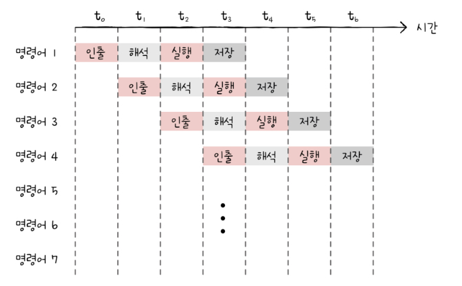

# CPU 성능 향상 기법

## 5-1 빠른 CPU를 위한 설계 기법

### 클럭
컴퓨터 부품들은 클럭 신호에 맞춰 명령어를 실행하기 때문에, 클럭 신호가 빨라지면 그만큼 빠른 박자에 맞춰 작동하고, 명령어 사이클을 더 빠르게 반복할 것이다.

`클럭 속도`는 헤르츠 단위로 측정된다. 이는 1초에 클럭이 몇 번 반복되는지 나타낸다.

	`클럭`이라는 단어를 보고 시계를 떠올려 속도가 일정하게 유지된다고 생각할 수 있는데 실제로는 그렇지 않다. 
	고성능을 요구하는 순간에 순간적으로 높이고, 그렇지 않을 때는 낮추기도 한다.

하지만 더 빠른 CPU를 위해서 무작정 클럭을 높히게 되면 발열 문제가 심각해지기 때문에 그럴 수 없다.

### 코어와 멀티코어
클럭 속도를 높히는 방법 외에 `CPU`의 성능을 높히는 방법에는 코어와 스레드 수를 늘리는 방법이 있다.

코어를 이해하려면 현대적인 관점에서 `CPU`라는 용어를 재해석해야 한다. 
`CPU`를 `명령어를 실행하는 부품`이라고 해왔지만, 기술적인 발전을 통해서 CPU 내부에 `명령어를 실행하는 부품`을 더 만들 수 있게 되었다. 
따라서 "명령어를 실행하는 부품"은 `코어`라는 용어로 사용된다. 또한, `CPU`는 "명령어를 실행하는 부품을 `여러 개` 포함하는 부품"으로 범위가 확장되었다.

코어를 여러 개 포함하고 있는 CPU를 `멀티코어 CPU` 또는 `멀티코어 프로세서`라고 부른다.

CPU의 연산 속도는 꼭 코어 수에 비례하여 증가하진 않는다. 코어마다 처리할 연산이 적절히 분배되지 않는다면 코어 수에 비례하여 연산 속도가 증가하지 않는다.
또한, 처리하고자 하는 작업량보다 코어 수가 지나치게 많아도 성능에는 크게 영향이 없다.

중요한 것은 `코어마다 처리할 명령어를 얼마나 적절하게 분배`하느냐이다.

### 스레드와 멀티스레드
`스레드`의 사전적 의미는 `실행 흐름의 단위`이다. 하지만 CPU에서 사용되는 스레드와 프로그래밍에서 사용되는 스레드는 다르다. 

CPU에서 사용되는 스레드를 `하드웨어적 스레드`라고 하고, 프로그램에서 사용되는 스레드를 `소프트웨어적 스레드`라고 한다.

#### 하드웨어적 스레드
`하나의 코어가 동시에 처리하는 명령어 단위`를 의미한다.

예를 들어 하나의 코어에 2개의 스레드가 있고, 2개의 코어가 있으면 2코어 4스레드 CPU로 한번에 4개의 명령어를 처리할 수 있는 CPU이다.

이렇게 하나의 코어로 여러 명령어를 동시에 처리하는 CPU를 `멀티스레드 프로세서` 또는 `멀티스레드 CPU`라고 한다. 
인텔은 자신들의 멀티스레드 기술을 `하이퍼스레딩`이라고 한다.

#### 소프트웨어적 스레드
`하나의 프로그램에서 독립적으로 실행되는 단위`를 의미한다.

예를 들어 워드 프로세서 프로그램을 개발한다고 했을 때, "사용자로부터 입력받은 내용을 화면에 보여 주는 기능", "사용자가 입력한 내용이 맞춤법에 맞는지 검사하는 기능", "사용자가 입력한 내용을 수시로 저장하는 기능" 등이 동시에 수행되기를 원한다.
이럴 때 각각의 기능을 스레드로 만들어 동시에 실행할 수 있다.

#### 멀티스레드 프로세서
용어의 혼돈을 방지하기 위해서 소프트웨어적 스레드를 `스레드`, CPU에서 사용되는 스레드를 `하드웨어적 스레드`라고 지칭한다.

`멀티스레드 프로세서`의 가장 큰 핵심은 레지스터이다. 하나의 코어로 여러 명령어를 동시에 처리하도록 만들려면, 프로그램 카운터, 스택 포인터, 데이터 버퍼 레지스터, 데이터 주소 레지스터와 같이 하나의 명령어를 처리하기 위해 `필요한 레지스터들을 여러 개` 가지고 있으면 된다.

만약, 2코어 4스레드 CPU에서 메모리 속 프로그램 입장에서는 하드웨어 스레드는 "명령어를 실행하는 부품"이 4개 있는 것처럼 보인다.
그래서 하드웨어 스레드를 `논리 프로세서`라고 부르기도 한다.

## 5-2 명령어 병렬 처리 기법

### 명령어 파이프라인
명령어 처리 과정을 클럭 단위로 나누어 보면 일반적으로 다음과 같이 나눌 수 있다.

1. 명령어 인출 (Instruction Fetch)
2. 명령어 해석 (Instruction Decode)
3. 명령어 실행 (Excute Instruction)
4. 결과 저장 (Write Back) 
 
여기서 중요한 점은 같은 단계가 겹치지만 않는다면 CPU는 `각 단계를 동시에 실행할 수 있다`는 것이다.

예를 들어 CPU가 한 명령어를 "인출"하는 동안에 다른 명령어를 "실행"할 수 있고, 또 다른 명령어를 "저장"할 수 있다.



이처럼 공장 생선 라인과 같이 명령어들을 `명령어 파이프라인`에 넣고 동시에 처리하는 기법을 `명령어 파이프라이닝`이라고 한다.

파이프라이닝이 높은 성늘을 가져오긴 하지만, 특정 상황에는 성능 향상에 실패하기도 한다. 이런 상황을 `파이프라인 위험`이라고 부른다. 파이프라인 위험에는 크게 `데이터 위험`, `제어 위험`, `구조적 위험`이 있다.

#### 데이터 위험
`데이터 위험`은 명령어 간 `데이터 의존성`에 의해 발생한다. 어떤 명령어는 동시에 처리할 수 없다.

```
R2 + R3 = R1 //명령어 1
R1 + R5 = R4 //명령어 2
```
다음과 같은 명령어가 2개 있으면 명령어1을 수행해야만, 명령어2를 수행할 수 있다. 명령어 2는 명령어 1의 `데이터에 의존적`이다.

이처럼 데이터 의존적인 두 명령어를 동시에 실행하려고 하면 파이프라인이 제대로 작동하지 않는 것을 `데이터 위험`이라고 한다.

#### 제어 위험
`제어 위험`은 주로 분기등으로 인한 `프로그램 카운터의 갑작스러운 변화`에 의해 발생한다. 기본적으로 프로그램 카운터는 `현재 실행 중인 명령어의 다음 주소`로 갱신된다. 하지만 프로그램 실행 흐름이 바뀌어 명령어가 실행되면서 프로그램 카운터 값에 갑작스러운 변화가 생긴다면 미리 가지고 와서 처리 중이던 명령어들은 쓸모가 없어진다. 

이런 상황을 `제어 위험`이라고 한다. 

이를 위해 사용하는 기술 중 하나가 `분기 예측`이다. 프로그램이 어디로 분기할지 미리 예측한 후 그 주소를 인출하는 기술이다.

#### 구조적 위험
`구조적 위험`은 명령어들을 겹처 실행하는 과정에서 서로 다른 명령어가 동시에 APU, 레지스터 등과 같은 CPU 부품을 사용하려고 할 때 발생한다.
`자원 위험`이라고도 부른다.

### 슈퍼스칼라
파이프라이닝은 단일 파이프라인으로도 구현 가능하지만, 오늘날 대부분의 CPU는 여러 개의 파이프라인을 이용한다.
이처럼 CPU 내부에 여러 개의 명령어 파이프라인을 포함한 구조를 `슈퍼스칼라`라고 한다.

슈퍼스칼라 구조로 명령어 처리가 가능한 CPU를 `슈퍼스칼라 프로세서` 또는 `슈퍼스칼라 CPU`라고 한다.

슈퍼스칼라 프로세서는 이론적으로 파이프라인 개수에 비례하여 프로그램 처리 속도가 빨라진다. 하지만 파이프라인 위험 등의 예상치 못한 문제가 있어 실제로 반드시 비례해서 빨라지진 않는다.
또한, 하나의 파이프라인을 사용할 때보다 다른 위험을 제어하기 더 까다롭다.

### 비순차적 명령어 처리
보통 `OoOE`(Out-Of-order excution)라고 줄여 부른다. 오늘날 CPU 성능 향상에 크게 기여한 기법이자 대부분 CPU가 차용하는 기법이다.

명령어 파이프라이닝, 슈퍼스칼라 모두 여러 명령어의 순차적인 처리를 상정한 방법이다. 하지만 파이프라인 위험과 같은 예상치 못한 문제들로 명령어들이 곧바로 처리되지 못하기도 한다. 그럼 이런 예상치 못한 상황에서 명령어 파이프라인이 멈춰버리게 된다.

명령어들 중에는 서로 데이터 의존성이 전혀 없이 순서를 바꿔 처리해도 수행 결과에 영향을 미치지 않는 명령어들이 있다.

명령어를  순차적으로 실행하지 않고 순서를 바꿔도 무방한 명령어를 먼저 실행하여 명령어 파이프라인이 멈추는 것을 방지하는 것을 `비순차적 명령어 처리 기법`이라고 한다.

하지만, 아무 명령이나 순서를 바꿔서 수행할 수 없다. 다음과 같은 예시가 있다.

```
1: M(100) = 1
2: M(101) = 2
3: M(102) = M(100) + M(101)
4: M(103) = M(102) + M(101)
5: M(104) = M(100)
```
3번과 1번은 바꿀 수 없지만 4번과 5번, 4번과 2번은 바꿀 수 있다.

이처럼 비순차적 명령어 처리가 가능한 CPU는 명령어들이 어떤 명령어와 데이터 의존성을 가지고 있는지, 순서를 바꿔 실행할 수 있는 명령어에는 어떤 것들이 있는지 판단할 수 있어야 한다.

## 5-3 CISC와 RISC

### 명령어 집합
CPU마다 명령어의 세세한 생김세, 명령어로 할 수 있는 연산, 주소 지정 방식 등은 CPU마다 조금씩 차이가 있다.
CPU가 이해할 수 있는 명령어들의 모음을 `명령어 집합` 또는 `명령어 집합 구조`(`ISA` - `Instruction Set Architecture`)라고 한다.

다른 ISA를 사용하는 컴퓨터는 서로의 명령어를 실행할 수 없다. 또한, 어셈블리어는 명령어를 읽기 편하게 표현한 것이기 떄문에 ISA가 달라지면 어셈블리어도 달라진다.

명령어의 생김세만 달라지는 것이 아니라 해석하는 방식, 레지스터의 종류와 개수, 메모리 관리 방법 등 많은 것들이 달라진다. 그리고 이는 CPU 하드웨어 설계에도 큰 영향을 미친다.

ISA는 CPU의 언어임과 동시에 CPU를 비롯한 하드웨어가 소프트웨어를 어떻게 이해할지에 대한 약속이라고도 볼 수 있다.

명령어 병렬 처리 기법에 유리한 ISA도 있고 그렇지 못한 ISA도 있다. 병렬 처리 기법을 도입하기 유리한 ISA에는 대표적으로 `CISC`와 `RISC`가 있다.

#### CISC
`CISC`는  `Complex Instruction Set Computer`의 약자이다. "복잡한 명령어 집합을 활용하는 컴퓨터"를 의미하며, 여기서 컴퓨터는 CPU라고 생각할 수 있다.

CISC는 다양하고 강력한 기능의 명령어 집합을 활용하기 때문에 명령어의 형태와 크기가 다양한 `가변 길이 명령어`를 활용한다. 
메모리에 접근하는 주소 지정 방식도 다양해서 아주 특별한 상황에서만 사용되는 독특한 주소 지정 방식들도 있다.

CISC는 메모리를 최대한 아끼며 개발해야 했던 시절에 인기가 높았다. `적은 수의 명령어만으로도 프로그램을 동작시킬 수 있다`는 점은 메모리 공간을 절약할 수 있다는 장점이기 떄문이다.

하지만 CISC에는 치명적인 단점이 있다. 활용하는 명령어가 워낙 복잡하고 다양한 기능을 제공하는 탓에 `명령어의 크기와 실행되기까지의 시간이 일정하지 않다.` 
또한, 대다수의 복잡한 명령어는 사용 빈도가 낮다.

따라서 CISC 기반 CPU는 성장에 한계가 있다.

#### RISC
CISC의 단점을 보안하기 위한 방법이 2가지 있다.
1. 빠른 처리를 위해 명령어 파이프라인을 활용해야된다. 원활한 파이프라이닝을 위해 `명령어 길이와 수행 시간이 짧고 규격화`되어 있어야 한다.
2. 어차피 자주 쓰이는 명령어만 사용된다. 복잡한 기능을 지원하는 명령어를 추가하기보다 `자주 쓰이는 기본적인 명령어를 작고 빠르게 만드는 것`이 중요하다.

이러한 개선점을 바탕으로 나온 것이 `RISC`(`Reduced Instruction Set Computer`)이다.
이름처럼 CISC에 비해 명령어의 종류가 적고, 짧고 규격화된 명령어, 되도록 1클럭 내외로 실행되는 명령어를 지향한다.
즉, RISC는 `고정 길이 명령어`를 활용한다.
명령어가 규격화되어 있고, 하나의 명령어가 1클럭 내외로 실행되기 때문에 RISC 명령어 집합은 명령어 파이프라이닝에 최적화되어 있다.
그리고 RISC는 메모리에 직접 접근하는 명령어를 `load`와 `store` 두 개로 제한할 만큼 메모리 접근을 단순화하고 최소화를 추구한다. 대신 레지스터 활용을 적극적으로 한다. 그래서 CISC에 비해서 레지스터를 이용하는 연산이 많고, 일반적인 경우보다 범용 레지스터 개수도 더 많다.

| CISC                                 | RISC                                 |
| ------------------------------------ | ------------------------------------ |
| 복잡하고 다양한 명령어               | 단순하고 적은 명령어                 |
| 가변 길이 명령어                     | 고정 길이 명령어                     |
| 다양한 주소 지정 방식                | 적은 주소 지정 방식                  |
| 프로그램을 이루는 명령어의 수가 적음 | 프로그램을 이루는 명령어의 수가 많음 |
| 여러 클럭에 걸쳐 명령어 수행         | 1클럭 내외로 명령어 수행             |
| 파이프라이닝하기 어려움              | 파이프라이닝하기 쉬움                | 
