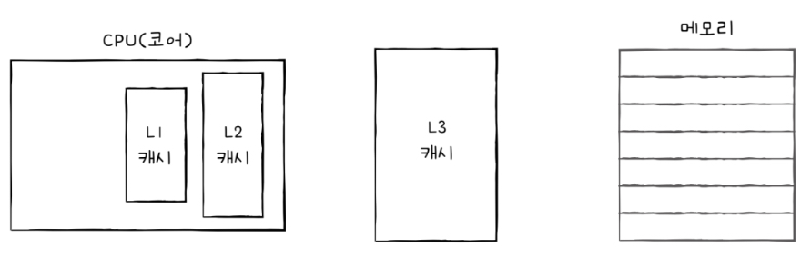
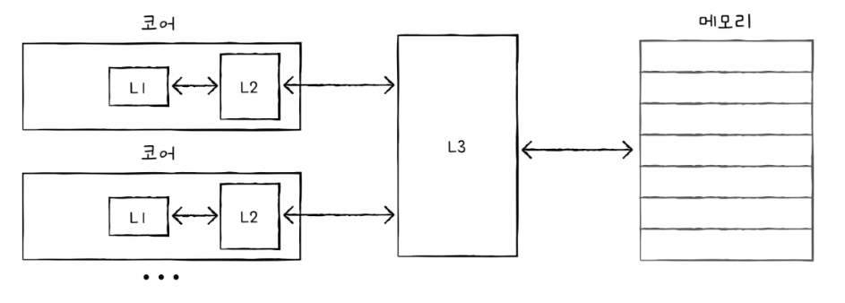
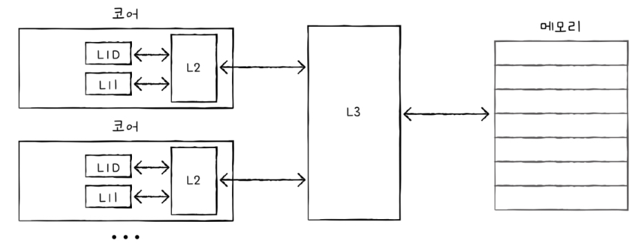
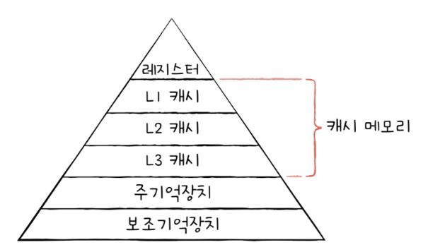

# 메모리와 캐시 메모리

## 6-1 `RAM`의 특징과 종류

### `RAM`의 특징
`RAM`에는 실행할 프로그램의 명령어와 데이터가 저장된다.
하지만 전원을 끄면 `RAM`에 저장된 명령어와 데이터가 모두 날라간다. 이런 저장 장치를 `휘발성 저장 장치`라고 한다.
하드디스크, SSD 등 전원이 꺼져도 유지되는 보조기억장치들을 `비휘발성 저장 장치`라고 한다.

보조기억장치는 전원을 꺼도 유지되지만, CPU는 보조기억장치에 직접 접근하지 못한다. 그래서 일반적으로 보조기억장치에는 '보관할 대상'을 지정하고, 휘발성 저장 장치에는 '실행할 대상'을 저장한다. CPU가 실행하고 싶은 프로그램이 보조기억장치에 있다면 이를 RAM으로 복사하여 저장한 뒤 실행한다.

### RAM의 용량과 성능
RAM의 용량이 크면 많은 프로그램들을 동시에 빠르게 실행하는데 유리하다. 하지만 계속 커진다고 비례해서 커지지 않으며 필요 이상 커지면 더 이상 성능에 영향을 주지 않는다.

### RAM의 종류
RAM의 종류에는 크게 `DRAM`, `SRAM`, `SDRAM`, `DDRSDRAM`이 있다.

#### DRAM - Dynamic RAM
Dynamic이 '동적의'라는 의미를 가지는데, 이는 저장된 데이터가 동적으로 변하는(사라지는) RAM을 의미한다. 즉, DRAM은 시간이 지나면 저장된 데이터가 점차 사라지는 RAM이다. 그래서 DRAM은 데이터의  소실을 막기 위해서 일정 주기로 데이터를 재활성화해야 한다.

우리가 일반적으로 사용하는 RAM은 DRAM이다. 이런 단점에도 불구하고 사용하는 이유는 소비 전력이 낮고, 저렴하고, 집적도가 높아서 대용량으로 설계하기에 용이하기 때문이다.

#### SRAM - Static RAM
Static은 '정적의'라는 의미를 가진다. 이는 저장된 데이터가 변하지 않는 RAM을 의미한다. DRAM과는 달리 SRAM은 시간이 지나도 데이터 사라지지 않는다. 그리고 일반적으로 DRAM보다 빠르다. 하지만, 이런 장점에도 불구하고 집적도가 낮고, 소비 전력도 크며, 가격도 더 비싸다. 그래서 캐시 메모리에서 사용된다.

#### SDRAM - Synchronous Dynamic RAM
SRAM과 DRAM의 합성어라고 오해하기 쉽지만 SRAM과 관계가 없다.
클럭 신호와 동기화된, 발전된 형태의 DRAM이다. 클럭 타이밍에 맞춰 CPU와 정보를 주고받을 수 있음을 의미한다.

#### DDR SDRAM - Double Data Rate SDRAM
최근에 가장 많이 사용되는 RAM이다.
대역폭을 넓혀 속도를 빠르게 만든 SDRAM이다. 여기서 `대역폭`이란 `데이터를 주고받는 길의 너비`를 의미한다.
SDRAM에 비해서 DDR SDRAM은 너비가 두 배인 도로와 같다. 이런 이유로 한 클럭당 하나의 데이터를 주고 받는 SDRAM을 `SDR SDRAM`(SIngle Data Rate SDRAM)이라고 부르기도 한다.
DDR2 SDRAM은 DDR SDRAM에 비해서 2배의 대역폭을 가지며, DDR3는 DDR2의 2배의 대역폭을 가진다.

## 6-2 메모리의 주소 공간

### 물리 주소와 논리 주소
'CPU와 실행 중인 프로그램은 현재 메모리 몇 번지에 무엇이 저장되어 있는지 다 알고 있을까?'
정답은 `그렇지 않다` 이다.
그 이유는 메모리에 저장된 정보는 시시각각 변하기 때문이다. 같은 프로그램이더라도 실행할 때마다 적재되는 주소가 달라질 수 있다.
주소는 실제로 저장된 하드웨어상의 주소인 `물리 주소`와 CPU와 실행 중인 프로그램이 사용하는 실행 중인 프로그램에 각각 부여된 0부터 시작되는  `논리 주소`로 나눠진다.

실행 중인 프로그램이 여러 개 있을 때, 각각의 프로그램은 모두 물리 주소가 아닌 0부터 시작하는 자신만의 논리 주소를 할당 받는다. 그리고 CPU는 이 논리 주소를 받아들이고, 해석하고, 연산한다.
그런데 CPU가 이해하는 주소가 논리 주소여도 CPU가 메모리와 상호작용하려면 논리 주소와 물리 주소 간의 변환이 이루어져야 한다.
논리 주소와 물리 주소의 변환은 CPU와 주소 버스 사이에 있는 `메모리 관리 장치`(`MMU`)라는 하드웨어에 의해 수행된다.

MMU는 CPU가 발생시킨 논리 주소에 베이스 레지스터의 값을 더하여 논리 주소를 물리 주소로 변환한다. 
`베이스 레지스터`는 프로그램의 가장 작은 물리 주소, 즉 프로그램의 첫 물리 주소를 저장하는 것이고, `논리 주소`는 프로그램의 시작점으로부터 떨어진 거리이다.

### 메모리 보호 기법
프로그램의 논리 주소 영역을 벗어나는 주소를 참조하려는 명령어가 들어오면 다른 프로그램의 논리 영역을 침범할 수 있기 때문에 실행할 수 없도록 막아야 한다.
이것은 `한계 레지스터`라는 레지스터가 담당한다.
프로그램의 물리 주소 범위는 베이스 레지스터 값 이상, 베이스 레지스터 값 + 한계 레지스터 값 미만이 된다.
만약, CPU가 한계 레지스터보다 높은 논리 주소에 접근하려고 하면 인터럽트를 발생시켜 실행을 중단시킨다.
이러한 방식으로 실행 중인 프로그램의 독립적인 실행 공간을 확보하고 하나의 프로그램이 다른 프로그램을 침범하지 못하게 보호할 수 있다.

## 6-2 캐시 메모리

### 저장 장치 계층 구조

'빠른 저장 장치'와 '용량이 큰 저장 장치'이 양립하기 어렵다.
저장 장치는 일반적으로 다음과 같은 명제를 따른다. 
1. CPU와 가까운 저장 장치는 빠르고, 멀리 있는 저장 장치는 느리다.
2. 속도가 빠른 저장 장치는 저장 용량이 작고, 가격이 비싸다.

이렇게 CPU에 얼마나 가까운가를 기준으로 계층적으로 나타낸 것을 `저장 장치 계층 구조`이다.

### 캐시 메모리

CPU가 메모리에 접근하는 속도는 레지스터에 접근하는 속도보다 느리다. 그럼에도 CPU는 프로그램을 실행하는 과정에서 메모리에 빈번히 접근해야 한다.
그래서 등장한 저장 장치가 캐시 메모리이다. `캐시 메모리`는 CPU와 메모리 사이에 위치하고, 레지스터보다 용량이 크고, 메모리보다 빠른 SRAM 기반의 저장 장치이다.
캐시 메모리는 CPU의 연산 속도와 접근 속도의 차이를 조금이나마 줄이기 위해 탄생했다. 캐시 메모리에 CPU가 필요로 하는 데이터가 있다면 필요한 데이터로의 접근 시간을 줄일 수 있다.

코어와 가장 가까운 캐시를 `L1 캐시`, 그 다음 가까운 캐시를 `L2 캐시`, 그 다음 가까운 캐시를 `L3 캐시`라고 부른다.
일반적으로 L1과 L2는 코어 내부에, L3는 코어 외부에 위치해 있다.



멀티 코어 프로세서에서 L1-L2-L3 캐시는 일반적으로 다음과 같이 구성된다. L1 캐시와 L2 캐시는 코어마다 공유한 캐시 메모리로 할당되고, L3 캐시는 여러 코어가 공유하는 형태로 사용된다.



코어와 가장 가까운 L1 캐시는 조금이라도 접근 속도를 빠르게 만들기 위해 명령어만 저장하는 L1I 캐시와 데이터만 저장하는 L1D 캐시로 분리하는 경우도 있다. 이런 경우를 `분리형 캐시`라고 한다.



#### 저장 장치 계층 구조



### 참조 지역성 원리

캐시 메모리는 메모리에 있는 모든 정보를 가져다 저장할 수는 없다. 캐시 메모리는 CPU가 사용할 법한 대상을 예측하여 저장한다. 이때 자주 사용될 것으로 예측한 데이터가 실제로 들어맞아 캐시 메모리 내 데티어가 CPU에 활용될 경우를 `캐시 히트`라고 한다.
반대의 상황을 `캐시 미스`라고 한다. 캐시 미스가 자주 발생하면 성능이 떨어지게 된다.
캐시가 히트되는 비율은 `캐시 적중률`이라 하고 다음과 같이 계산한다.
```
캐시 히트 횟수 / (캐시 히트 횟수 + 캐시 미스 횟수)
```

우리가 사용하는 컴퓨터의 캐시 적중률은 대략 85% ~ 95% 정도이다.

캐시는 한 가지 원칙에 따라 메모리로부터 가져올 데이터를 결정한다. 바로 `참조 지역성의 원리`이다. 참조 지역성의 원리란 CPU가 메모리에 접근할 때의 주된 경향을 바탕으로 만들어진 원리이다.
1. CPU는 최근에 접근했던 메모리 공간에 다시 접근하려는 경향이 있다.
2. CPU는 접근한 메모리 공간 근처를 접근하려는 경향이 있다.

#### '최근에 접근했던 메모리 공간에 다시 접근하려는 경향'이란?
변수에 값을 저장하고 나면 언제든 변수에 다시 접근하여 변수에 저장된 값을 사용할 수 있다. 그리고 변수에 지정된 값은 일반적으로 한번만 사용되지 않고 여러 번 사용된다.
이렇게 '최근에 접근했던 메모리 공간에 다시 접근하려는 경향'을 `시간 지역성`이라고 한다.

#### '접근한 메모리 공간 근처를 접근하려는 경향'이란?
CPU가 실행하려는 프로그램은 보통 관련 데이터끼리 모여 있다. 그리고 하나의 프로그램 내에서도 관련 있는 데이터들은 모여서 저장된다. CPU가 프로그램을 실행할 때, '모여 있는 공간 근처를 집중적으로 접근하려는 경향'을 `공간 지역성`이라고 한다.

