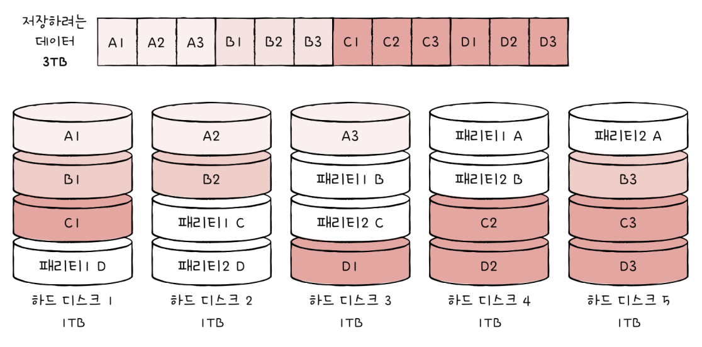

# 보조기억장치

## 7-1 다양한 보조기억장치

### 하드디스크

`하드디스크`는 자기적인 방식으로 데이터를 저장하는 보조기억장치이다. 이 때문에 하드 디스크를 `자기 디스크`의 일종으로 지칭하기도 한다.

하드디스크에서 실질적으로 데이터가 저장되는 곳은 원판인 `플래터`이다. 
그 플래터를 회전 시키는 역활을 하는 것을 `스핀들`이라고 한다. 
스핀들이 플래터를 돌리는 속도는 분당 회전수인 `RPM`으로 나타낸다.
플래터를 대상으로 데이터를 읽고 쓰는 부품을 `헤드`라고 한다.
헤드는 헤드를 원하는 위치로 이동시키는 `디스크 암`에 부착되어 있다. 일반적으로 플래터는 여러 겹으로 이루어져 있고 플래터 양면을 모두 사용할 수 있다. 일반적으로 모든 헤드는 디스크 암에 부착되어 다같이 이동한다.

플래터는 `트랙`과 `섹터`라는 단위로 데이터를 저장한다. 플래터를 동심원으로 나누었을 때 그중 하나의 원을 `트랙`이라고 부른다.
그리고 그 트랙은 마치 피자처럼 여러 조각으로 나눠져 있는데, 이 한 조각을 `섹터`라고 한다.
일반적으로 섹터는 512바이트 정도의 크기를 가지고 있지만, 정확한 크기는 하드 디스크에 따라 차이가 있다.

플래터는 여러 겁으로 이루어질 수 있는데 이때 여러 겹의 플래터 상에서 같은 트랙이 위치한 곳을 모아 연결한 논리적 단위를 `실린더`라고 부른다. 연속된 정보는 보통 한 실린더에 기록한다. 
예를 들어 두 개의 플래터를 사용하는 하드 디스크에서 네 개 섹터에 걸쳐 데이터를 저장할 때는 첫 번째 플래터 윗면, 첫 번째 플래터 뒷면, 두 번째 플래터 윗면, 두 번째 플래터 뒷면에 데이터를 저장한다.
연속된 정보를 하나의 실린더에 저장하는 이유는 디스크 암을 움직이지 않고도 바로 데이터에 접근할 수 있기 때문이다.

하드 디스크가 저장된 데이터에 접근하는 시간은 크게 `탐색 시간`, `회전 지연`, `전송 시간`으로 나뉜다.

#### 탐색 시간
접근하려는 데이터가 저장된 트랙까지 헤드를 이동시키는 시간을 의미한다.

#### 회전 지연
헤드가 있는 곳으로 플래터를 회전 시키는 시간을 의미한다.

#### 전송 시간
하드 디스크와 컴퓨터 간의 데이터를 전송하는 시간을 의미한다.

	프로그래머가 꼭 알아야 할 컴퓨터 시간들

| L1 캐시 참조 시간                                   | 0.5ns         |
| --------------------------------------------------- | ------------- |
| L1 캐시 참조 시간                                   | 0.5ns         |
| L2 캐시 참조 시간                                   | 5ns           |
| 메모리 참조 시간                                    | 7ns           |
| 메모리에서 1MB를 순차적으로 읽는 시간               | 250,000ns     |
| 하드 디스크 탐색 시간                               | 10,000,000ns  |
| 하드 디스크에서 1MB를 순차적으로 읽는 시간          | 30,000,000ns  |
| 한 패킷이 캘리포니아에서 네덜란드까지 왕복하는 시간 | 150,000,000ns |

2011년에 자료가 공개된 이후 오늘날 하드 디스크 성능은 많이 향상되었지만, 하드 디스크에서 다량의 데이터를 탐색하고 읽어 들이는 시간은 생각보다 어마어마하다.

탐색 시간과 회전 지연을 단축시키기 위해서 플래터를 빨리 돌려 RPM을 높이는 것도 중요하지만 `참조 지역성`을 활용해서 데이터가 플래터 혹은 헤드를 조금만 옮겨도 접근할 수 있는 위치해 있는 것도 중요하다.

	헤드가 트랙마다 있어서 탐색 시간이 들지 않는 `다중 헤드 디스크`도 존재한다. 이런 디스크를 `고정 헤드 디스크`라고 부르기도 한다.

### 플래시 메모리

USB 메모리, SD 카드, SSD가 모두 플래시 메모리 기반의 보조기억장치이다.
플래시 메모리는 전기적으로 데이터를 읽고 쓸 수 있는 `반도체 기반 저장 장치`이다. 
플래시 메모리는 보조기억장치 범주에만 속하지 않고 다양한 곳에 널리 사용하는 저장 장치다. 주기억장치 중 하나인 ROM에도 사용된다.

	플래시 메모리에는 크게 2가지 `NAND 플래시`와 `NOR 플래시 메모리`가 있다. 대용량 저장 장치로 많이 사용되는 플래시 메모리는 NAND 플래시로 특별한 언급이 없으면 '플래시 메모리'는 NAND 플래시를 의미한다.

플래시 메모리에는 `셀`이라는 단위가 있다.
셀이란 플래시 메모리에서 데이터를 저장하는 가장 작은 단위이다. 이때 하나의 셀에 몇 비트를 저장할 수 있느냐에 따라 플래시 메모리 종류가 나뉜다.
한 셀에 1비트를 저장할 수 있는 플래시 메모리를 `SLC`(`Single Level Cell`), 한 셀에 2비트를 저장할 수 있는 플래시 메모리를 `MLC`(`Multiple Level Cell`), 한 셀에 3비트를 저장할 수 있는 메모리를 `TLC`(`Triple-Level Cell`)이라고 한다.

#### SLC 타입
SLC 타입은 한 셀로 두 개의 정보를 표현할 수 있다. MLC나 TLC에 비해서 비트의 빠른 입출력이 가능하다. 
수명도 MLC나 TLC보다 길다. 하지만 용량 대비 가격이 비싸다.
보통 데이터를 읽고 쓰기가 매우 많이 발생하며, 고성능의 빠른 저장 장치가 필요한 경우 사용된다.

#### MLC 타입
SLC보다 일반적으로 속도와 수명은 떨어지지만, 한 셀에 두 비트씩 저장할 수 있다는 점에서 대용화하기 유리하다. 또한, SLC보다 용량 대비 가격이 저렴하다. 시중에서 사용되는 많은 플래시 메모리 저장 장치들이 MLC 또는 TLC로 만들어진다.

#### TLC 타입
한 셀에 3비트씩 저장할 수 있어 대용화 하기에 유리하다. 하지만 SLC이나 MLC보다 수명이나 속도가 떨어지며, 용량 대비 가격이 저렴하다.

| 구분           | SLC    | MLC  | TLC    |
| -------------- | ------ | ---- | ------ |
| 셀당 bit       | 1bit   | 2bit | 3bit   |
| 수명           | 길다   | 보통 | 짧다   |
| 읽기/쓰기 속도 | 빠르다 | 보통 | 느리다 |
| 용량 대비 가격 | 높다   | 보통 | 낮다   |

플래시 메모리의 셀보다 큰 단위에는 다음과 같은 것을이 있다.
셀들이 모여서 만들어진 단위인 `페이지`, 페이지가 모여 만들어진 단위인 `블록`, 블록이 모여서 만들어진 `플레인`, 플레인이 모여서 `다이`가 된다.

플래시 메모리에서 읽기와 쓰기는 `페이지` 단위에서 이루어진다. 하지만 삭제는 페이지보다 큰 `블록` 단위로 이루어진다. 읽기/쓰기 단위와 삭제 단위가 다르다는 것이 플래시 메모리의 가장 큰 특징 중 하나이다.

페이지는 세 개의 상태를 가질 수 있다. 각각 `Free`, `Valid`, `Invalid` 상태이다.
* `Free` : 어떠한 데이터도 저장하고 있지 않아 새로운 데이터를 저장할 수 있는 상태
* `Valid` : 이미 유효한 데이터를 저장하고 있는 상태
* `Invalid` : 쓰레기값이라고 부르는 유효하지 않는 데이터를 저장하고 있는 상태

플래시 메모리는 하드 디스크와 달리 덮어쓰기가 불가능하여 Valid 상태인 페이지에는 새 데이터를 저장할 수 없다.

플래시 메모리는 삭제는 블록 단위로 이루어지고 값을 덮어쓸 수 없기 때문에 페이지에 쓰레기 값이 있는 경우, `가비지 컬렉션` 기능을 사용한다.
가비지 컬렉션은 유효한 페이지들만 새로운 블록으로 복사한 뒤, 기존의 블록을 삭제하는 기능이다.

## 7-2 RAID의 정의와 종류

### RAID의 정의

주로 하드 디스크와 SSD를 사용하는 기술로, 데이터의 안정성 혹은 높은 성능을 위해 여러 개의 물리적 보조기억장치를 마치 하나의 논리적 보조기억장치처럼 사용하는 기술

### RAID의 종류

RAID를 구성하는 방법은 여러 가지가 있다. RAID 구성 방법을 `RAID 레벨`이라고 표현한다.

#### RAID 0
여러 개의 보조기억장치에 데이터를 단순히 나누어 저장하는 구성 방식이다. 어떠한 데이터를 저장할 때, 각 하드 디스크는 아래와 같이 번갈아 가면서 데이터를 저장한다. 

이때 마치 줄무늬처럼 분산되어 저장된 데이터를 `스트라입`이라 하고, 분산하여 저장하는 것을 `스트라이핑`이라고 한다.
그렇게 데이터가 스트라이핑되면 저장된 데이터를 읽고 쓰는 속도가 빨라진다. 하나의 대용량 저장 장치를 이용했다면 여러 번에 걸쳐 읽고 써야되지만 데이터를 동시에 읽고 쓸 수 있기 떄문이다.
RAID 0에는 단점이 있다. 저장된 정보가 안전하지 않다는 것이다. RAID 0로 구성된 하드 중에 하나에 문제가 생기면 다른 모든 하드의 정보를 읽는데 문제가 생길 수 있다. 그래서 만들어진 것이 RAID 1이다.

#### RAID 1
RAID 1은 복사본을 만드는 방식이다. 완전한 복사본을 만드는 구성으로 `미러링`이라고 부른다. 
RAID 1 방식은 복구가 매우 간단하다는 장점이 있다.
하지만 디스크 갯수가 한정적일 때 사용 가능한 용량이 적어지는 단점이 있다. 이는 비용의 증가로 이어진다.

#### RAID 4
RAID 1처럼 완전한 복사본을 만드는 대신 오류를 검출하고 복구하기 위한 정보를 저장한 장치를 두는 구성 방식이다. 이때 '오류를 검출하고 복구하기 위한 정보'를 `패리티 비트`라고 한다.
RAID 4에서는 패리티를 저장한 장치를 이용해 다른 장치들의 오류를 검출하고, 오류가 있다면 복구한다. 이렇게 RIAD 4는 RAID 1보다 적은 디스크로 데이터를 안전하게 보관할 수 있다.
패리티 값으로 오류 복구를 하는 방법을 `패리티 계산법`이라고 한다.

#### RAID 5
RAID 4에서는 새로운 데이터를 저장할 때마다 패리티를 저장하는 디스크에도 데이터를 쓰게 됨으로 패리티를 저장하는 장치에 병목 현상이 발생한다.
RAID 5는 패리티 정보를 분산하여 저장하는 방식으로 RAID 4의 병목 현상을 해소한다.

#### RAID 6
기본적인 구성은 RAID 5와 같으나, 서로 다른 두 개의 패리티를 두는 방식이다. 이는 오류를 검출하고 복구할 수 있는 수단이 두 개 생긴 셈이다. 따라서 RAID 4나 RAID 5보다 안전한 구성이다.
하지만, 새로운 저장할 떄마다 저장할 패리티가 두 개로 쓰기 속도는 RAID 5보다 느리다. 

#### Nested RAID
각각의 RAID 방식을 혼합하는 방식으로 RAID 0과 RAID1을 혼합한 RAID 10 등이 있다.