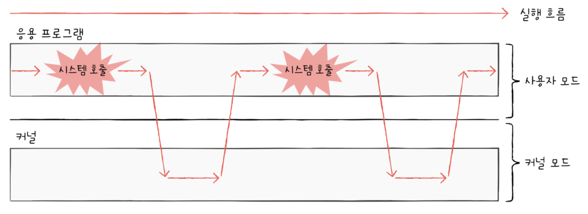

# 운영체제 시작하기

## 9-1 운영체제를 알아야 하는 이유

### 운영체제란

프로그램 실행에 필요한 요소들을 가르켜 `시스템 자원`, 혹은 `자원`이라고 한다. CPU, 메모리, 보조기억장치, 입출력장치 등과 같은 컴퓨터 부품들은 모두 자원이라고 볼 수 있다.
여기서 실행할 프로그램에 필요한 자원을 할당하고, 프로그램이 올바르게 실행되도록 돕는 특별한 프로그램이 `운영체제`이다.

운영체제도 프로그램이기 때문에 메모리에 적제되어야 한다. 하지만 운영제체는 매우 특별한 프로그램임으로 항상 컴퓨터가 부팅될 때 메모리 내 `커널 영역`이라는 공간에 따로 적재되어 실행된다.
커널 영역을 제외한 나머지 영역, 사용자가 이용하는 응용 프로그램이 적재되는 영역을 `사용자 영역`이라고 한다.
즉, 운영체제는 커널 영역에 적재되어 사용자 영역에 적재된 프로그램들에 자원을 할당하고 올바르게 실행되도록 돕는다.

만약, 사용자가 여러 프로그램을 동시에 사용한다면, 사용자 영역에 각각의 프로그램들을 적재하고, 사용이 끝나면 메모리에서 지워줘야 한다. 이러한 작업을 운영체제가 한다.
또한, 프로그램이 CPU를 얼마나 사용할 것인지 어떤 프로그램부터 사용하게 할 것인지를 정해서 CPU 자원을 할당해준다.

운영체제도 관리할 자원별로 기능이 나눠져 있어서, CPU를 관리하는 부분, 메모리를 관리하는 부분, 파일을 관리하는 부분등으로 나눠져 있다.

## 9-2 운영체제의 큰 그림

### 운영 체제의 심장, 커널

자원에 접근하고 조작하는 기능, 프로그램이 올바르고 안전하게 실행되게 하는 기능이 운영체제의 핵심 서비스에 속한다. 이러한 운영체제의 핵심 서비스를 담당하는 부분을 `커널`이라고 한다.
운영체제가 설치된 모든 기기에는 커널이 있다. 보통 운영체제를 지칭할 때, 특별한 언급이 없으면 커널을 지칭한다고 생각해도 무방하다.

운영체제가 제공하는 서비스 중 커널에 포함되지 않은 서비스도 있는데, 대표적인 것이 `사용자 인터페이스`다. 사용자 인터페이스는 윈도우의 바탕화면과 같이 사용자가 컴퓨터와 상호작용할 수 있는 통로이다.
운영체제가 제공하는 사용자 인터페이스에는 `GUI`(`Graphical User Inteface`)와 `CLI`(`Command Line Interface`)가 있다.

### 이중 모드와 시스템 호출

운영체제는 사용자가 실행하는 응용 프로그램이 하드웨어 자원에 직접 접근하는 것을 방지하고 자신을 통해서만 접근하도록 하여 자원을 보호한다. 응용 프로그램이 자원이 접근하기 위해서는 운영체제에 도움을 요청해야 한다. 이때 '운영체제에 도움을 요청한다'라는 말은 '운영체제 코드를 실행하려고 한다.'는 말과 같다. 응용 프로그램에 요청을 받은 운영체제는 대신 자원에 접근하여 요청한 작업을 수행한다.

이러한 운영체제의 역활은 이중 모드로써 구현된다. `이중 모드`란 CPU가 명령어를 실행하는 모드를 크게 사용자 모드와 커널 모드로 구분하는 방식이다. CPU는 명령어를 사용자 모드로써 실행할 수 있고, 커널 모드로써 실행할 수 있다.

`사용자 모드`는 운영체제 서비스를 제공받을 수 없는 실행 모드이다. 즉, 커널 영역의 코드를 실행할 수 없는 모드이다. 일반적으로 응용 프로그램은 기본적으로 사용자 모드로 실행된다. 사용자 모드로 실행 중인 CPU는 입출력 명령어와 같이 하드웨어 자원에 접근하는 명령어를 실행할 수 없다. 그래서 사용자 모드로 실행되는 일반적인 응용 프로그램은 자원에 접근할 수 없다.

`커널 모드`는 운영체제 서비스를 제공받을 수 있는 실행 모드이다. 즉, 커널 영역의 코드를 실행할 수 있는 모드이다. CPU가 커널 모드로 명령어를 실행하면 자원에 접근하는 명령어를 비롯한 모든 명령어를 실행할 수 있다. 운영체제는 커널 모드로 실행되기 때문에 자원에 접근할 수 있다.

	CPU가 사용자 모드로 실행 중인지, 커널 모드로 실행중인지 플래그 레지스터 속 슈퍼바이저 플래그를 보면 알 수 있다.

사용자 모드로 실행되는 프로그램이 자원에 접근하는 운영체제 서비스를 제공받으려면 운영 체제에 요청을 보내 커널 모드로 전환되어야 한다. 이때, 운영체제 서비스를 제공받기 위한 요청을 `시스템 호출`이라고 한다. 사용자 모드로 실행되는 프로그램은 시스템 호출을 통해 커널 모드로 전환하여 운영체제 서비스를 제공받을 수 있다.

시스템 호출은 일종의 인터럽트이다. 정확히는 인터럽트를 발생시키는 특정 명령어에 의해 발생하는 `소프트웨어적인 인터럽트`이다. 

시스템 호출을 발생시키는 명령어가 실행되면 CPU는 지금까지의 작업을 백업하고, 커널 영역 내에 시스템 호출을 수행하는 코드를 실행한 뒤 다시 기존에 실행하던 응용 프로그램으로 복귀하여 실행을 계속해 나간다.

일반적으로 응용 프로그램은 실행 과정에서 운영체제 서비스를 매우 빈번하게 이용한다. 그 과정에서 빈번하게 시스템 호출을 발생시키고 사용자 모드와 커널 모드를 오가며 실행된다.

### 운영체제의 핵심 서비스

#### 프로세스 관리

실행 중인 프로그램을 `프로세스`라고 한다.
컴퓨터를 사용하는 동안 메모리 안에서는 새로운 프로세스들이 생성되고, 사용되지 않는 프로세스는 메모리에서 삭제된다.

일반적으로 하나의 CPU는 한 번에 하나의 프로세스만 실행할 수 있기에 CPU는 이 프로세스들을 조금씩 번갈아 가며 실행한다.

이때 각 프로세스는 상태도, 사용하고자 하는 자원도 다양하다. 그래서 운영체제는 다양한 프로세스를 관리하고 실행한다.
추가로, 여러 프로세스가 동시에 실행되는 환경에서는 `프로세스 동기화`가 필수적으로, 프로세스가 더 이상 실행되지 못하는 상황인 `교착 상태`를 해결해야 한다.

#### 자원 접근 및 할당

모든 프로세스는 실행을 위해 자원을 필요로 한다. 그리고 운영체제는 프로세스들이 사용할 자원에 접근하고 조작함으로써 프로세스에 필요한 자원을 할당해 준다.

##### CPU

일반적으로 메모리에는 여러 프로세스가 적재되고, 하나의 CPU는 한 번에 하나의 프로세스만 실행할 수 있다. 그래서 하나의 프로세스가 CPU을 이용하고 있다면 다른 프로세스는 기다려야 한다.
이에 운영체제는 프로세스들에 공정하게 CPU를 할당하기 위해 어떤 프로세스부터 CPU를 이용할지, 얼마나 오래 CPU를 이용하게 할지를 결정할 수 있어야 한다. 이를 `CPU 스케줄링`이라고 한다.

##### 메모리

메모리에 적재된 프로세스들은 크기도, 적재되는 주소도 가지각색이다. 같은 프로세스라 할지라도 실행할 때마다 적재되는 주소가 달라질 수 있다. 그래서 운영체제는 새로운 프로세스가 적재될 때마다 어느 주소에 적재해야 할지를 결정해야 한다.
때로는 메모리가 이미 꽉 차있어서 적재할 공간이 없는 경우도 있고, 메모리에 공간에 남았는데도 프로세스를 적재하지 못할 수도 있다.

#### 파일 시스템 관리

우리가 컴퓨터를 사용할 때 파일들을 디렉터리(폴더)로 관리하는데, 이것도 운영체제가 지원하는 핵심 서비스인 `파일 시스템`이다.

## 추가

### 가상 머신과 이중 모드의 발전

가상 머신을 통한 가상화를 지원하는 현대 CPU는 두 가지 모드 이상을 지원한다.
`가상 머신`이란 이름 그대로 소프트웨어적으로 만들어낸 가상 컴퓨터이다. 가상 머신을 설치하면 새로운 운영체제와 응용 프로그램을 설치하고 실행할 수 있다.

이때, 가상 머신 또한 응용 프로그램이다. 그래서 사용자 모드로 작동한다. 그래서 가상 머신에 설치된 응용 프로그램이 운영체제 서비스를 제공받기 위해서는 커널 모드로 전환되어야 하는데, 가상 머신에 설치된 운영체제도 사용자 모드로 작동하면 제공받기 어렵다.

그래서 가상화를 지원하는 CPU는 커널 모드, 사용자 모드 이외에 가상 머신을 위한 모드인 하이퍼 바이저 모드를 따로 둔다.

### 시스템 호출의 종류

| 종류            | 시스템 호출 | 설명                                  |
| :---------------: | :-----------: | ------------------------------------- |
| 프로세스 관리   | fork()      | 새 자식 프로세스 생성                 |
|| execve()    | 프로세스 실행(새로운 내용으로 덮어씀) |
|| exit()      | 프로세스 종료                         |
|| waitpid()   | 자식 프로세스가 종료할 때까지 대기    |
| 파일 관리       | open()      | 파일 열기                             |
|| clase()     | 파일 닫기                             |
|| read()      | 파일 읽기                             |
|| write()     | 파일 쓰기                             |
|| stat()      | 파일 정보 획득                        |
| 디렉터리 관리   | chdir()     | 작업 디렉터리 변경                    |
|| mkdir()     | 디렉터리 생성                         |
|| rmdir()     | 비어 있는 디렉터리 삭제               |
| 파일시스템 관리 | mount()     | 파일 시스템 마운트                    |
|| umount()    | 파일 시스템 마운트 해제               |

