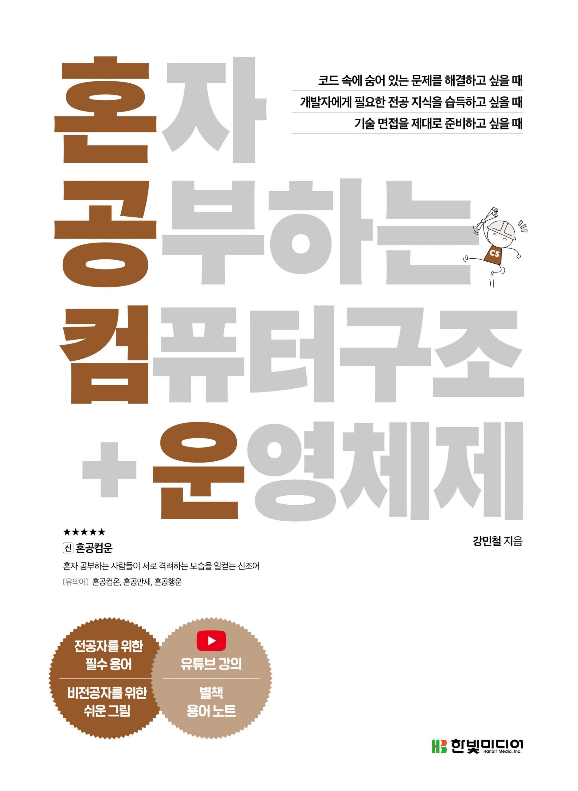

# 혼자 공부하는 컴퓨터구조 + 운영체제

* [컴퓨터 구조 시작하기](/OS_and_computer_structure/1-Computer_Structure_Start.md)
* [0과 1로 표현하기](/OS_and_computer_structure/2-Binary.md)
* [명령어](/OS_and_computer_structure/3-Command.md)
* [CPU](/OS_and_computer_structure/4-CPU.md)
* [CPU 성능 향상 기법](/OS_and_computer_structure/5-FastCPU.md)
* [메모리와 캐시 메모리](/OS_and_computer_structure/6-Memory&Cache_Memory.md)
* [보조기억장치](/OS_and_computer_structure/7-Auxiliary_storage.md)
* [입출력장치](/OS_and_computer_structure/8-Input_device.md)
* [운영체제 시작하기](/OS_and_computer_structure/9-OS_start.md)
* [프로세스와 스레드](/OS_and_computer_structure/10-Process&Thread.md)
* [CPU 스케줄링](/OS_and_computer_structure/11-CPU_Scheduling.md)
* [프로세스 동기화](/OS_and_computer_structure/12-Process_Synchronization.md)
* [교착 상태](/OS_and_computer_structure/13-Deadlock.md)
* [가상 메모리](/OS_and_computer_structure/14-Virtual_Memory.md)
* [파일 시스템](/OS_and_computer_structure/15-File_System.md)