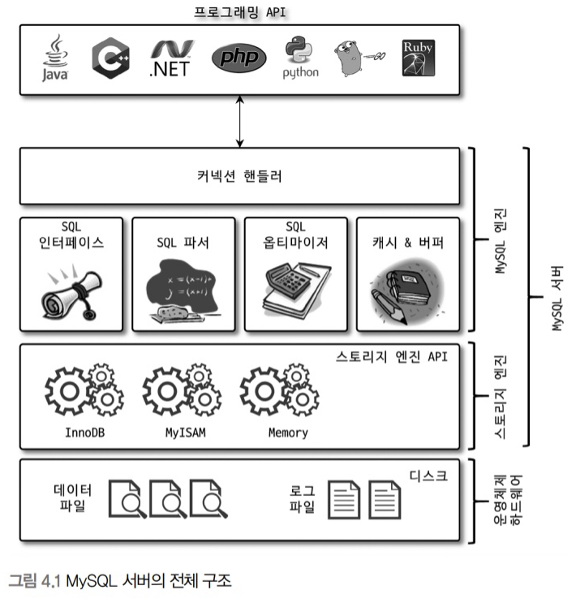
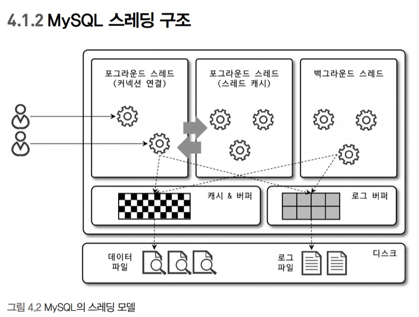

# 4-아키텍처
MySQL 서버는 사람의 머리 역활을 담당하는 MySQL 엔진과 손발 역할을 담당하는 스토리지 엔진으로 구분할 수 있다. 그리고 손과 발 역할을 담당하는 스토리지 엔진은 핸들러 API를 만족하면 누구든지 스토리지 엔진을 구현해서 MySQL 서버에 추가해서 사용할 수 있다.

## 4.1 MySQL 엔진 아키텍처
### 4.1.1 MySQL의 전체 구조


#### 4.1.1.1 MySQL 엔진
MySQL 엔진은 클라이언트로부터의 접속 및 쿼리 요청을 처리하는 커넥션 핸들러와 SQL 파서 및 전처리기, 쿼리의 최적화된 실행을 위한 옵티마이저가 중심을 이룬다. 또한 MySQL은 표준 SQL(ANSI SQL) 문법을 지원하기 때문에 표준 문법에 따라 작성된 쿼리는 타 DBMS와 호환되어 실행될 수 있다.

#### 4.1.1.2 스토리지 엔진
실제로 데이터를 디스크 스토리지에 저장하거나 디스크 스토리지로부터 데이터를 읽어오는 부분은 스토리지 엔진이 전담한다. MySQL 서버에서 MySQL 엔진은 하나지만 스토리지 엔진은 여러 개를 동시에 사용할 수 있다.

```MySQL
CREATE TABLE test_table (fd1 INT, fd2 INT) ENGINE=INNODB;
```

위 예제와 같이 스토리지 엔진을 지정하면 이후 해당 테이블의 모든 읽기, 변경 작업은 정의된 스토리지 엔진을 사용하게 된다.

#### 4.1.1.3 핸들러 API
MySQL 엔젠의 쿼리 실행기에서 데이터를 쓰거나 읽어야 할 때는 각 스토리지 엔진에 쓰기 또는 읽기를 요청하는데, 이러한 요청을 핸들러 요청이라고 하고, 여기서 사용되는 API를 핸들러 API 라고 한다. InnoDB 스토리지 엔진 또한 이 핸들러 API를 이용해 MySQL 엔진과 데이터를 주고받는다. 

이 핸들러 API를 통해 얼마나 많은 데이터 작업이 있었는지 다음 명령을 통해 확인할 수 있다.

```MySQL
SHOW GLOBAL STATUS LIKE 'Handler%';
```

### 4.1.2 MySQL 스레딩 구조


MySQL 서버는 프로세스 기반이 아니라 스레드 기반으로 작동하며, 크게 포그라운드 스레드와 백그라운드 스레드로 구분할 수 있다. MySQL 서버에서 실행 중인 스레드의 목록은 다음과 같이  `performance_schema` 데이터베이스의 `threads` 테이블을 통해 확인할 수 있다.

```MySQL
SELECT thread_id, name, type, processlist_user, processlist_host FROM performance_schema.threads ORDER BY type, thread_id;
```

`thread/sql/one_connection` 스레드만 실제 사용자의 요청을 처리하는 포그라운드 스레드이다. 백그라운드 스레드의 개수는 MySQL 서버의 설정 내용에 따라 가변적일 수 있다. 동일한 이름의 스레드가 2개 이상씩 보이는 것은 MySQL 서버의 설정 내용에 의해 여러 스레드가 동일 작업을 병렬로 처리하는 경우다.

	여기서 말하는 스레드 모델은 MySQL 서버가 전통적으로 가지고 있던 스레드 모델이며, 엔터프라이즈 에디션과 Percona MySQL 서버에서는 스레드 풀 모델을 사용할 수 있다.

#### 4.1.2.1 포그라운드 스레드(클라이언트 스레드)
포그라운드 스레드는 최소한 MySQL 서버에 접속된 클라이언트의 수만큼 존재하며, 주로 각 클라이언트 사용자가 요청하는 쿼리 문장을 처리한다. 클라이언트 사용자가 작업을 마치고 커넥션을 종료하면 해당 커넥션을 담당하던 스레드는 다시 스레드 캐시로 돌아간다. 이때 이미 스레드 캐시에 일정 개수 이상의 대기 중인 스레드가 있으면 스레드 캐시에 넣지 않고 스레드를 종료시켜 일정 개수의 스레드만 스레드 캐시에 존재하게 한다. 이대 스레드 캐시에 유지할 수 있는 최대 스레드 개수는 `thread_cache_size` 시스템 변수로 설정한다.

포그라운드 스레드는 테이터를 MySQL의 데이터 버퍼나 캐시로부터 가져오며, 버퍼나 캐시에 없는 정우에는 디스크에서 직접 데이터나 인덱스 파일로부터 데이터를 읽어와서 작업을 처리한다. 

MyISAM 테이블은 디스크 쓰기 작업까지 포그라운트 스레드가 처리하지만 InnoDB 테이블은 데이터 버퍼나 캐시가지만 포그라운드 스레드가 처리하고, 나머지 버퍼로부터 디스크까지 기록하는 작업은 백그라운드 스레드가 처리한다.

	MySQL에서 사용자 스레드와 포그라운드 스레드는 똑같은 의미로 사용된다.

#### 4.1.2.2 백그라운드 스레드
InnoDB는 다음과 같은 여러 작업들이 백그라운드로 처리된다.
* 인서트 버퍼를 병합
* 로그를 디스크로 기록
* InnoDB 버퍼 풀의 데이터를 디스크에 기록
* 데이터를 버퍼로 읽기
* 잠금이나 데드락을 모니터링

이중 가장 중요한 것은 로그 스레드와 버퍼의 데이터를 디스크로 내려쓰는 작업을 하는 쓰기 스레드이다. MySQL 5.5버전부터 데이터 쓰기 스레드와 데이터 읽기 스레드의 개수를 2개 이상 지정할 수 있게 되었으며, `innodb_write_io_threads`와 `innodb_read_io_threads` 시스템 변수로 스레드의 개수를 설정한다.

일반적으로는 설멍할 필요 없지만, 일반적인 내장 디스크를 사용할 때는 2~4 정도, DAS나 SAN 같은 스토리지를 사용할 때는 디스크를 최적으로 사용할 수 있을 만큼 충분히 설정하는 것이 좋다.

