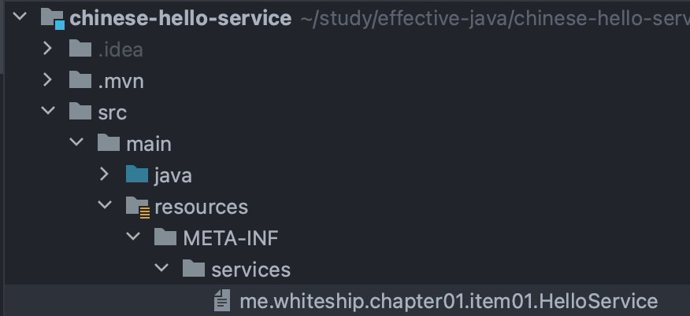
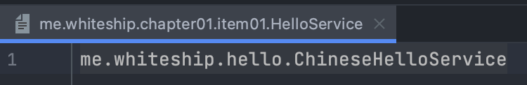

# item1 - 생성자 대신 정적 팩터리 메서드를 고려하라.

무조건 사용하라는 의미가 아니다. `고려하라`라는 뜻이다.

## 장점 1

장점 1 - 이름을 가질 수 있다. (`객체 생성을 더 잘 표현할 수 있다.`)

```java 
public class Order{
	private boolean prime;
	private boolean urgent;
	private Product product;

	public Order(Product product, Boolean prime){
		this.product = product;
		this.prime = prime;
	}

	//컴파일 에러가 발생한다.
	public Order(Product product, Boolean urgent){
		this.product = product;
		this.urgent = urgent;
	}

	//이건 가능
	public Order(Boolean urgent,Product product){
		this.product = product;
		this.urgent = urgent;
	}
}
```

생성자에서 시그니처는 타입까지 보기 때문에 매개 변수의 이름과는 상관없이 같은 `Product, Boolean` 타입을 가지는 생성자 2개를 생성할 수 없다.

따라서, 만드려면 매개 변수의 순서를 바꿔서 만든다.

하지만 정적 팩터리 메서드를 만들면 우리가 표현하고자 하는 객체 생성을 더 잘 표현할 수 있다.

```java
public class Order{
	private boolean prime;
	private boolean urgent;
	private Product product;

	public static Order primeOrder(Product product) {  
	    Order order = new Order();  
	    order.prime = true;  
	    order.product = product;  
	  
	    return order;  
	}  
  
	public static Order urgentOrder(Product product) {  
	    Order order = new Order();  
	    order.urgent = true;  
	    order.product = product;  
	    return order;  
	}
}
```

## 장점 2

장점 2 - 생성할 떄마다 객체를 생성하는 것이 아니라 미리 생성된 객체를 사용함을 보장할 수 있다.(`Boolean`,`valueOf`)

```java
public class Settings {  
    private boolean useAutoSteering;  
    private boolean useABS;  
    private Difficulty difficulty;  
  
    private Settings() {}
  
    private static final Settings SETTINGS = new Settings();  

	//정적 팩토리 메서드
    public static Settings getInstance() {  
        return SETTINGS;  
    }  
}
```

생성자를 `public`하게 제공하면 인스턴스의 생성을 컨트롤할 수 없다.

### Flywight 패턴
* 객체를 가볍게 만들어 메모리 사용을 줄이는 패턴
* 자주 변하는 속성(또는 외적인 속성, `extrinsit`)과 변하지 않는 속성(또는 내적인 속성, `intrinsit`)을 분리하고 재사용하여 메모리 사용을 줄일 수 있다.

## 장점 3 & 장점 4

장점 3 - 인터페이스 혹은 하위 클래스로 반환이 가능(`인터페이스 기반 프레임워크`,`인터페이스에 정적 메소드`)
장점 4 - 매개 변수에 따라서 다른 인스턴스 반환 가능(`EnumSet`)

```java
public class HelloServiceFactory{

	public static HelloService of(String lang){
		if (lang.equals("ko")){
			return new KoreanHelloService();
		} else {
			return new EnglishHeeloService();
		}
	}
}
```

`Interface`를 반환함으로써 실제 구현체를 숨길 수 있다.

또한, 자바 8부터는 `Interface`에 `static method`를 만들 수 있기 때문에 굳이 정적 팩토리 메서드를 가지고 있는 `Factory Class`를 만들어서 사용하지 않아도 된다.

```java
 interface HelloService {
 
	String hello();
	
	static HelloService of(String lang){
		if (lang.equals("ko")){
			return new KoreanHelloService();
		} else {
			return new EnglishHeeloService();
		}
	}
}
```

## 장점 5
장점 5 - 정적 팩토리 메서드를 작성하는 시점에는 반환할 객체의 클래스가 존재하지 않아도 된다.(`서비스 제공자 프레임워크`)

```java
public class HelloServiceFactory {

	public static void main(String[] args){
		//어떤 임의의 구현체가 올지 모르는 상태
		ServiceLoader<HelloService> loader = ServiceLoader.load(HelloService.class);
		Optional<HelloService> helloServiceOptional = loader.findFirst();
		helloServiceOptional.ifPresent(h -> {
			System.out.println(h.hello());
		});

		//이렇게 사용 가능하다. 하지만 chinese hello service에 의존하게 된다.
		HelloService helloService = new ChineseHelloService();
		System.out.println(helloSerivce.hello());
	}
}
```

서비스 제공자 프레임워크의 자바 기본 구현체 -> `ServiceLoader`

> chinese-hello-service




어떠한 구현체가 올지 모르지만 인터페이스 기반으로 코딩을 할 경우가 생긴다. 이때, 엄청난 유연함을 준다. 

> `JDBC`는 `ServiceLoader`가 등장하기 전에 만들어져서 이를 사용하진 않는다.

`JDBC`를 예시로 들 수 있다. 어떠한 구현체를 사용할 지 몰라도 인터페이스 기반으로 동작만 하면 됨으로 이러한 경우에서 응용할 수 있을 것이다.

## 단점 1
