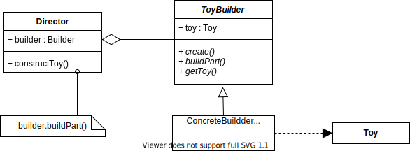

# Item2 - 생성자에 매개변수가 많다면 빌더를 고려하라
정적 팩터리와 생성자에 선택적 매겨변수가 많을 때 고려할 수 있는 방안

* 대안 1 : `점층적 생성자 패턴` 또는 `생성자 체이닝`
	* 매개변수가 늘어나면 클라이언트 코드를 작성하거나 읽기 어렵다.
* 대안 2 : `자바빈즈 패턴`
	* 완전한 객체를 만들려면 메서드를 여러번 호출해야 한다. 
	* 일관성이 무너진 상태가 될 수도 있다.
		* 필수값이 세팅된 이전에 사용될 수 있다.
	* 클래스를 불변으로 만들 수 없다.

권장하는 방법 : `빌더 패턴` 
* `플루언트 API` 또는 `메서드 체이닝`을 한다.
	* 자기 자신을 리턴함으로 가능해진다.

```java
public static class Builder {  
    // 필수 매개변수  
    private final int servingSize;  
    private final int servings;  
  
    // 선택 매개변수 - 기본값으로 초기화한다.  
    private int calories      = 0;  
    private int fat           = 0;  
    private int sodium        = 0;  
    private int carbohydrate  = 0;  
  
    public Builder(int servingSize, int servings) {  
        this.servingSize = servingSize;  
        this.servings    = servings;  
    }  
  
    public Builder calories(int val)  
    { calories = val;      return this; }  
    public Builder fat(int val)  
    { fat = val;           return this; }  
    public Builder sodium(int val)  
    { sodium = val;        return this; }  
    public Builder carbohydrate(int val)  
    { carbohydrate = val;  return this; }  
  
    public NutritionFacts build() {  
        return new NutritionFacts(this);  
    }  
}
```

* 계층적으로 설계된 클래스와 함께 사용하기 좋다.
	* 상속적인 상황에서 사용하기 좋다.

```java
abstract static class Builder<T extends Builder<T>> {  
    EnumSet<Topping> toppings = EnumSet.noneOf(Topping.class);  
    public T addTopping(Topping topping) {  
        toppings.add(Objects.requireNonNull(topping));  
        return self();  
    }  
    abstract Pizza build();   
    // 하위 클래스는 이 메서드를 재정의(overriding)하여  
    // "this"를 반환하도록 해야 한다.  
    protected abstract T self();  
}
```

* 점층적 생성자보다 클라이언트 코드를 읽고 쓰기가 훨씬 간결하고, 자바빈즈보다 훨씬 안전하다.
	* 필수적인 값은 반드시 들어가도록 설정할 수도 있다.
* 필수적인 필드와 아닌 필드가 혼용되어 있거나 불변하게 객체를 만들어야 하는 경우 고려해볼 수 있다.


* 롬복을 사용하면 빌더를 알아서 만들어주게 된다.
	* 장점
		* 어노테이션 하나로 코드를 엄청 줄일 수 있다.
	* 단점
		* 기본적으로 모든 파라미터를 받는 생성자를 만든다.
		* 빌더가 아닌 생성자로 만들어질 수 있다.
			* `AccessLevel`을 `private`로 설정하면 못 쓰게 할 수 있다.
		* 필수적인 값을 꼭 사용하는 빌더를 만들기 어렵다.

# 추가 개념

## 자바빈(`JavaBean`)
재사용 가능한 소프트웨어 컴포넌트  
`java.beans` 패키지 안에 있는 모든 것

* 자바빈이 지켜야 할 규약
	* `argument`가 없는 기본 생성자	  
		* 리플렉션을 통해서 객체를 생성하기 용이하기 위해서
	* `getter`와 `setter` 메소드 이름 규약
	* `Serializable` 인터페이스 구현
* 그 중에서도 `getter`와 `setter`가 주로 쓰이는 이유
	* `JPA`나 `스프링`과 같은 여러 프레임워크에서 리플렉션을 통해 특정 객체의 값을 조회하거나 설정하기 때문이다.
* `java-17`에서 제공하는 `recode`에 대해서 찾아보기

## 객체 얼리기 (`freezing`)
임의의 객체를 불변 객체로 만들어주는 기능
자바에서는 제공하지 않고 자바스크립트는 제공한다

* `Object.freeze()`에 전달한 객체는 그뒤로 변경될 수 없다.
	* 새 프로퍼티를 추가하지 못함
	* 기존 프로퍼티를 제거하지 못함
	* 기존 프로퍼티 값을 변경하지 못함
	* `프로토타입`을 변경하지 못함
* `strict` 모드에서만 동작한다.
* 비슷한 류의 함수로는 `Object.seal()`과 `Object.preventExtensions()`가 있다.
* 예상하지 못할 사이드 이펙트가 발생할 가능성이 높다.

## 빌더 패턴
동일한 프로세스를 거쳐 다양한 구성의 인스턴스를 만드는 방법  
복잡한 객체를 만드는 프로세스를 독립적으로 분리할 수 있다.


## `IllegalArgumentException`
잘못된 인자를 넘겨 받았을 때 사용할 수 있는 기본 런타임 예외  
어떤 `argument`가 잘못되었는지 어떻게 잘못되었는지 넘겨주는 것이 좋다.

* `checked exception` & `unchecked exception`
* 간혹 메소드 선언부에 `unchecked exception`을 선언하는 이유는?
	* 클라이언트에게 명시적으로 알려주고 싶을 때 선언하게 된다.
 * `checked exception`은 왜 사용할까?
	 * 클라이언트가 `exception`에 대해서 어떤 행위를 강요하기 위해서

## 가변인수
여러 인자를 받을 수 있는 가변적인 `argument` (`Var` + `args`)

* 가변인수는 메소드에 오직 하나만 선언할 수 있다.
* 가변인수는 메소드의 가장 마지막 매개변수가 되어야 한다.
* 빌더의 각 메소드에 가변인수를 사용하면 마치 여러 개의 가변 인수를 쓰는 효과를 나타낼 수 있다.

```java
public void printNumbers(int... numbers){
	Arrays.stream(numbers)
		.forEach(System.out::println);
}
```